# Multi-Cloud Networking With Alkira

## Introduction
_Multi-Cloud_ is making its rounds. Network and Security engineers face increasing challenges with managing complexity and risk as they work to react with more agility to enable business outcomes. At the start, enterprises didn't just decide they would be multi-cloud. They started with a single cloud, likely [**Amazon Web Services**](https://aws.amazon.com/) and tailored their strategy around that cloud's architecture and features.

A little time passes, and now those engineers that are still evolving to handle AWS are tasked with adopting [**Microsoft Azure**](https://azure.microsoft.com/en-us/). Those handcrafted design patterns, features, and core architectures in scope for AWS it turns out, don't port over to Azure. At this point, those engineers are starting to get overwhelmed. Just as they finish getting the initial design in place for Azure, there is now a push to begin setting up the foundational structure and connectivity for [**Google Cloud**](https://cloud.google.com/).

In _May_, [**Alkira**](https://www.alkira.com/) exited stealth with the first unified multi-cloud network delivered _as-a-service_ which aims to solve problems like this. Alkira is brought to us by [Amir Khan](https://theorg.com/org/alkira/org-chart/amir-khan) and [Atif Khan](https://theorg.com/org/alkira/org-chart/atif-khan) who also created and co-founded [Viptela SD-WAN](https://www.cisco.com/c/en/us/about/corporate-strategy-office/acquisitions/viptela.html) (Viptela was acquired by [Cisco](https://www.cisco.com/) in 2017 for _610 million_). Listen to [Packet Pushers Podcast - Heavy Networking 520](https://packetpushers.net/podcast/heavy-networking-520-cloud-architects-multi-cloud-network-adoption-with-alkira-sponsored/) as I talk through the challenges of multi-cloud and how Alkira can help you solve them.

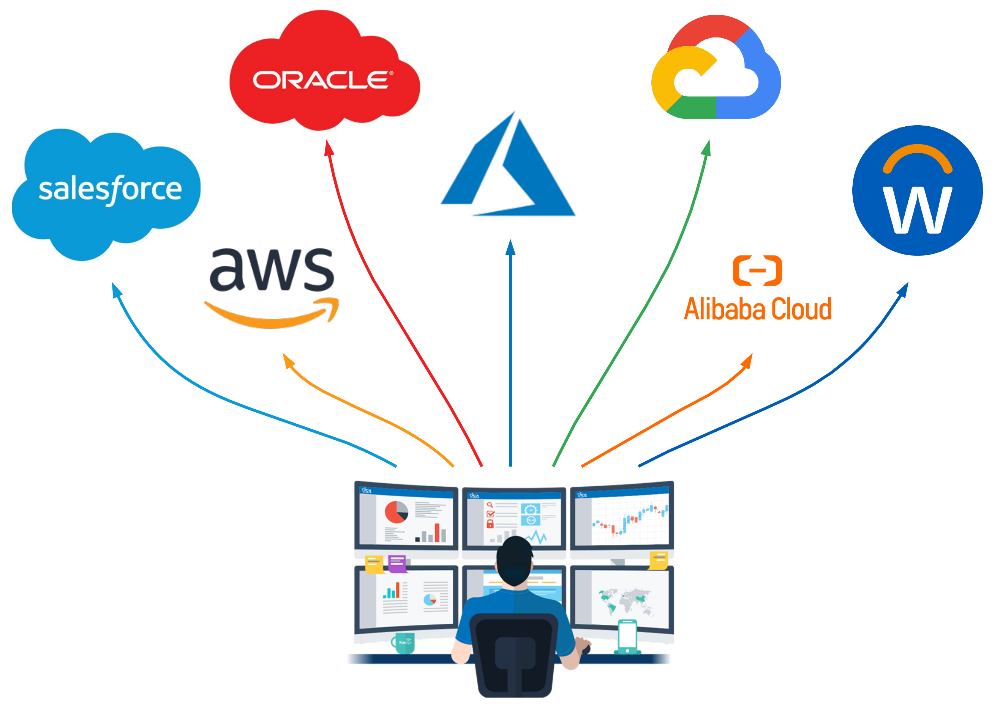

### By The Numbers
Back when multi-cloud started to gather momentum, I admittedly thought it was a sham. Some of the biggest names in the cloud game seem to choose a single cloud, innovate, optimize, and scale. Might have heard of that streaming giant [Netflix](https://www.netflix.com/), no? They are using AWS exclusively. What about [Spotify](https://www.spotify.com/us/), who went from 20 million premium subscribers in 2015 to a staggering 130 million in 2020? Well, they are all in on Google Cloud.

While efficiently managing 1 cloud may seem hard enough, it looks like enterprises and SMBs are taking a different approach. According to [**Flexera 2020** - _State of the Cloud Report_](https://info.flexera.com/SLO-CM-REPORT-State-of-the-Cloud-2020), **93 percent** of enterprises have a _multi-cloud_ strategy; **87 percent** have a _hybrid-cloud_ strategy. On average, organizations are actively using 3.4 clouds and experimenting with another 1.5 clouds (private and public). The numbers tell a story.

### How Did We Become Multi-Cloud Anyway?
For some, it all started with the words **_Digital_** and **_Transformation_**. Cloud is the new foundation for our agile business, right? We proudly setup our VPN to AWS and thought, that was easy. I can _cloud_ with the best of em! Then things kind of snowballed from there. While no organization has the exact same story to tell, we can look at a hypothetical example in which many can probably relate. 

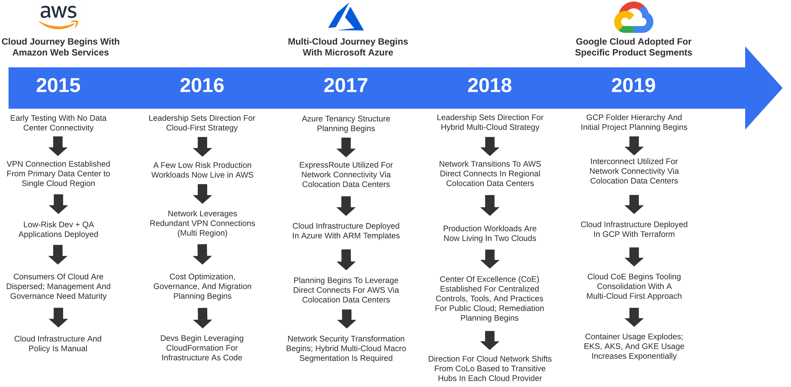

## Analyzing Multi-Cloud Network Design Patterns
The concept of [design patterns](https://en.wikipedia.org/wiki/Design_pattern) was first introduced by [Christopher Alexander](https://en.wikipedia.org/wiki/Christopher_Alexander) and has profoundly influenced _software engineering_. Simply put, a design pattern is just a reusable solution to a commonly occurring problem. This applies to any discipline and is of critical importance when architecting for the cloud.

The network is not just limited to _public cloud_. In the instance of _Healthcare_, you may have existing data centers, corporate offices, hospitals, and a growing remote workforce which require fast, reliable, and secure transport. Examining the prominent building blocks of cloud computing - [IaaS](https://azure.microsoft.com/en-us/overview/what-is-iaas/), [PaaS](https://azure.microsoft.com/en-us/overview/what-is-paas/), and [SaaS](https://azure.microsoft.com/en-us/overview/what-is-saas/) can add color as to how the future network may look.

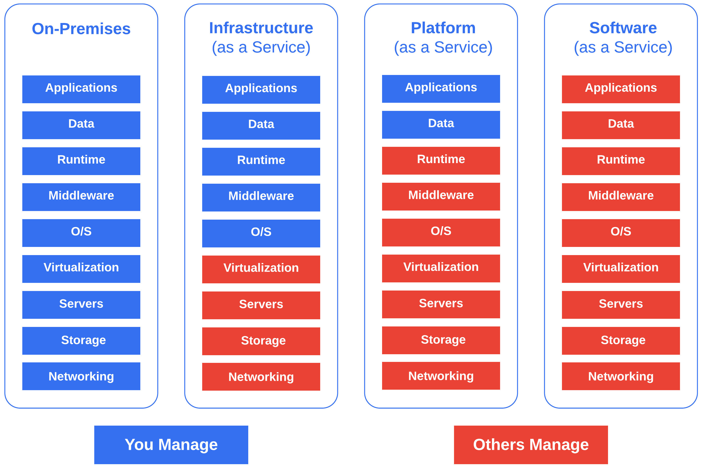

### Pre-Cloud Design - (Data Center Backhaul)
You can't adopt the cloud without taking that first step. Most enterprises and SMBs took that step by merely setting up accounts in AWS and sandboxing. Since network and security folks generally slow things down, this was typically started without much oversight.

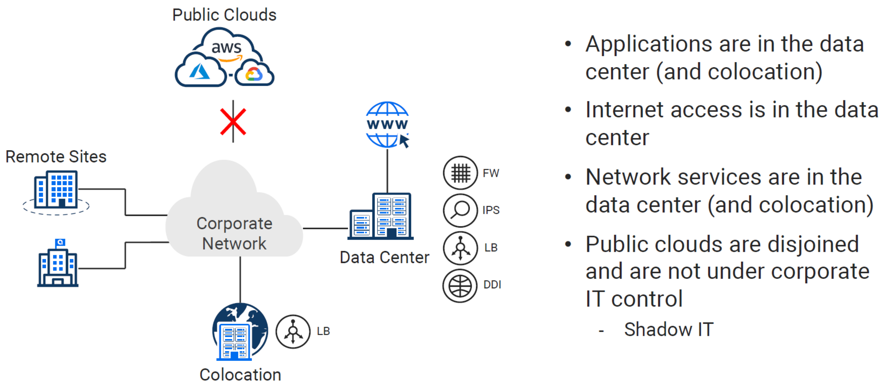

### Design Pattern Evolution
Cloud has caused _disruption_ across all technical disciplines, and networking is no exception. Although not a _one-to-one_ match to the evolution of _cloud computing_ models, we can definitely draw some comparisons.

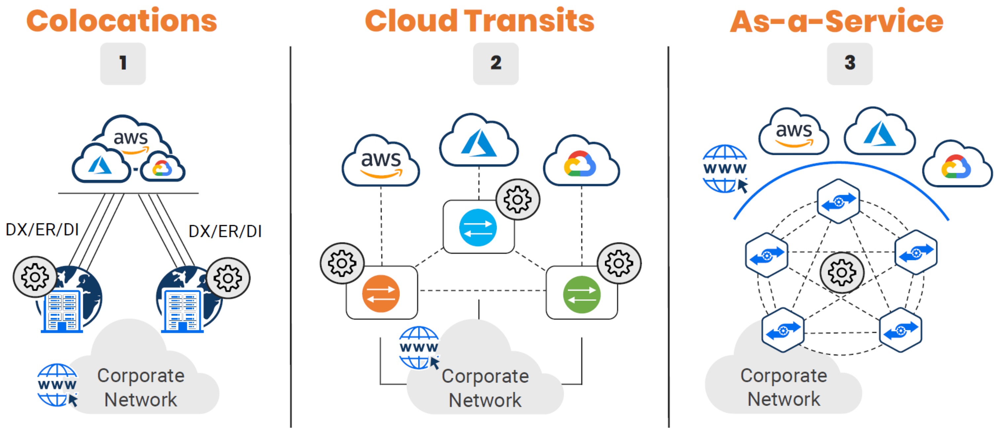

#### 1 - Design Pattern - (Colocation)
Once network performance for cloud becomes critical, adoption of [Direct Connect](https://docs.aws.amazon.com/directconnect/latest/UserGuide/Welcome.html), [ExpressRoute](https://azure.microsoft.com/en-us/services/expressroute/), and [Interconnect](https://cloud.google.com/network-connectivity/docs/interconnect/concepts/overview) become essential for connecting your existing infrastructure. These links are critical for migrations and _tiered hybrid_ deployments (Backend application reuse, with frontend components being migrated case by case). 

Colocation data centers have many qualities that can be attractive to a business seeking to get _well connected_. One major value add would be, getting you closer to the cloud providers, applications, and services, which are also hosted in a respective CoLo. This solution isn't really _centralized_ or _decentralized_. I would say it fits somewhere in the middle, maybe call it _regionalized_?

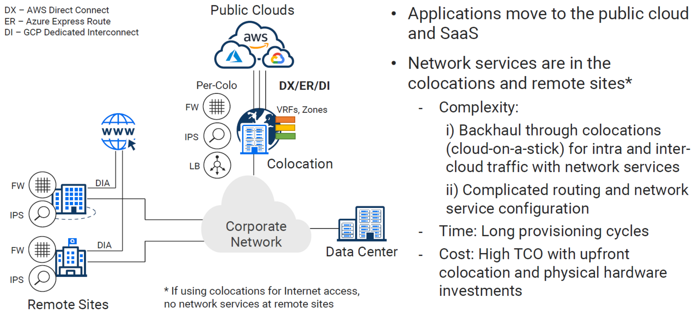

#### 2 - Design Pattern - (Cloud Transits)
To _centralize_ or _decentralize_, that is the question. This seems to be the proverbial pendulum swing in action. We got somewhere in the middle with CoLos, but now with SD-WAN making us transport agnostic, why not wholly _decentralize_? Every cloud, data center, and remote for itself, easy right?

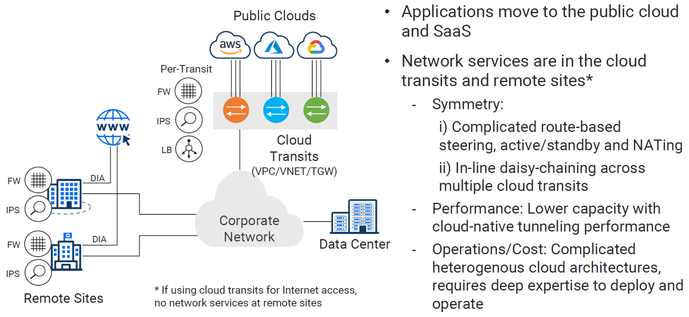

#### 3 - Design Pattern - (As a Service)
Each of the previous patterns solves specific problems but also leaves new ones in its wake. [Alkira](https://www.alkira.com/) aims to tackle this in a disruptive fashion similar to how the cloud computing models transformed application delivery. By shifting to a service based consumption, you gain a lot of the benefits of cloud applied to the full domain of networking.

Although their solution is marketed _as-a-service_ with consumption-based billing, I will attempt to expand on this notion. In the world of cloud, _as-a-service_ implies that you don't technically do anything but consume. I would argue that Alkira is more like a _SaaS_ solution that enables you to operate components of your network in a _PaaS_ like fashion.

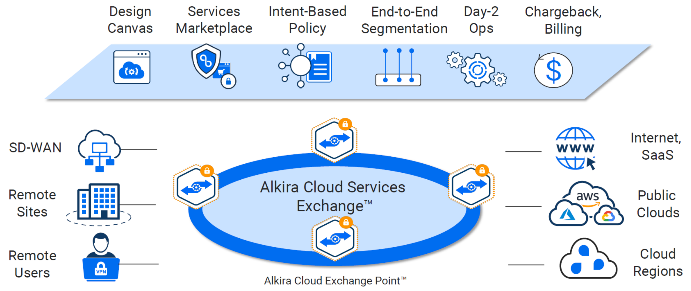

## Examining Complexity In Multi-Cloud Today
Complexity can be a tricky thing. Often times, adding complexity to a network to either increase availability or make it more secure can backfire. If the person responsible for a given design has to think about it for a length of time when something breaks or has difficulty explaining it, then it may be overly complicated. This means it will be far more difficult for operational teams to manage over time.

## The CoLo Approach
In the journey to get _well connected_, many organizations are leveraging global colocation data centers like [Equinix](https://www.equinix.com/) or [Megaport](https://www.megaport.com/) for _interconnection_ services. In many reference architectures, this is referred to as _performance hubs_ which are distributed in proximity to your data centers, remotes, customers, and physical location of public cloud data centers.

**Key Drivers**
* Regional private WAN egress to the Internet
* Low latency private connections to Cloud Providers
* Localized security stack per CoLo (no backhaul to data centers)
* Leverage competition between carriers (cost consideration)

CoLos have a lot to offer in terms of value, but they also significantly increase complexity and operational overhead. A lot of times when CoLos are discussed, I often hear some variation of the question - "Aren't we going to cloud so we can get out of the business of managing our own data centers"? The idea is to avoid additional spend on hardware, costly refreshes, and additional staffing to manage it all.

### Physical Hardware Leads The Way
In building out CoLos, physical hardware is used to terminate connections, route traffic, and perform security functions. While services exist like [Equinix Cloud Exchange Fabric](https://www.equinix.com/interconnection-services/cloud-exchange-fabric/), this merely enables you to provision multiple logical circuits on-top of a single physical port. You are still on the hook for terminating bare-metal connections and routing traffic.

#### Layer 2 Across Clouds
As we start setting up our fast on-ramps to cloud, we must first setup the physical hardware to terminate each cloud's variation of direct connection. For increased SLA and reliability, these are sold in pairs, so our physical hardware must be setup in an Active/Standby configuration.

We will have a _cross connect_ from _Switch-A_ going to _DirectConnect-A_ and a _cross connect_ additionally from _Switch-B_ to _DirectConnect-B_. This will be required for each Cloud provider.

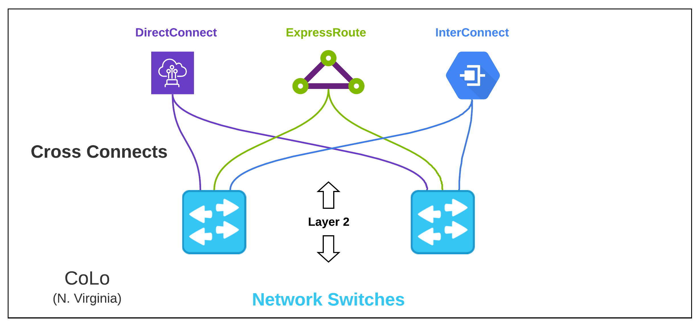

#### Layer 3 Across Clouds 
Now that we're switching those frames, it's time to route some packets. Aside from some nice enterprise-grade switches, we are probably going to need some nice shiny routers to see our reflection in. Although we could have simply terminated connections on the same device we are routing with, as we expand the hardware topology to _NGFWs_, the separate switches make sense.

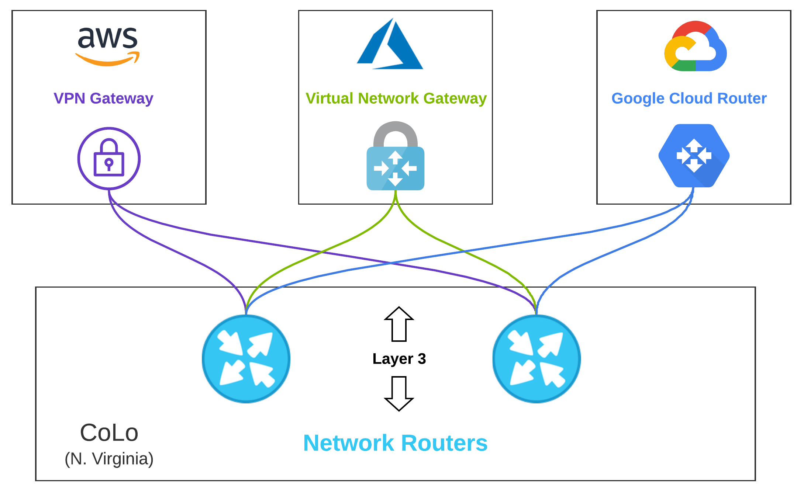

#### Layer 3, 4, and 7 Across Clouds
[The Cisco Annual Internet Report](https://www.cisco.com/c/en/us/solutions/executive-perspectives/annual-internet-report/index.html) makes the staggering prediction that by _2021_, **85%** of network traffic will be east-west. This creates a compelling case for putting time and effort into understanding what, how, and why specific traffic is communicating inside and across clouds.

If I am an attacker, I want sensitive information. When organizations are migrating to the cloud, the raw data may not exist in the cloud, but network connectivity is required to the cloud to plan and orchestrate migrations.

This opens the door for cross-cloud attacks in which a bad actor might piggyback on address-based controls and protocols that are missed by non-modernized toolkits or lack of visibility. The bad actor can then propagate malware across clouds, or to on-premises data centers.

Regionally placing security gear in CoLos can help alleviate some of these concerns as you can force all of your traffic through Next-Gen appliances. When you start going multi-cloud however, your traffic flows, routing, and segmentation complexity begin to increase exponentially.

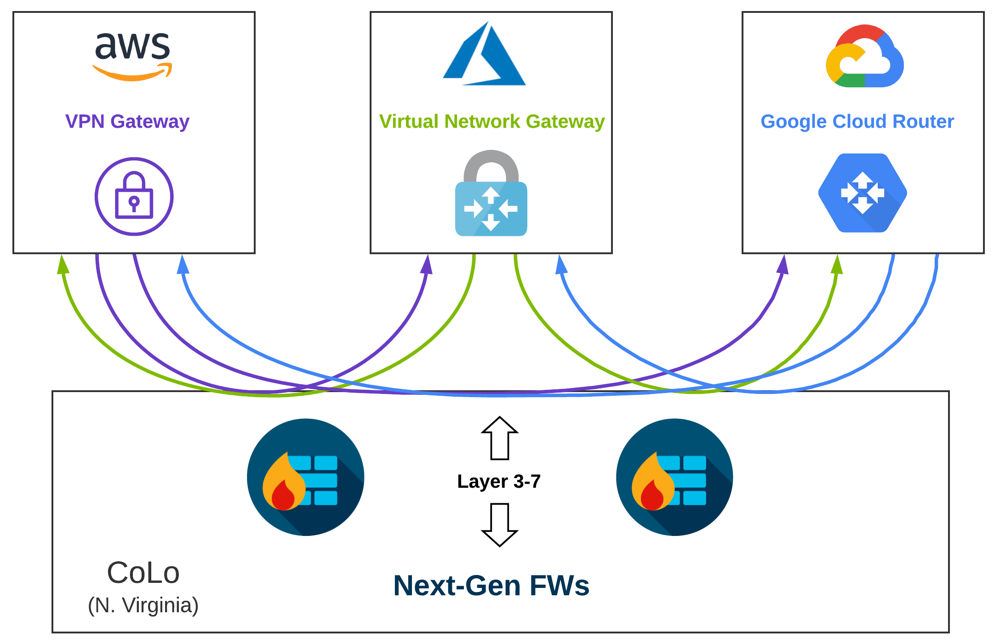

#### Segmentation
Cloud Security _should_ be similar to a very large, plain-looking, yet complex onion. This onion has several layers, and each layer you peel back has a unique but intentional function. In network security, _macro-segmentation_ is a higher-level and less granular method in which we can group categories of things, traditionally geared towards _north-south_ communication. 

As we get more granular, we leverage _micro-segmentation_. This expands the looking glass to encompass _east-west_ traffic with the intent of providing seamless protection for workloads spanning data centers and multiple clouds.

In getting started, we intend to keep this as simple as possible while still meeting security-focused requirements. We can use the tried and true (but also traditional) building blocks of networking to meet some of our _macro-segmentation_ requirements. This works well since; technically, we are just using these performance hubs as lightning-fast vehicles to cloud.

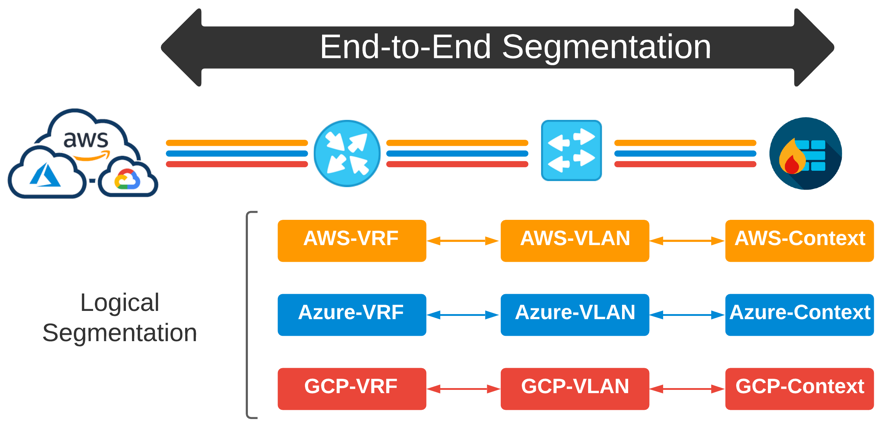

#### Segmentation Overload
As complexity increases and requirements change, the problem statement changes as well. What if a specific workload needs to talk outside of an AWS VRF across cloud to a VRF that drives connectivity for a specific Azure VNet? Well, since these VRFs were scoped out on a per-cloud basis, we need to incorporate more segmentation to keep this traffic separated at a _workload_ level. 

So, I can define traffic in prefix-lists. I can then use those prefix-lists to dictate policy in route-maps from which I can apply to cloud-specific VRFs. Then, the original way we might have segmented things five years ago changes dramatically because BANG - multi-cloud. Now I am leaking routes from VRFs, routing between firewall contexts, and my own snowflakes are now turning into a full-on blizzard.

Also, how do we define what a Macro Segment is? How do we determine what a Micro Segment is? Who decides how granular we should get on the network, and why doesn't this complexity live up in the cloud anyways?

It seems to me; segmentation should have a very unique and intentional strategy across all environments. When developers are driving the way infrastructure looks and behaves in the cloud, how can we keep end-to-end control of the network while still helping forward progress and enabling the business?

> There are a lot of products hitting the market today to help solve these problems. To get a look at how other vendors are tackling this, checkout [NSX Cloud](https://www.vmware.com/products/nsx-cloud.html) from VMware, [Cisco - Secure Agile Exchange (SAE)](https://www.cisco.com/c/en/us/td/docs/switches/datacenter/Cloud-Services-Platform/csp_5000/sae/solution_guide/b-SAE-solution-guide/b-SAE-solution-guide_chapter_00.html), and [Aviatrix - Cloud Network Platform](https://aviatrix.com/). Some of these solutions may require you to install a given vendor's appliances in the cloud provider VPCs / VNets or setup additional physical hardware on-premises or in CoLos. 

## Alkira - CSX
Alkira has coined their platform _Cloud Services Exchange (CSX)_. The sales pitch: **Provision a global, fully routed multi-cloud network with integrated network services, visibility, and governance in minutes. All delivered _as-a-service_.** Inside CSX, their unified platform enables the customer to manage products and services. As new features are released over time, they will become available via the CSX for consumption.

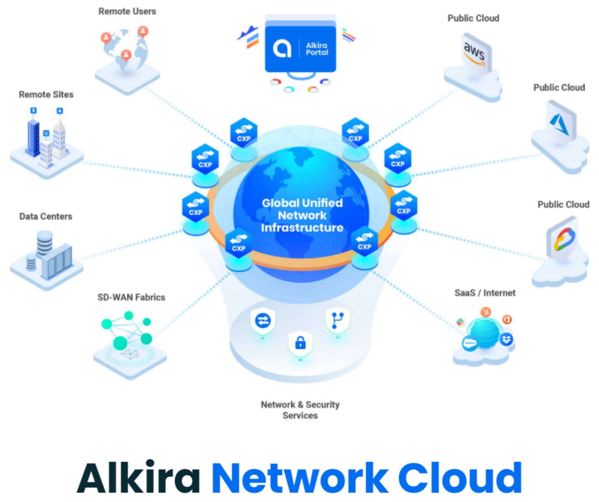

### Cloud Exchange Points (CXPs)
If CSX is the unified platform, then _Cloud Exchange Points (CXPs)_ are the interconnected brain. You can think of CXPs as globally distributed multi-cloud _points of presence_, which provide a full routing stack and network services. They provide elastic and highly available _regional_ entry points for all the things you want to connect.

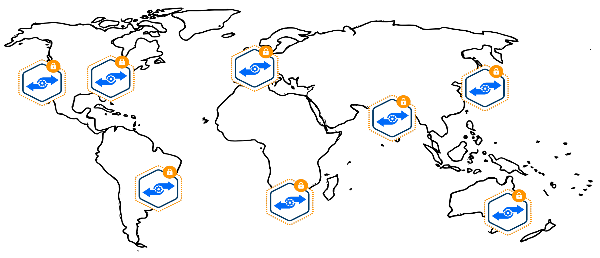

### Tackling Segmentation With Alkira
Alkira takes a unique approach to network segmentation. To bridge the gap for segmentation inside the cloud and out, they pull in VPC and VNet policy from a given cloud provider into their platform. Not having to install and manage additional appliances in each cloud provider is a major plus. Creating segments is painless. In addition to segments, you can define logical groups of things in which you build policy against.

The sweet spot here is, all of those segments, groups, and policies can be used across all of your clouds, remotes, data centers, or any other network you choose to connect through their platform. The experience with creating and applying these policies is unlike any other. You click and drag your pieces into place as you build your intended design.

When doing this, my mind automatically began thinking, "Wow, this click and drag was a few days worth of planning and change windows". Once you get all of your desired policy in place, no changes are executed until you click their **Provision** button.

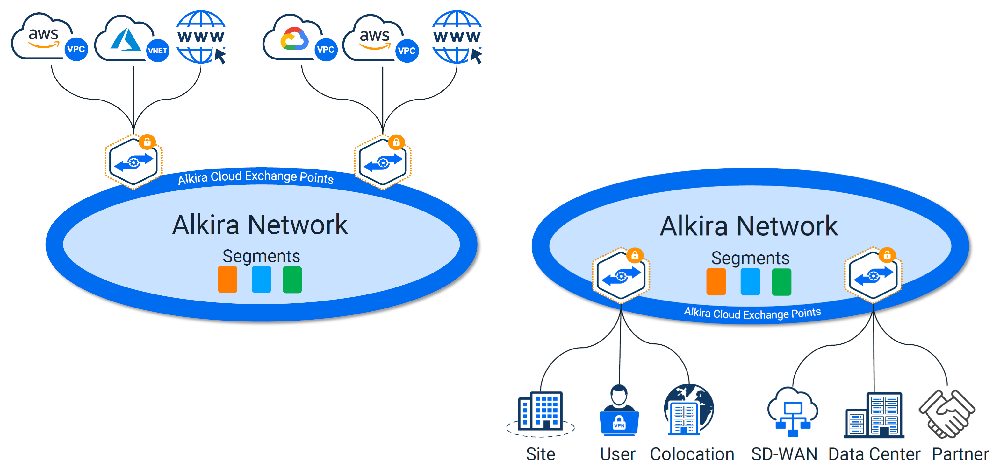

## Services Marketplace
What good is a _cloud_ offering without the ability to inject 3rd party services? The three giants AWS, Azure, and GCP all have their own flavor of a marketplace. I would assume since Alkira is primarily focused on reinventing the network, that their focus on a marketplace would be based in _network_ based appliances and services. As of today, the marketplace is limited to adding firewalls from [Palo Alto](https://www.paloaltonetworks.com/). 

### Palo Alto VM-Series Firewalls
Just like segments and groups, a Palo Alto Firewall can be setup and used across all of your clouds and sites. These can be deployed to your existing instance of [Panorama](https://www.paloaltonetworks.com/network-security/panorama), and configured to _auto-scale_ as load increases. This really beats managing individual _scale-sets_ in each cloud provider.

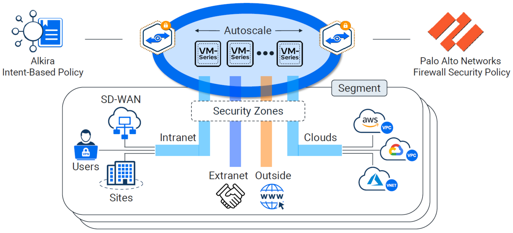

## The Server Admin Evolves
In the _pre-cloud_ era, the server admin stayed pretty busy. Not just with solving problems directly tied to the business, but with mundane tasks that held up other teams from executing work.

### Server Admin Pre-Cloud
Racking a server isn't as easy as just racking a server. This may sound like a quick and trivial task, but gets complicated relatively quickly depending on an environment. Some of my longest nights have been spent either installing, upgrading, or troubleshooting hardware inside data centers.

Maybe it is a pod-based solution? Is compute, network, virtualization, and storage all baked into the same rack? Now we are going beyond the simple racking of a server to understanding some of the upstream networking components in order to ensure proper failover in outage scenarios.

Once the Layer 1 stuff is done, we have to install and configure a hypervisor. Setting up _Out-of-Band Management_ is also a must (more networking stuff, I know). If something breaks, you have to have an alternate method of troubleshooting beyond driving into the data center and rolling over the crash-cart. 

Not to mention - in smaller to medium-sized shops, these same individuals are probably solely responsible for OS lifecycle management too. Let's not forget installing, patching, and troubleshooting VMs? All of this overhead, and we haven't even got to the application or load balancer yet.

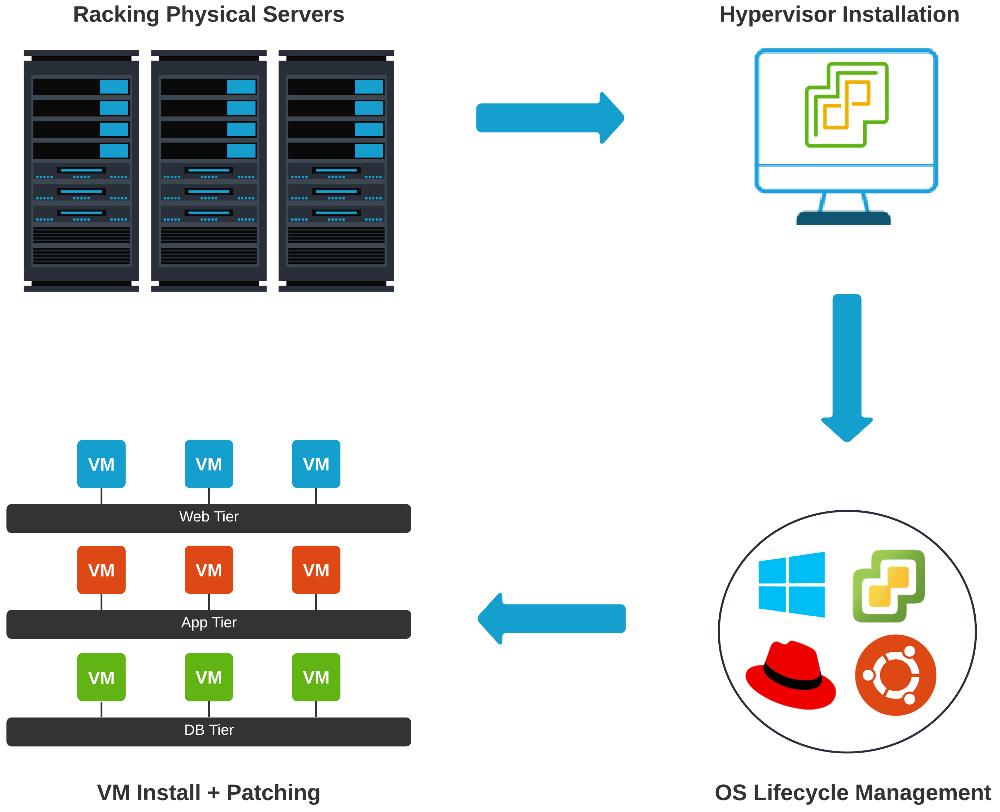

### Server Admin Post-Cloud
In the 1930s, an industrial engineer - Allen F. Morgenstern coined the phrase **Work smarter, not harder**. This phrase is the first thing that comes to my mind when thinking of today's _Server Admin_. Once you remove a lot of the busy work, the cycles are then focused on design, efficiency, automation, and outcomes.

#### Hypothetical Server Build - Today
* Changes are committed to source control
* [Azure DevOps](https://azure.microsoft.com/en-us/services/devops/) builds and packages application
* Release artifact is produced with associated trigger
* Trigger envokes [Packer](https://www.packer.io/) to build a Linux Image
* [Ansible](https://www.ansible.com/) installs middleware + application
* Infrastructure is provisioned with [Terraform](https://www.terraform.io/)

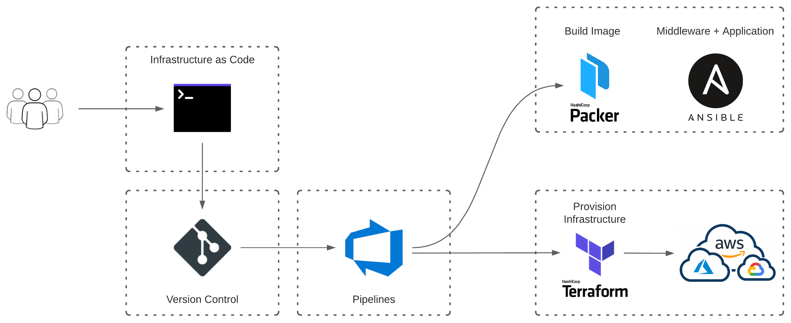

### What About Networking?
With the technology, automation, and abstraction available to us today, can't we solve some of the painful network problems like cloud did for compute? Depending on the industry, institutional knowledge, and available talent, it behooves oneself to make a design only as complicated as requirements mandate. When inserting state into a network - (think NAT or stateful firewalls), enforcing traffic symmetry at that point in the network is critical. In multi-cloud, this usually means complicated hop-by-hop configuration + Policy Based Routing (PBR) to steer traffic.

In **2020**, in the era of Cloud, it doesn't feel like this is where network engineering cycles should be placed. Network engineers should be more focused and intune with intent and driving outcomes for the business.
I think this is where [Alkira](https://www.alkira.com/) aims to take networking. Abstracting some of the larger pain points away while still enabling the network team's ability to leverage all the nerd knobs (maintaining control and visibility).

For instance, say the business requires _AWS-Prod_ communication to _GCP-Prod_. Or maybe _Product-A_ in Azure needs limited communication with _Product-B_ in GCP.
This type of policy is easily definable in Alkira. Your intent is described, and their platform handles the rest. No complicated policy based routing, traffic steering through a NGFW, or HA + autoscale per cloud.

## Conclusion
[Alkira](https://www.alkira.com/) provides a flexible, adaptable, innovative, and fresh spin on how the network can be used as a _utility_. A solution which leverages additional abstractions that ultimately lead to a reduction in _time-to-value_ while accelerating _speed-to-market_.

The landscape is changing faster than ever before. The need for hardware is rapidly decreasing, and it no longer makes sense to _back-haul_ anything back to data centers. User experience is rightfully taking center stage.

Having the ability to deliver unified network and security services, remain location agnostic, and provide low-latency from the cloud edge is a bare minimum for the future. Getting this right has a lot of challenges.

Any solution that doesn't integrate seamlessly into public cloud, or where application delivery happens, will further impede network and security professionals with design and operational setbacks. Alkira seems to have found the sweet spot to achieve outcomes in this space
