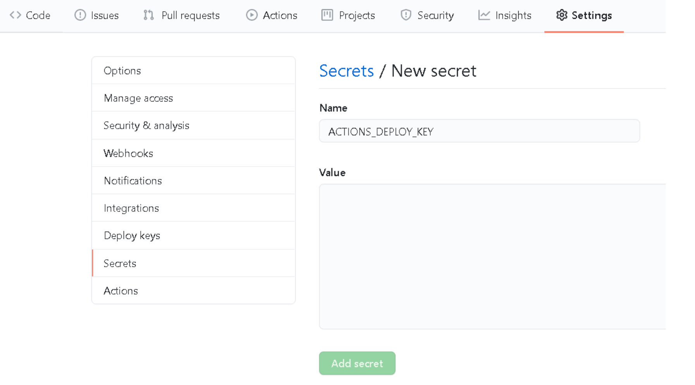
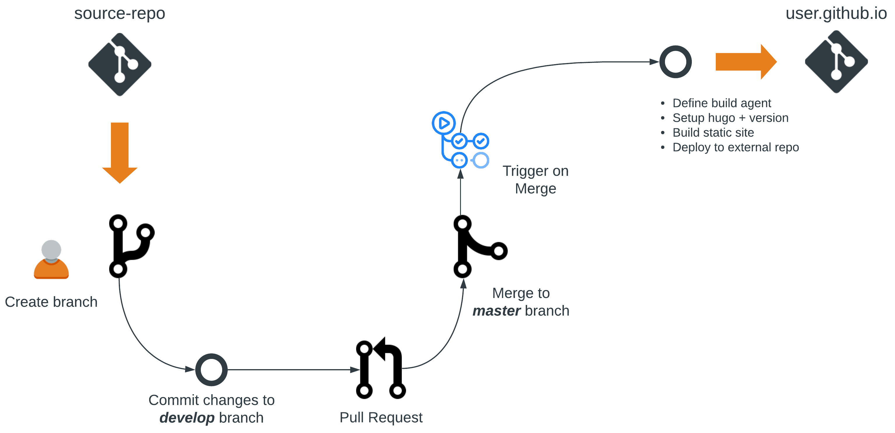

# Automating Blog Releases: Hugo + GitHub Actions

A lot of the work I do professionally involves transforming _traditional_ network culture, practices, and technology. Just as [DevOps](https://www.atlassian.com/devops) transformed application delivery, [NetDevOps](https://cumulusnetworks.com/blog/netdevops-meaning/) is here to make sure the network can keep up. This post will cover how I deploy this blog with [Hugo](https://gohugo.io/) to [GitHub Pages](https://pages.github.com/) using [GitHub Actions](https://github.com/features/actions) to completely automate the workflow. This is very similar to how I approached modernizing network documentation for my current employer. Listen to [Day Two Cloud Podcast](https://packetpushers.net/podcast/day-two-cloud-034-everything-as-code-including-documentation/) as I talk through this transformation in more detail.

## Why Docs-as-Code?
[Docs-as-Code](https://www.writethedocs.org/guide/docs-as-code/) refers to the philosophy that you should be writing documentation with the same tools as code. It is also an easy and non-intrusive way to get traditional engineers started using tools like [git](https://git-scm.com/) which have practical use cases far beyond documentation. Some of the benefits include:

* Version Control (Git)
* Incorporating Automation (CICD)
* Ensure Docs evolve with code (Linked work items)
* Adopt _DevOps_ practices in network engineering (Priceless)

## Static Site Generation
Static sites are making a comeback! In today's world, speed and security are kind of a big deal. The more complex something is, the more difficult it is to secure. Static site generators are becoming popular as they bridge the gap between static sites of old, and dynamic sites of today. Benefits of static webpages include:

* Cost (Fast delivery, low up front cost)
* Simplicity (Hosting, scaling, and automation)
* Speed (No backend database calls or dynamic content generation)
* Security (Less exposure to the internet)

> A request can only be made for files that contain *HTML*, *CSS*, *JavaScript*, *Images*, *Audio*, or *Video*. Since there is no database to breach and no server-side platform or CMS, the threat vector doesn't exist to maliciously control an application or exploit a database.

## Hugo - Static Site Generator

[Hugo](https://gohugo.io/) is written in [GoLang](https://golang.org/) and claims to be the world's fastest framework for building websites. At **_<1 ms_** per page, the average site builds in less than a second. It doesn't take many cycles to get acclimated with writing in [Markdown](https://www.markdownguide.org/), and [Hugo's Shortcodes](https://gohugo.io/content-management/shortcodes/) help you extend functionality to new heights.

## GitHub - Source + Build + Release

Since everyone knows what [GitHub](https://github.com/) is and are probably already experts at using **_git_**, this doesn't require much explanation. If you are not an expert, then have a look [here](https://www.atlassian.com/git/tutorials/comparing-workflows/gitflow-workflow) to educate yourself. You may not know as much about GitHub Pages and GitHub Actions.

### GitHub Pages
[GitHub Pages](https://pages.github.com/) allows you to host a webpage directly from your GitHub repository. This is a great way to showcase your blog, portfolio, project, documentation, or anything else you are interested in sharing with the world. With no databases to setup and no servers to build, you can focus more on content and less on management.

All your host provider has to do is serve static assets. Since they don't need to support a specific programming language or framework, this makes it simple to host, manage, and even migrate to another hosting provider. Professionally, I am using [Pivotal Cloud Foundry on Azure](https://docs.microsoft.com/en-us/azure/cloudfoundry/cloudfoundry-get-started) to host a **NetDevOps** DocSite.

### GitHub Actions

[GitHub Actions](https://github.com/features/actions) enable you to automate your workflow. I have been using [Azure Pipelines](https://azure.microsoft.com/en-us/services/devops/pipelines/) quite a bit recently for [continuous integration and continuous delivery (CI/CD) ](https://opensource.com/article/18/8/what-cicd). With the exception of a few things, GitHub Actions worked in a very similar way and is a breeze to setup. I would imagine GitHub Actions will be leveraged largely by the open source community as GitHub is geared for open source projects.

## Putting it Together
There are a few different ways you can deploy a static site using [Hugo](https://gohugo.io/) on [GitHub Pages](https://pages.github.com). I like the idea of keeping my source code in a dedicated repository and generating the contents of the site to an external repository. For me, this seems much cleaner than building the content inside the same repository and lends itself more to to a logical branching strategy.

### Setup Repositories
* **User/Org** or **Project** repo setup - [Instructions here](https://gohugo.io/hosting-and-deployment/hosting-on-github/)
* Hugo source repo setup (This repo can be private, and the naming convention doesn't matter)
* Hugo site committed to source repo (To _develop_ or other integration branch)

### Generate SSH Keys
To enable the ability to push from source to destination repo, we need to generate SSH keys.


# Private key added as a secret in Hugo source repo
# Public key added as deploy key in GitHub Pages repo
ssh-keygen -t rsa -C "hugo_deploy" -b 4096 -f ~/.ssh/hugo_deploy


### Add Source Repo - Secret
Navigate to settings on the source repo and create a new secret with the name **_ACTIONS_DEPLOY_KEY_**. Use your private key contents as the _Value_ for the secret.

### Add Destination Repo - Deploy Key
On the GitHub Pages repo, we need to create a Deploy Key. The naming convention doesn't matter, but should be descriptive like - **_Deploy Key Pub_**. Use the public key contents as the _Key_.

### Workflow Overview
Since I am the only one contributing to [this blog](https://wcollins.github.io), the branching is pretty simple. I create a branch for a given post and merge back with **develop** (integration) branch. Once I am ready to release a new post, I create a pull request and merge back with **master**. The workflow looks something like this:

### Workflow File
Add **_.github/workflows/deploy_hugo_site.yml_** to the Hugo source repo. Substitute _username/destination-repo_ with the appropriate GitHub Pages / Destination repo.



### Validation
Once the code is committed and the workflow gets triggered, you can track the progress under **Actions** in the hugo source repo. The first time a site is deployed to GitHub Pages, you will have to wait a few minutes for it to be reachable. Subsequent releases should update within a few seconds.

## Conclusion
If you want to check out some popular alternatives to [Hugo](https://gohugo.io/), check out [Jekyll](https://jekyllrb.com/) and [Gatsby](https://www.gatsbyjs.org/). In integrating these types of tools into a technical workflow, you are not force-fitting _writer-centric_ tools onto engineers but rather fitting the documentation into _developer-centric_ tooling.
