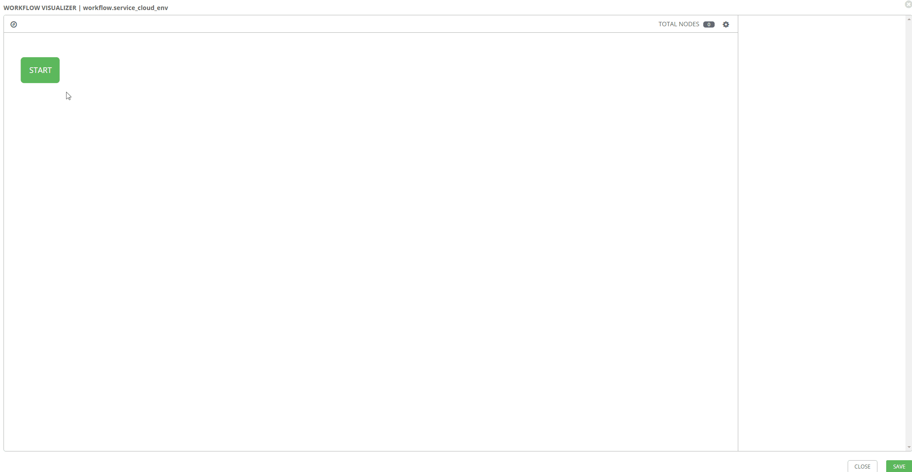
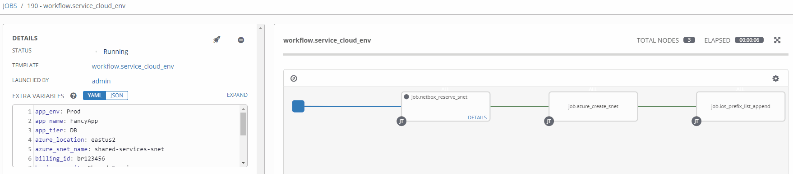
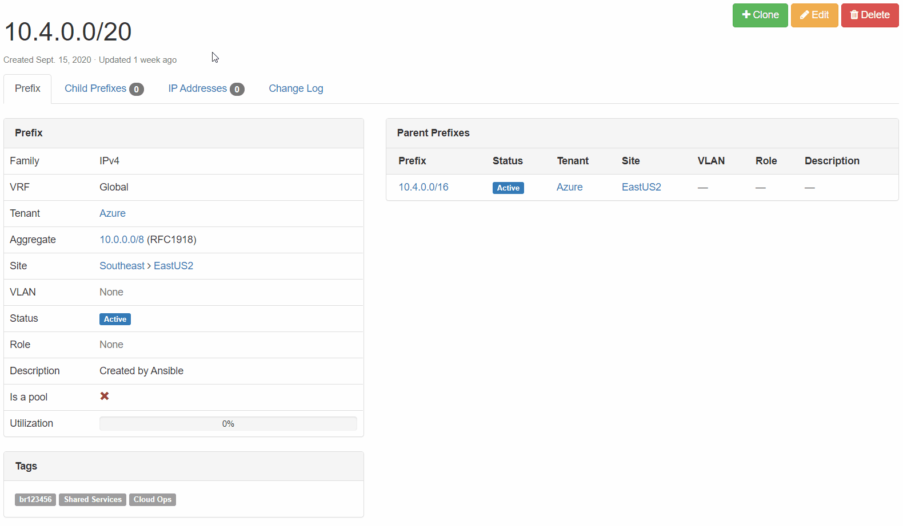

# AnsibleFest 2020 - Automating IPAM In Cloud

[AnsibleFest 2020](https://www.ansible.com/ansiblefest), like most conferences this year, took place completely virtual. I presented on _Automating IPAM In Cloud: Ansible + Netbox_. You can find the slides along with the demonstration code in [this git repo.](https://github.com/wcollins/ansible-cloud-ipam) In this post, I'm going to expand a little further on the content I presented.

## What is IPAM?
_IP Address Management (IPAM)_ is the critical component that organizes your IP addresses and networks in one place. Responsible management of IP addressing drives efficient, repeatable, and reliable network automation. It is also a dependency for many other types of automation. Think of all the things that require IP addresses to communicate?

## The Problem
If you are _hybrid multi-cloud_, it probably means you share the same [RFC1918](https://en.wikipedia.org/wiki/Private_network) space across clouds and traditional networking. If this is the case, it means you probably want to keep track of allocation across _VNets_, _Subnets_, and _VMs_.

### Boundaries Are Blurred
* As Hybrid Multi-Cloud becomes a reality, private IP space becomes shared across cloud(s) and on-premises
* Developers leverage **CI/CD** as they deploy, maintain, and migrate applications in the cloud; network can't keep up
* Some developers do not have a good understanding of how IP addressing works and how to consume it responsibly

### Inconsistency In Data Domains
* Data required for efficient automation is often dispersed across many tools and platforms
* Frequently, overlap can exist between these tools and platforms for a given data domain
* Tools and platforms may be owned and managed by different teams with different directions
* Good automation is dependent on data accuracy, consistency, and ability to be consumed

## What Is Our Desired Outcome?
Aside from the idea that we want to automate IP address management, the main focus is **user experience**. This encompasses the overall experience for those designing for the future, supporting current, and consuming cloud networking services. The following considerations are critical:
* Minimal human intervention
* Repeatable with other cloud providers
* Compatible across traditional + cloud networking
* End-to-end network automation

## Why Automate Here?
If [_Tesla_](https://www.tesla.com/) can make self-driving cars and my coffee maker turns itself on in the morning, we can automate _IPAM_ across the _hybrid multi-cloud_ network, right? Also, the cloud demands agility. If you want agility, you need design patterns to build something repeatable against. If you manage IPAM in the cloud with any Microsoft Office tool, you are doing it wrong.

### Why Ansible and Netbox?
Leveraging something like [Ansible](https://ansible.com) begins to make sense when the goal is automation at scale for networking across multiple vendors and environments. [Netbox](https://netbox.readthedocs.io/en/stable) can serve as a Source of Truth intended to represent the _desired_ state of a network versus its _operational_ state. The API is very flexible, and the functionality can drive many automation use cases well beyond IPAM.

### Prerequisites
This post will not detail how to deploy Ansible or Netbox as there is plenty of examples out there already. There is excellent documentation for setting up both of these platforms via [Docker](https://docker.com). Instructions for setting up _Ansible AWX_ can be found [here](https://github.com/ansible/awx) and _Netbox_ [here.](https://github.com/netbox-community/netbox-docker)

To authenticate to an Azure subscription, you will need to create a [Service Principal](https://docs.microsoft.com/en-us/azure/active-directory/develop/app-objects-and-service-principals). Once a Service Principal is created, you will need to assign a role so that you can access the resources in that subscription. Detailed instructions for completing these steps can be found [here.](https://docs.microsoft.com/en-us/azure/active-directory/develop/howto-create-service-principal-portal)

## What Are We Automating?
Let's examine the cloud environment so we can begin formulating our approach for how we want to automate.

### The Technology

### Digging Down Into The Environments
In the cloud, you generally have a hierarchy in which logical components exist, which may contain additional logical components. With Azure, for instance, management groups include subscriptions. Subscriptions hold Resource Groups, which include VNets. A VNet may be a shared resource across many apps and services in scope across many teams.

Colocation Data Centers like [Equinix](https://www.equinix.com/) or [Megaport](https://www.megaport.com/) are being used more frequently as demand for cloud services increase. We will need to make some changes to a few physical [Cisco ASRs](https://www.cisco.com/c/en/us/products/routers/asr-1002-hx-router/index.html), so packets can route.

## Design Drives Automation
Thinking through a given design is a crucial element for how you approach the automation. If our goal is _end-to-end_ network automation at scale, that means we must automate across multiple vendors and environments.

### Standard Workflows
To automate both the foundational (shared) and service-oriented (app-specific) components, leveraging two distinct workflows makes sense.

### A Scalable Tagging System
If you want to do cloud right, cost governance should be in your considerations. This means a well-designed and consistently applied tagging convention, which compliments lifecycle management, automation, and visibility in reporting. In treating our pets like cattle, we need a _source of truth_ with standardized identification across all networking components.

### Touchpoints
Between both of our workflows, there are numerous touchpoints:
* [network_cli](https://docs.ansible.com/ansible/latest/plugins/connection/network_cli.html) for traditional networking
* [Ansible Cloud Modules](https://docs.ansible.com/ansible/latest/modules/list_of_cloud_modules.html#azure) via [Azure Resource Manager](https://docs.microsoft.com/en-us/azure/azure-resource-manager/management/overview)
* [Netbox Collection](https://galaxy.ansible.com/netbox/netbox) leveraging the Netbox API

## Breaking Down The Logic
A great benefit of using [Ansible](https://www.ansible.com/) is flexibility. This can also cause significant confusion as there are many ways in which we can structure things. It is beneficial to understand the structure, logic flow, and inheritance.

### Project Structure
Thinking through your project structure can make future work more manageable. The following guide -  [Best Practices - Content Organization](https://docs.ansible.com/ansible/latest/user_guide/playbooks_best_practices.html) in Ansible's documentation is a good starting point. However, this is not a one size fits all scenario, and experimenting, reevaluating, and tweaking will probably be necessary. The following approach has served me well in the past.

### Ansible Collections
[Ansible Collections](https://www.ansible.com/products/content-collections) are pretty slick. My only recommendation here is, manage your collections with a _requirements.yml_ file. When it comes to testing new versions of a collection, all you need do is create a new git branch, set the new version in your _requirements.yml_ file, and point Tower to this branch. Ansible has documented collections usage pretty thoroughly [here.](https://docs.ansible.com/ansible/latest/user_guide/collections_using.html)

[**ansible-cloud-ipam/collections/requirements.yml**](https://github.com/wcollins/ansible-cloud-ipam/blob/master/collections/requirements.yml)


> I would stress never pulling down collections from Galaxy and committing them directly into the source control repository for your project. Friends do not let friends engage in this type of behavior!

### High-Level Plays
The playbooks sitting in our root project folder are pretty simple. They are primarily used as the _entry_ point for Ansible and execute based on a specific condition.

[**ansible-cloud-ipam/play.azure_snet_add.yml**](https://github.com/wcollins/ansible-cloud-ipam/blob/master/play.azure_snet_add.yml)


### Functional Roles
Roles for this demo are organized by either a given platform or OS type. Each role's main file will include specific _tasks_ to use based on the condition defined in the root level play.

[**ansible-cloud-ipam/roles/netbox/tasks/main.yml**](https://github.com/wcollins/ansible-cloud-ipam/blob/master/roles/netbox/tasks/main.yml)


### Purpose Built Tasks
The actual logic is handled inside a given role's tasks. Each task is purpose-built and does a very intentional thing. Also, the idea is to keep things DRY _(Don't repeat yourself)_ so that we can easily reuse things. This means we don't want to set values here statically. The smaller a thing is, the less it does. If something does less, it makes it easier to repeat.

[**ansible-cloud-ipam/roles/netbox/tasks/task.netbox_reserve_prefix_snet.yml**](https://github.com/wcollins/ansible-cloud-ipam/blob/master/roles/netbox/tasks/task.netbox_reserve_prefix_snet.yml)


### The Physical Network
Out of the three platforms we have interacted with here, the [Cisco ASR](https://www.cisco.com/c/en/us/products/routers/asr-1002-hx-router/index.html) is the only one that isn't _API_ driven. For automating this beauty, I'll be using the [ios_config](https://docs.ansible.com/ansible/latest/modules/ios_config_module.html) module for configuration.

There are more modern ways to do this today, but this is probably the reality for most in practice. This is a straightforward use case, so this type of execution serves its purpose for a demo's scope. Each time the _Service Workflow_ is run, the subnet it reserves will be appended to a _prefix-list_ living on the _ASR_.

In a _real world_ cloud scenario, this _prefix-list_ could be used to identify and filter traffic. It could then be used inside a _route-map_ to enable and enforce policy criteria beyond the _routing table_. When doing BGP to the cloud, this can be important as you may want to enforce specific policies on specific neighbors to particular clouds.

[**ansible-cloud-ipam/roles/cisco-ios/tasks/task.ios_prefix_list_append.yml**](https://github.com/wcollins/ansible-cloud-ipam/blob/master/roles/cisco-ios/tasks/task.ios_prefix_list_append.yml)


## Putting It All Together
Ansible Tower offers two flavors of templates. [Job Templates](https://docs.ansible.com/ansible-tower/latest/html/userguide/job_templates.html) are used to execute a single task many times, while [Workflow Templates](https://docs.ansible.com/ansible-tower/latest/html/userguide/workflow_templates.html) stitch together multiple _Job Templates_.

The value here aims at getting the same outcome that your typical _Build/Release_ pipelines would offer for _Infrastructure as Code_. When thinking of _infrastructure as Code_, I generally think _immutability_ and cloud _exclusivity_. 

In my opinion, this approach lends itself more to remaining flexible and accommodating for a multitude of disparate and traditional infrastructure while also providing the ability to integrate with new technologies.

### Job Templates
In the spirit of building for repeatability, I created _Job Templates_ for each unique task. This allows me to reuse them over time in new _Workflow Templates_ as new use cases present themselves.

### Workflow Templates
I then assembled my two _Workflow Templates_ outlined above. The _Base Workflow_ in practice would be run far less frequently than the _Service Workflow_.

### Workflow Visualizer
Stitching your workflow together is pretty simple with Tower's _workflow visualizer_. Once you create a blanket workflow, you can add and arrange jobs.

### Using Surveys
[Surveys](https://docs.ansible.com/ansible-tower/latest/html/userguide/job_templates.html#surveys) are a great way to populate variables at runtime interactively. Once a _source of truth_ in a given data domain is populated, and the logic is more mature, this will probably be used less.

### Workflows In Action
Now that our workflow is populated with the right variables let's take it for a spin!

### A Little Manual Validation
Purely for the sake of delightful visuals, let's validate a few things.

**Netbox Prefix Reservation:**
We can see here that the next available prefix was reserved, configuration criteria are correct, and our enforced tags are in place.

**Cisco ASR 1002-HX Configuration:**
The prefix reserved above has now been added to the _cloud-allowed-prefixes_ list on our router. If the list does not exist, the job will create it. From there, any new prefixes reserved will then be appended.

## Conclusion
Building a logical way for developers to consume _IPAM_ at the speed of cloud is **_WINNING!_** Remember, go **fast**, but go **responsibly!**

