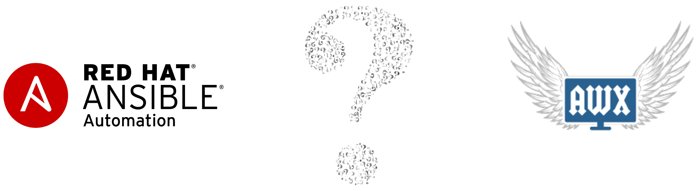
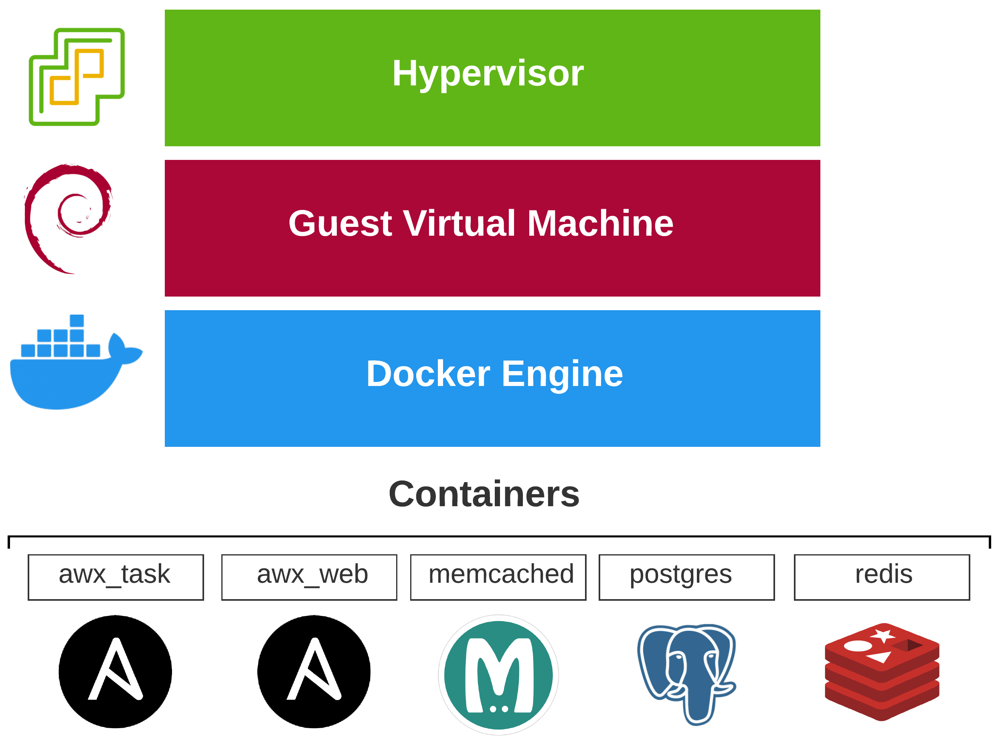
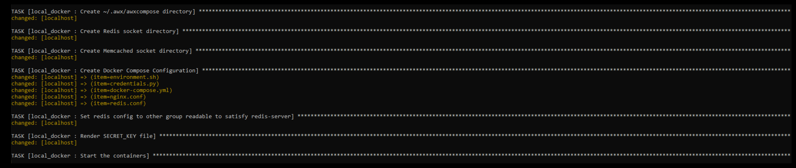
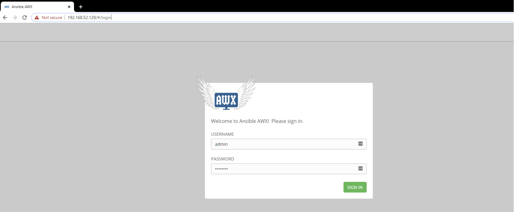
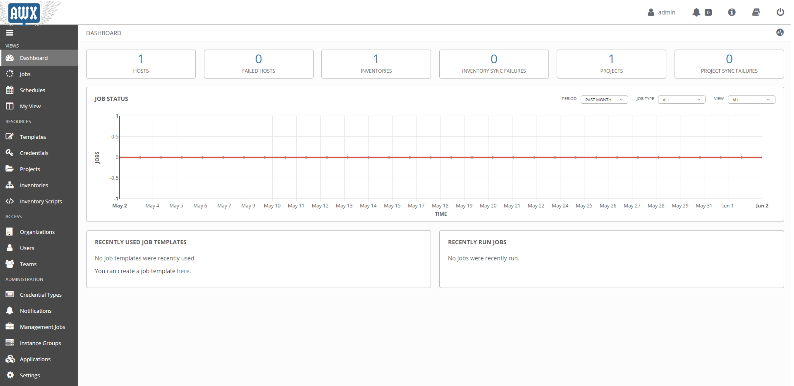

# Setting Up Ansible (AWX) On Debian

## Ansible Tower VS AWX
The best way to learn is by constructing your own knowledge, not passively absorbing information. A lot of great projects are open source these days, including [The AWX Project](https://www.ansible.com/products/awx-project). At zero cost, you can build your automation skill set, increasing your chances at landing that next big promotion.

This post will cover how to setup _Ansible AWX_ on [Debian](https://www.debian.org/intro/about). I use a combination of [Ansible](https://ansible.com) and [Terraform](https://terraform.io) in the _NetDevOps_ toolchain. These tools play a huge role in keeping my knowledge relevant as _Tech_ progresses.

### What is AWX?
So, maybe you have heard of this _Linux Distro_ called [Fedora](https://getfedora.org). This is the fast moving upstream project for [Red Hat Enterprise Linux (RHEL)](https://www.redhat.com/en/technologies/linux-platforms/enterprise-linux). Red Hat also funds [CentOS](https://centos.org) which is essentially a clone of _RHEL_ minus all Red Hat branding. This is kind of how _AWX_ works upstream for the official [Ansible Tower](https://www.ansible.com/products/tower) product.

> Red Hat also announced [CentOS Stream](https://www.centos.org/centos-stream/) which sits between bleeding edge _Fedora_, and rock solid _RHEL_. Sitting somewhere in the middle, this would allow developers an easier path for getting their packages in _RHEL_.

### How does it differ from Ansible Tower?
**The AWX Project**
- Fast iterating with frequent releases
- No paid enterprise support available
- Direct in-place upgrades are not supported
- Not recommended for use in _Production_
- Licensed under [Apache 2.0](https://www.apache.org/licenses/LICENSE-2.0)

> _AWX_ is a fantastic tool for the lab, testing, and demos. If you want to dip a toe into the _Ansible Tower_ world without forking over the cash, look no further.

**Ansible Tower**
- Commercial derivative of _AWX_
- Longer release cycle aimed at long-term supportability
- Fully supported and license based solution
- In-place upgrade to latest version (from up to two major releases behind)
- Recommended for use in _Production_

> Ansible Tower is the reliable solution you want for the _enterprise_. Deployment may differ since you will likely make use of _scale-out clustering_ for added redundancy and capacity.

## Deployment Options
_AWX_ runs as a containerized application using _Docker_ images deployed to either [OpenShift](https://github.com/ansible/awx/blob/devel/INSTALL.md#openshift), [Kubernetes](https://github.com/ansible/awx/blob/devel/INSTALL.md#kubernetes), or [Docker Engine](https://github.com/ansible/awx/blob/devel/INSTALL.md#docker-compose). 

### Standalone Deployment with Debian + Docker
 In the spirit of keeping this simple, I use _Docker_ running on [Debian Linux](https://www.debian.org/intro/about) in the lab. I also run everything on virtual machines as _snapshots_ are a beautiful thing. Any _hypervisor_ should work - [VMware Workstation](https://www.vmware.com/products/workstation-pro.html), [Oracle VirtualBox](https://www.virtualbox.org/), [ESXi](https://www.vmware.com/products/esxi-and-esx.html), or even [KVM](https://www.linux-kvm.org/page/Main_Page). For this setup, I'll be using _VMware Workstation_.

 

 ### Why Debian?
My love for Linux started back in the _90s_ with [Slackware.](http://www.slackware.com/) At some point or another, I tested out [Debian](https://www.debian.org/) and my wish for the perfect operating system was granted. For me it strikes the right balance between ease of use, stability, and airy minimalism. Using the [Debian netinstall](https://cdimage.debian.org/debian-cd/current/amd64/iso-cd/debian-10.4.0-amd64-netinst.iso), you only install what you need. I have _AWX_ running smoothly with:
* Processor: 1
* Memory: 2 GB
* Hard Disk: 12 GB

### Prerequisites
The official _prerequisites_ for _AWX_ can be found [here.](https://github.com/ansible/awx/blob/devel/INSTALL.md#prerequisites) I'll be using [Debian 10 - Buster](https://wiki.debian.org/DebianBuster) however any release **_>=_** 10 will work. At this point, _Debian_ should be installed, running, and reachable.

If running in a _virtual machine_, a snapshot should be taken _now_. In the event anything goes wrong, this is an easy way to revert back to our beginning state.

## Getting Started
> **_Disclaimer_**: Downloading and executing scripts from the internet may potentially harm your machine. Make sure to review the source code before execution so that you have a good understanding of what is going to happen.

### The Installer Script
The installer is pretty basic. It will make sure we are up to date, install some dependencies, clone the projects, set a few parameters, and start the install.

**_awx_install.sh_**


### Running The Installer

# Go home!
cd ~/

# Install cURL
sudo apt-get install -y curl

# Run the installer
curl -sSL https://gist.githubusercontent.com/wcollins/caca9aa1c416d05379ab3638804e3dd6/raw/479e5e8d6d0f5a93db9f3ee0a6cd46d8ef310e6e/awx_install.sh | bash


Depending on _host machine_ horsepower, this may take a few minutes. You should see progress as the installer deploys the containers.

### Validation + Login
If using _VMware Workstation_ with network adapter type: _NAT_, you can see what _IP Address_ it gave you with **_/sbin/ifconfig_**. You should then be able to reach this _IP_ from your host machine. 

On the permanent instance I have up and running in the lab, I'm using [GitHub Actions](https://github.com/features/actions) to build and release after each _AWX_ software release. I use [Linux KVM](https://wiki.debian.org/KVM) as a _Type-1_ hypervisor with a static _IP_ of my choice assigned.

We should now be able to login with _default credentials_ for _AWX_. There are many _best practice_ considerations we would work through for handling _authentication_ in a production environment but for the lab, we just want to roll up our sleeves and dive in, right?

## Conclusion
Don't wait to get started with automation. If you wait, you may miss out on a great opportunity. With so much open source software available, there is no upfront cost other than a laptop powerful enough to run a few _virtual machines_.

In the land of _network engineering_, getting your feet wet with _public cloud_ and _automation_ can help you make that next big step in your career. There is currently a _high-demand_ with _low-supply_ for these skills in the _network engineering_ space.
