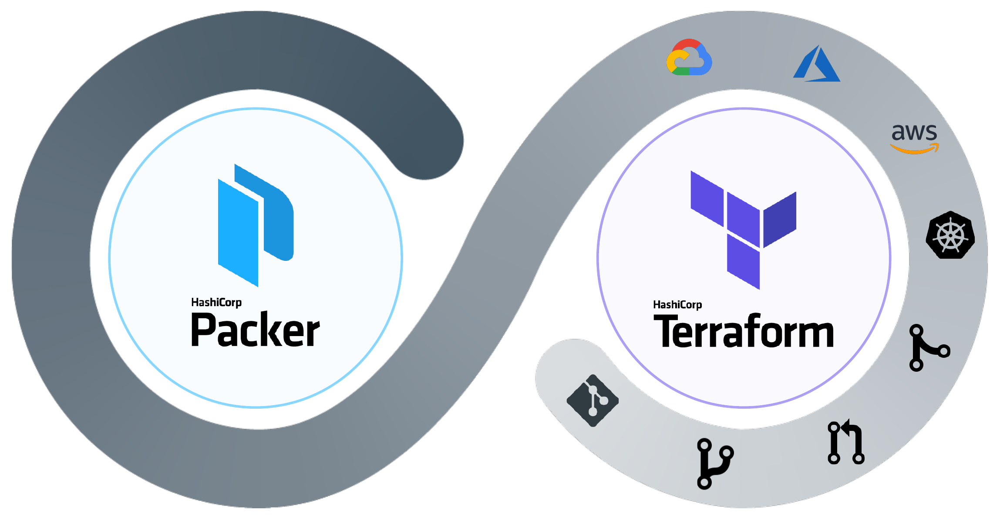
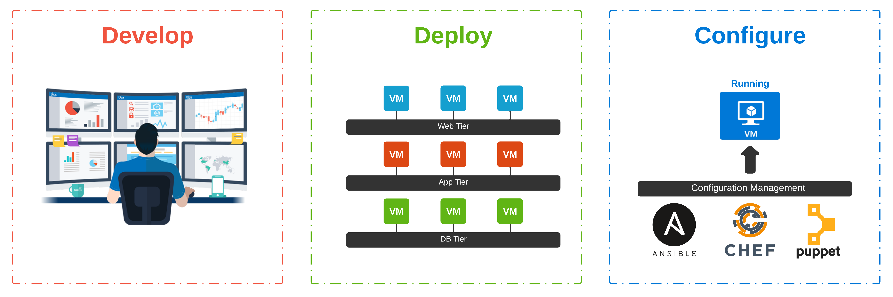
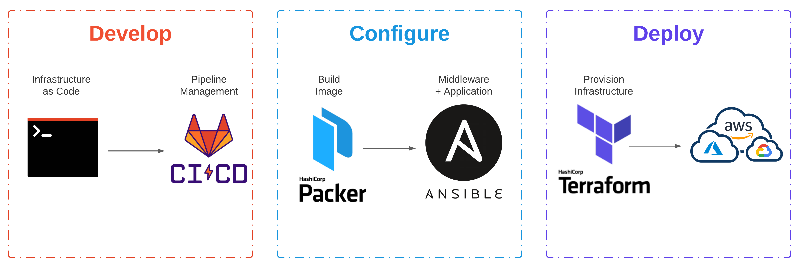
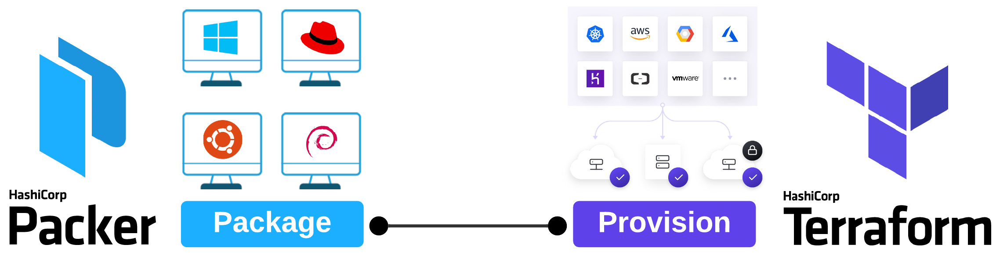
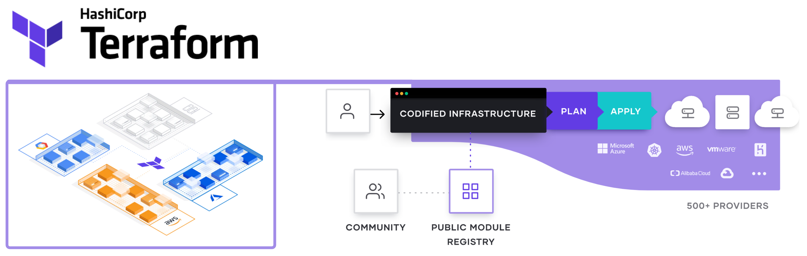

# Cloud Grade Automation With Packer and Terraform

Manually provisioning infrastructure slows down application delivery, isolates knowledge, can hamper operations teams, and doesn't scale. Automating infrastructure provisioning can address these challenges by shifting manual process into code. [Hashicorp](https://www.hashicorp.com/) has products spanning the infrastructure, security, and application stack that can unlock that cloud operating model and deliver applications faster.

Let's examine _image lifecycle management_ and _IaaS deployment_. Both of these tasks are common challenges faced by the _enterprise_ when moving to the cloud. Using [Packer](https://www.packer.io/), we can _automate_ the build process for images and then deploy common infrastructure and [virtual machines](https://azure.microsoft.com/en-us/services/virtual-machines/) with [Terraform](https://www.terraform.io/).

## What Is Cloud Grade Automation?
I started using this expression as a _catch phrase_ some time back, mainly in Powerpoint slides. The way I would describe its meaning goes well beyond a single tool, process, or methodology. To me, it embodies the core guiding principles for cloud and application delivery in today's landscape. Let's start with the outcomes we are aiming for:
* Loosely coupled application architecture; Cloud Native
* Infrastructure hosting a given application is delivered intact
* Infrastructure is never touched, changed, or otherwise modified in any way
* When changes are necessary, the environment is re-deployed from the newest artifact
* Rollback occurs in the same way except with an older versioned artifact

The culture, tooling, process, and delivery that can achieve these outcomes, is my impression of what _Cloud Grade Automation_ is. I'll be focusing specifically on the tooling and delivery in this post.

## Evolving Automation
Automation can typically be handled at two different stages of a given _workflow_. Choosing which stage can ultimately drive _operational_ decisions. As application architectures have evolved, the automation used to build the infrastructure has transformed. Complexity has largely shifted from _runtime_ to _build-time_.

### Runtime - (Mutable)
When we think _automation_, folks that have been around a while typically think in terms of _mutable_. This means we deploy our server and then configure, update, or modify it _in-place_. I have seen anything from scripts (Shell, Perl, and Python) to configuration management tools like [Ansible](https://www.ansible.com/), [Chef](https://www.chef.io/) and [Puppet](https://puppet.com/) used to accomplish this.

> [Webster](https://www.merriam-webster.com/dictionary/mutable) defines _mutable_ as **":prone to change: INCONSTANT"**.

To further expand on _runtime_ configuration, let's take the example of installing an agent-based solution. For the sake of demonstration, let's say that each virtual machine provisioned in our infrastructure requires running [ThousandEyes - Enterprise Agents](https://www.thousandeyes.com/product/enterprise-agents) for monitoring.

* A _greenfield_ application is getting developed; New infrastructure is required (Develop)
* The new server (or multiple servers) are provisioned for the application to run on (Deploy)
* Config Management tooling applies the standard configuration, including the Agent (Configure)

_Mutable_ infrastructure is susceptible to _configuration drift_. As individual changes get applied on servers throughout their lifecycle, the configuration will significantly differ from the _desired state_ and other servers across the environment.

### Build-time - (Immutable)
_Immutable_ infrastructure aims to reduce the number of moving pieces at _runtime_. Handling infrastructure this way speeds up delivery, eliminates configuration drift, increases environment consistency, optimizes rollback, and simplifies horizontal scaling.

> [Webster](https://www.merriam-webster.com/dictionary/immutable) defines _immutable_ as **":not capable of or susceptible to change"**.

To further expand on _build-time_ configuration, let's take the same example used above:
* A _greenfield_ application is getting developed; New infrastructure is required (Develop)
* The standard configuration and _Enterprise Agent_ get packaged at build-time (Configure)
* Infrastructure is provisioned using the machine template and deployed at _runtime_ (Deploy)

Building _immutable_ infrastructure can be a significant undertaking when considering the transition of _brownfield_ applications. One dependency ensures that the _application layer_ remains [stateless](https://en.wikipedia.org/wiki/Service_statelessness_principle), including servers. Anything at this level should and will be consistently destroyed and rebuilt.

## Getting Started With Packer
[Packer](https://www.packer.io/) automates the creation of any machine image. Once the image is packaged, it can then be provisioned with Terraform. While this is the new, modern, cool, and cloud way to accomplish this, other methods have existed for a very long time. Back in 2014, I was doing _non-interactive_ installs of various Linux distributions on [Linux KVM](https://www.linux-kvm.org/page/Main_Page) with [virsh](https://libvirt.org/manpages/virsh.html) and [virt-install](https://linux.die.net/man/1/virt-install). Virt-install would use _libvirt's_ streaming API to upload the kernel and modified _initrd_ to the remote host.

### Building A Machine Image
As an example, let's package an [Ubuntu 18.04](https://releases.ubuntu.com/18.04/) image with a [ThousandEyes - Agent](https://www.thousandeyes.com/product/enterprise-agents). Although an overly simplistic example, it should demonstrate our desired intent and behavior. Demo code can be found [here.](https://github.com/wcollins/packer-azure-demo-linux)

[**ubuntu-18.04-LTS.json**](https://github.com/wcollins/packer-azure-demo-linux/blob/master/ubuntu-18.04-LTS.json)


> Instead of using the _shell_ provisioner to deploy the agent (see line 35 in the template), a more elegant method would call the **"type": "ansible"** provisioner pointing to a **playbook.yml** file in the repository. This would allow you to separate packages into separate playbooks managed in _version control_.

## Getting Started With Terraform

[Terraform](https://www.terraform.io/) codifies cloud APIs into declarative configuration files. If you want to create reproducible infrastructure for consistent testing, staging, and production environments with the same configuration, look no further! While it's generally not that simple, Terraform does seem to be the _defacto_ tool these days for _Infrastructure as Code_ in the cloud.

### Deploying Some Infrastructure
Let's deploy some foundational infrastructure along with a [virtual machine](https://azure.microsoft.com/en-us/services/virtual-machines/) provisioned from the _machine image_ we built above with Packer. Demo code can be found [here.](https://github.com/wcollins/terraform-azure-demo-vm)

[**main.tf**](https://github.com/wcollins/terraform-azure-demo-vm/blob/master/main.tf)


> This template is an example. In practice, this would probably be broken up into at least two distinct modules (network and compute). If specific groups of resources have a similar life cycle, you would probably create a module for them. An example of this might be core network components like VNets, Subnets, and UDRs.

## Conclusion
Learning to use [Packer](https://packer.io) or writing [Terraform](https://terraform.io) templates is a tiny piece of a vast puzzle. If the desired outcome is [Continuous Delivery](https://https://aws.amazon.com/devops/continuous-delivery/) then application architecture, cultural philosophies, and [release management](https://https://en.wikipedia.org/wiki/Release_management#:~:text=Release%20management%20is%20the%20process,testing%20and%20deploying%20software%20releases.) all play equally important roles.

Enterprise Leaders all want [DevOps](https://https://en.wikipedia.org/wiki/DevOps#:~:text=DevOps%20is%20a%20set%20of,delivery%20with%20high%20software%20quality.) for the benefits of automation, quicker releases, reduced downtime, reliable recovery from disasters, and cost benefits in the cloud **(That last one makes me chuckle)**. The real question is, will they do what is necessary to buck traditional culture and adopt truly immutable infrastructure?
