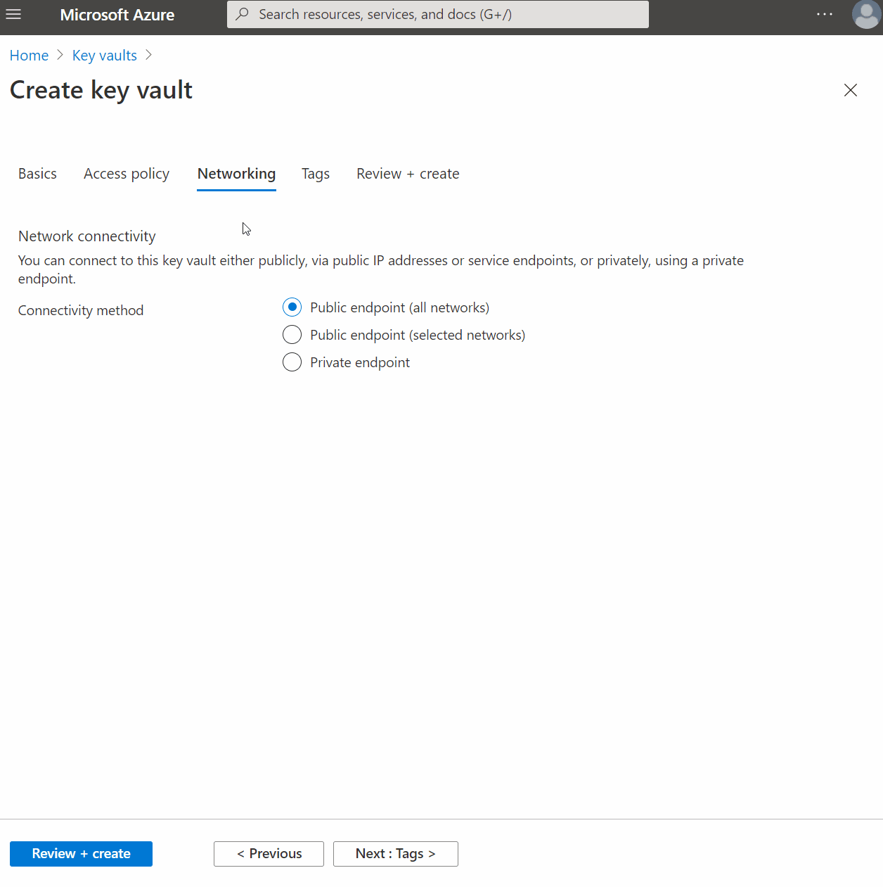

# Cloud Security And Azure Private Link

[Azure Private Link](https://azure.microsoft.com/en-us/services/private-link/) enables access to _hosted_ customer and _partner_ services over a private endpoint in an Azure virtual network. This means private connectivity over your own [RFC1918](https://tools.ietf.org/html/rfc1918) address space to any supported [PaaS](https://azure.microsoft.com/en-us/overview/what-is-paas/) service while limiting the need for additional gateways, NAT appliances, public IP addresses, or [ExpressRoute (Microsoft Peering)](https://docs.microsoft.com/en-us/azure/expressroute/expressroute-circuit-peerings#microsoftpeering).

Hold on, wasn't the point of [Public Cloud](https://azure.microsoft.com/en-us/overview/what-is-a-public-cloud/) to leverage services offered by _third-party_ providers over the public internet? Why, then, would we want to contain traffic in our private IP space, which is likely routable across our on-premises network? Let's examine this a little deeper to understand the problem we are aiming to solve, solutions available today, some complexities introduced with _Private Link_, and why we wouldn't just use PaaS services _as is_.

> Microsoft announced Private Link [(Preview)](https://azure.microsoft.com/en-us/blog/announcing-azure-private-link/#:~:text=With%20today%27s%20announcement%2C%20you%20can,using%20simple%20clicks%20and%20approval) in 2019 becoming generally available in [early 2020](https://azure.microsoft.com/en-us/updates/private-link-now-available-in-ga/). AWS released their flavor of [Private Link](https://aws.amazon.com/privatelink/?privatelink-blogs.sort-by=item.additionalFields.createdDate&privatelink-blogs.sort-order=desc) back in 2017. [Google Cloud](https://cloud.google.com/) released [Private Service Connect](https://cloud.google.com/blog/products/networking/introducing-private-service-connect) in 2020.

## The Problem
Leveraging [PaaS](https://azure.microsoft.com/en-us/overview/what-is-paas/) services is kind of like owning a home. Except in that home, you don't have to fix cracks in the foundation, patch that leaky roof, clean the garage, or even mow the lawn. PaaS services significantly reduce infrastructure management and increase agility while simplifying your ability to scale. Security-focused teams will usually identify the following as problems when talking _PaaS_:

* The risk of **data leakage / exfiltration** increases as PaaS integration with [IaaS](https://azure.microsoft.com/en-us/overview/what-is-iaas/) and on-premises environments increase
* Decreasing or eliminating **internet exposure** is preferred; Azure PaaS services were originally available via public IP addresses only
* Anything that runs over a network that isn't your own private _WAN_ is risky and must be **avoided**

> While I understand and share concerns with risk here, these are generally obstacles I have run into with various security teams throughout my time in tech. I can look back on some tough conversations in the past when trying to advocate for [SD-WAN](https://www.cisco.com/c/en/us/solutions/enterprise-networks/sd-wan/what-is-sd-wan.html). Since it went over the _internet_, it couldn't be reliable and introduced significant _risk_ to the business. Fast-forward to _2021_ especially in the current state of the [COVID-19](https://www.cdc.gov/coronavirus/2019-ncov/index.html) pandemic; most large enterprises now declare _internet_ as the new network, _public cloud_ as the new data center, and _identity_ as the new perimeter.

### Examining Cloud Security Models
Our scope here is _security in the cloud_, not _security of the cloud_. Security considerations differ in the cloud by service model. In descending through each service model's different layers, the responsibility for security shifts between Customer and Provider.

For example, with [SaaS](https://azure.microsoft.com/en-us/overview/what-is-saas/), the layers a customer is responsible for is relatively small; data and access/identity are considered. As you move into [PaaS](https://azure.microsoft.com/en-us/overview/what-is-paas/), the application layer, along with some platform configuration, comes into play. Moving into [IaaS](https://azure.microsoft.com/en-us/overview/what-is-iaas/), the operating system is now customer responsibility, along with all the layers above.

> When you have a nice mixture of the three cloud layers and the full gamut of all things data center, thinking through the security domain becomes complicated quickly. Add some [Multi-Cloud](https://en.wikipedia.org/wiki/Multicloud) to this venue, and you are in for a real party.

### Risky Patterns
In the _Digital Era_, privacy is at the top of the list. This is especially true when considering specific regulations like [GDPR](https://gdpr.eu/) or [HIPAA](https://www.cdc.gov/phlp/publications/topic/hipaa.html). A data leak can cause a significant loss in revenue and long-term damage to your brand. Specific patterns can expose the number of porous areas, contributing to possible data leakage if not appropriately hardened.

* [**Identity & Access Management _(IAM)_**](https://azure.microsoft.com/en-us/product-categories/identity/) - Access based on identity authentication and authorization controls; The ground floor for establishing [Zero Trust](https://www.microsoft.com/en-us/security/business/zero-trust) in the public cloud
* **Cloud Endpoints to On-Premises** - Services in public cloud provider's managed network need to make calls to on-premises _private networks_
* **On-Premises to Cloud Endpoints** - Exact opposite of the first pattern; Services in public cloud provider's managed network need to be called from an on-premises _private network_
* **Internet Egress** - Any point of internet exit; A sinister concoction of data center places, _properly designed_ cloud places, _shadow IT_ **oops** cloud places, and... plenty of other venues just south of anyone's radar

## A Word On Provider Architectures
For _public cloud_ to achieve the massive _scale-out_ which accommodates customer growth, _cloud services_ are built on large pools of resources (network, compute, and storage). This large pool of resources is managed by a centralized [control plane](https://en.wikipedia.org/wiki/Control_plane#:~:text=In%20computing%2C%20the%20control%20plane,that%20processes%20the%20data%20requests.). As demand increases, additional _resources_ are added to the pool to increase capacity.

### Service Behavior
There are ultimately two ways in which services can be categorized based on _networking_ behavior. Since this write-up is _Azure_ focused, I'll map _Azure_ specific constructs into the examples:

**Public Services** is typically what we think of when referencing _PaaS_. Public Services are consumed over the internet, reachable via _public IP addresses_, and are not provisioned in the customer's _VNet_. An example of a _public service_ would be [Azure Storage](https://azure.microsoft.com/en-us/services/storage/).

**Private Services** by default, are not reachable over the internet. Services are assigned [RFC1918](https://tools.ietf.org/html/rfc1918) addresses and are deployed directly inside a customer's virtual network. An example of a _private service_ would be an [Azure Virtual Machine](https://azure.microsoft.com/en-us/services/virtual-machines/).

### Resource Allocation
When customers provision a service, the _control plane_ will create an _instance_ of the service. Resources are then allocated accordingly. There are generally two ways in which a _service_ can allocate resources to an _instance_:

**Shared Services** - Resources are allocated to more than one service instance; Each instance consumes resources _simultaneously_.

**Dedicated Services** - Resources are allocated to a single instance; These resources remain dedicated for the _instance's_ entire _lifecycle_.

## Integration
Suppose you are going through the cloud migration journey. In that case, you may have some strategy that includes a combination of [rehost, replatform, and refactor.](https://aws.amazon.com/blogs/enterprise-strategy/6-strategies-for-migrating-applications-to-the-cloud/) At some point, you will probably be faced with integrating cloud [PaaS](https://azure.microsoft.com/en-us/overview/what-is-paas/) services with [IaaS](https://azure.microsoft.com/en-us/overview/what-is-iaas/) and even back _on-premises_.

## Before Service Endpoints
[Azure SQL DB](https://docs.microsoft.com/en-us/azure/azure-sql/database/sql-database-paas-overview/) is a great way to migrate your SQL Server databases without changing your apps, making it extremely popular. Before Service Endpoints came along, how would a [virtual machine](https://azure.microsoft.com/en-us/services/virtual-machines/) communicate to Azure SQL?

* Azure SQL DB is available via public IP address and listens on port 1433
* The virtual machine has direct connectivity to the internet via NAT'ed IP address
* The virtual machine leverages this for internet egress to reach Azure SQL service
* Azure SQL service sees the NAT'ed IP address, not the private IP of the virtual machine
* No restrictions can be enforced to limit service ingress to your private IP addresses only

### Why Is This Risky?
To filter traffic in this scenario, the virtual machine would need a public IP address. This presents the following complications:

* Virtual Machine now allows ingress directly from the internet (This is never a good practice)
* The subnet that hosts the virtual machine would require a NAT gateway; More configuration with potential performance implications
* Azure SQL would need to be open to clients on any network; In the event credentials are leaked, anyone on the internet could gain access

### Tradeoffs
Aside from being inflexible in controlling _ingress_ and _egress_ traffic, the route is not optimal. Traffic is technically going out to the internet, but this is probably, in reality, routing through Azure's external backbone and coming back in. The service is reachable via public IP address only. Considering the design and various integrations required to make it work, there could be significant opportunities for data leakage or exfiltration.

## VNet Integration
[VNet Integration](https://docs.microsoft.com/en-us/azure/app-service/web-sites-integrate-with-vnet) is leveraged for services whose design matches the _dedicated services_ architecture. Also called _VNet Injection_, this method deploys a given service directly in your _VNet_. As a solution, it enables better continuity for workloads operating in _tiered hybrid_ design.

### Problems Solved By VNet Integration
* _Injected_ services are exposed over [RFC1918](https://tools.ietf.org/html/rfc1918) addresses directly from your VNet
* As a dedicated platform, none of the components are shared across other customers; This could be a requirement in some cases
* At the _network layer_, the behavior would be similar to that of a virtual machine in the same _VNet_
* Communication to virtual machines in same _VNet_ and in [peered VNets](https://docs.microsoft.com/en-us/azure/virtual-network/virtual-network-peering-overview) is _bidirectional_
* Communication between on-premises environments over [ExpressRoute - Private Peering](https://docs.microsoft.com/en-us/azure/expressroute/expressroute-circuit-peerings#privatepeering) or VPNs is _bidirectional_
* Inbound connections from routable IP addresses outside of VNet address space is possible when exposed behind public IP address; Best to use an [external load balancer](https://docs.microsoft.com/en-us/azure/load-balancer/quickstart-load-balancer-standard-public-portal?tabs=option-1-create-load-balancer-standard) / front-end IP address
* [VNet Source NAT](https://docs.microsoft.com/en-us/azure/load-balancer/load-balancer-outbound-connections) can be used to initiate connections to internet routable IP addresses

### VNet Integration Tradeoffs
Although _VNet Integration_ was created to deploy [App Services](https://azure.microsoft.com/en-us/services/app-service/web/) privately, is all of it really private and _exclusive_ to only your _VNet_? While the service itself is dedicated, the control plane managing the services is not. Integrated services require inbound and outbound connections to _platform managed_ public IP addresses, which facilitate interaction to the _control plane_. Whether this is a tradeoff is debatable.

* Integrated services are deployed into an _isolated_ subnet; Services contain [sizing guidlines](https://docs.microsoft.com/en-us/azure/app-service/environment/network-info#ase-subnet-size)
* Each service identifies the required dependencies for control plane communication; For example, [App Service Environment](https://docs.microsoft.com/en-us/azure/app-service/environment/intro) dependencies can be found [here](https://docs.microsoft.com/en-us/azure/app-service/environment/network-info#ase-dependencies)
* Increased complexity in managing [NSGs](https://docs.microsoft.com/en-us/azure/virtual-network/network-security-groups-overview) and [UDRs](https://docs.microsoft.com/en-us/azure/virtual-network/virtual-networks-udr-overview#user-defined); [Service Tags](https://docs.microsoft.com/en-us/azure/virtual-network/network-security-groups-overview#service-tags) should be used to reduce overhead as the mapping between tag and addresses are automatically managed by the platform
* Ultimately, each service will exhibit different behavior and likely has different requirements; Always consult the official documentation

## Service Endpoints
[Service Endpoints](https://docs.microsoft.com/en-us/azure/virtual-network/virtual-network-service-endpoints-overview) as a solution can be applied to select _PaaS_ services with a _shared architecture_. A route is created from your _PaaS_ service into the desired _VNets_.

### Problems Solved By Service Endpoints

* After enabling a service endpoint in the subnet where the [Application Gateway](https://azure.microsoft.com/en-us/services/application-gateway/) is deployed, source IP addresses switch from public to private IP addresses
* Traffic from a given virtual machine in a private subnet can now talk directly to Azure SQL without requiring internet egress; Without a public IP address, bad actors can't scan a virtual machine's open ports for vulnerabilities, thus limiting application downtime and data theft
* Service Endpoints ensure traffic egressing a given subnet is tagged with the subnet ID; Traffic inbound to Azure SQL can then be identified and blocked except for your desired subnet IDs (like the subnet which hosts the service endpoint)
* An [NSG](https://docs.microsoft.com/en-us/azure/virtual-network/network-security-groups-overview) can then restrict all egress traffic from the subnet to the internet, thus locking down communication both ways
* Connecting to Azure Services from your VNet happens with an optimized route over Azure's internal backbone network; This reduces network hops, which increases performance (In most cases)

### Setting Up A Service Endpoint
When provisioning a compatible service like [Azure Keyvault](https://azure.microsoft.com/en-us/services/key-vault/), you will have an option to use **_Public Endpoint (Selected Networks)_** during the setup process. It will then walk you through enabling _service endpoints_ on your desired virtual network and subnet.

### DNS Behavior With Service Endpoints
[DNS](https://en.wikipedia.org/wiki/Domain_Name_System) behavior remains _as-is_ when leveraging _service endpoints_. DNS of a given resource will always resolve the resource's public IP address regardless of where the traffic originates. This is because the _service endpoint_ doesn't change the network interface IP address of the resource it was added to. In doing a DNS lookup from an Azure virtual machine, we get a _CNAME_ to **_cloudapp.net_** which gives us **_20.185.217.251_**. This lookup is identical when being executed both from the virtual machine living in the _VNet_ and on my local machine at home.

### Service Endpoint Tradeoffs
Leveraging service endpoints is an excellent way to harden your VNet and service communication; As with everything in technology, it has tradeoffs to consider.

* Connection initiation with service endpoints is _unidirectional_; The initiator must be inside the subnet that holds the integration
* From a VNet's vantage point, _service endpoints_ provide access to the entire _PaaS_ service; You cannot target specific _instances_ of a PaaS service
* Once enabled on a _subnet_, clients in the subnet have _network level_ access to all instances of that particular service (including those belonging to other users); To mitigate the risk of leakage or data exfiltration, [Service Endpoint Policies](https://docs.microsoft.com/en-us/azure/virtual-network/virtual-network-service-endpoint-policies-overview) should be used
    > Service Endpoint Policies enable VNet owners to control precisely which _instances_ of a service type can be accessed from their VNet
* The source is now a private IP address, but the destination is still the service resource's public IP address; Traffic is still leaving your virtual network (Whether this is a tradeoff is debatable)
* Service Endpoints override any [BGP](https://en.wikipedia.org/wiki/Border_Gateway_Protocol) or [UDR](https://docs.microsoft.com/en-us/azure/virtual-network/virtual-networks-udr-overview) routes for the address prefix match of any Azure service; While this isn't necessarily a problem, it introduces another traffic pattern that must be accounted for
    > When a _service endpoint_ is created, routes for all the public prefixes used by the service type get added to the subnet's route table. The _next-hop_ is set to a value of **VirtualNetworkServiceEndpoint**. All packets that match that _next hop_ are encapsulated in outer packets, which carry information about the identity of their source _virtual network_.
* Service Endpoints do not work across [Azure AD Tenants](https://docs.microsoft.com/en-us/azure/active-directory/fundamentals/active-directory-whatis); This is not generally a problem in smaller environments but may require a workaround in larger or non-standard environments
* Endpoints can't be used for traffic originating from on-premises networks

> When service endpoints launched, the recommended solution for connecting from on-premises was to set up [Microsoft Peering](https://docs.microsoft.com/en-us/azure/expressroute/expressroute-circuit-peerings#microsoftpeering), which comes with additional complexity and considerations. This would involve identifying the Azure service resource side's public IP addresses and allowing via _resource IP firewall_ and the ExpressRoute / On-Premises firewall. Why not just use _internet_ at this point?

## Private Link
To address additional customer demand surrounding integration and security, [Private Link](https://azure.microsoft.com/en-us/services/private-link/) was born. It is the latest solution to integrate services with a _shared architecture_. It addresses limitations of _service endpoints_ by exposing _PaaS_ services via _private IP addresses_ taken from a VNets [RFC1918](https://tools.ietf.org/html/rfc1918) space.

### Breaking Down The Components
* [**Virtual Networks** _(VNets)_](https://docs.microsoft.com/en-us/azure/virtual-network/virtual-networks-overview) are created in a subscription with private address space and provide network-level containment of resources with no traffic allowed by default between any two virtual networks. Any communication between virtual networks needs to be explicitly provisioned.
* [**Private Endpoint**](https://docs.microsoft.com/en-us/azure/private-link/private-endpoint-overview) establishes a logical relationship between a public service _instance_ and a _NIC_ attached to the VNet where the _service_ is exposed.
* [**Private Link Service**](https://azure.microsoft.com/en-us/services/private-link/) enables you to access Azure PaaS Services over a private endpoint. Services supported today can be found [here.](https://docs.microsoft.com/en-us/azure/private-link/private-link-overview#availability)

### Problems Solved By Private Link
* Using a _private endpoint_ enables flexible _PaaS_ integration with your own _private_ address space
* With no public IP addresses exposed, this means network-based _access restrictions_ are not so complicated or not required at all; This simplifies network design as a whole
* _Private Link_ enables on-premises clients to use existing [ExpressRoute Private Peering](https://docs.microsoft.com/en-us/azure/expressroute/expressroute-circuit-peerings#privatepeering) or an existing [VPN](https://docs.microsoft.com/en-us/azure/architecture/reference-architectures/hybrid-networking/#vpn-connection) to consume _PaaS_ services via _private_ IP addresses
* A private endpoint is mapped to an instance of a _PaaS_ resource instead of the full service meaning consumers can only connect to that specific resource; This provides additional _built-in_ protection against data leakage
* Connectivity from a designated _VNet_ to a partner (inside or outside) organization's _VNet_ is now possible; This creates new opportunities for B2B _(Business-to-Business)_ which can leverage Azure native connections without the necessity for _public endpoints_

### Setting Up A Private Endpoint
Using the [Azure Keyvault](https://azure.microsoft.com/en-us/services/key-vault/) example again, you will have an option to use **_Private Endpoint_** during the setup process. It will then walk you through setting up all the necessary configuration for a _private endpoint_ and optionally creating a [Private DNS Zone](https://docs.microsoft.com/en-us/azure/dns/private-dns-privatednszone). Following the defaults, it will also create the [A Record](https://www.cloudflare.com/learning/dns/dns-records/dns-a-record/) for you.

### DNS Behavior With Private Endpoints
One of the more significant differences between _service endpoints_ and _private endpoints_ is with [DNS](https://en.wikipedia.org/wiki/Domain_Name_System). In doing a DNS lookup from an Azure virtual machine, we directly resolve the private IP address **_10.5.1.4_**. If we did this same lookup from a machine outside of our _VNet_ or Azure, then we would get a _CNAME_ to **_cloudapp.net_** which would then give us the public IP address of the service.

### Private Link Tradeoffs
* Connection initiation with Private Link is _unidirectional_; The initiator can be multiple _VNets_ or _on-premises_ networks
* As of today, NSGs are not supported on _private endpoints_; While subnets containing the _private endpoint_ can have an NSG associated, the rules will not be effective on traffic being processed
* [DNS](https://en.wikipedia.org/wiki/Domain_Name_System) integration is a major part of _Private Link_ and brings additional complexity; Mapping design and configuration to outcomes requires significant planning
* Transitioning infrastructure from _service endpoints_ to _private endpoints_ will require additional planning and downtime

### Expanding On DNS Complexity
In the most simple of scenarios, an instance of a service that supports _Private Link_ can be accessed concurrently through the service's _public IP address_ and _private endpoint_ (across multiple VNets). During provisioning, each _instance_ of a _public service_ is assigned a unique and publicly resolvable _FQDN_. With a service operating in _shared architecture_, multiple instances run on the same set of resources sharing the same _IP address_. To handle resolution, [CNAME](https://en.wikipedia.org/wiki/CNAME_record) records map the _FQDNs_ of each instance back to the same address.

_Private Link_, by design, requires DNS behavior to change based on origin - e.g., inside/outside and also based on the existence of a  _private endpoint_ for a given _instance_. Since, by default, the _FQDN_ of the service resolves to a public IP, you would need to configure DNS accordingly to map to the _private IP address_ allocated from your _VNet_. This is a topic that should be planned out prior to leveraging this service. One consistent *truth* I have learned working in technology is, **_Some of the most bizarre problems leading to colossal time waste turn out to be misconfigured DNS_**. A great way to get ahead of these challenges is to [educate on how name resolution for resources in Azure works](https://docs.microsoft.com/en-us/azure/virtual-network/virtual-networks-name-resolution-for-vms-and-role-instances#name-resolution-that-uses-your-own-dns-server) and also know your options for [integrating with on-premises DNS.](https://docs.microsoft.com/en-us/azure/private-link/private-endpoint-dns#on-premises-workloads-using-a-dns-forwarder)

## Conclusion
[Service Endpoints](https://docs.microsoft.com/en-us/azure/virtual-network/virtual-network-service-endpoints-overview) as a solution is easier to set up and manage, although integration with on-premises can be a challenge. [Private Link](https://azure.microsoft.com/en-us/services/private-link/) is much more complex and will differ across environments. Deploying _Private Link_ will require much more up-front discovery and planning around existing design, which also segues into _infrastructure as code_ and possibly incorporating automation outside of [Azure](https://azure.microsoft.com/en-us/) - (If leveraging existing DNS solution).

[Benjamin Franklin](https://en.wikipedia.org/wiki/Benjamin_Franklin) once said, **_"By failing to prepare, you are preparing to fail."_** By taking that extra preparation, _Private Link_ can offer much more granular control with how _PaaS_ services are integrated into an environment. In the state of _Cybersecurity_ post-pandemic, I predict that all the major cloud providers will _prioritize_ the _privatization_ of all _PaaS_ endpoints.

### Acknowledgements
Big thanks to the wise and insightful [Steven Hawkins](https://www.linkedin.com/in/sthawkins/) for taking the time to peer review this post.
