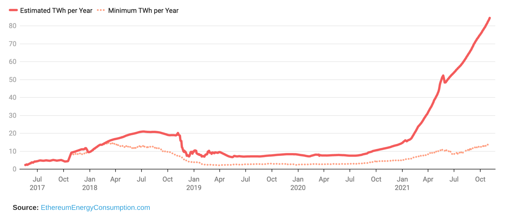

# Cryptocurrency, Energy, and Proof-of-Stake

New to _cryptocurrency_? [Check this out](https://wcollins.io/posts/2021/understanding-the-world-of-bitcoin/) for a quick primer. One of the giant debates, often a significant source of criticism, is [Bitcoin's](https://en.wikipedia.org/wiki/Bitcoin) energy efficiency _(or lack thereof)_. This criticism may also be expanded to any other currency, or [blockchain](https://en.wikipedia.org/wiki/Blockchain) backed technology that leverages [proof-of-work](https://en.wikipedia.org/wiki/Proof_of_work) as a consensus mechanism. Innovation is _inherent_ in technology. New ideas, methods, and optimizations come along to take something, add new features, and make it more efficient. One such optimization is _proof-of-stake_ which brings a greener look to consensus. How much can it help?



## Bitcoin - Energy Consumption
The _Digital Assets Programme (DAP) Team_ at [The Cambridge Centre for Alternative Finance](https://www.jbs.cam.ac.uk/faculty-research/centres/alternative-finance) maintains a fantastic project called [The Cambridge Bitcoin Electricity Consumption Index (CBECI)](https://cbeci.org/index) that estimates the power demand for the Bitcoin network. The material presented gets updated every 24-hours. Today, the estimated annualized consumption of the _Bitcoin Network_ is **> 111 TWh**. A _terawatt-hour_ is one trillion watts per hour, equal to **3.6x1015** Joules.


The _CBECI_ hypothesizes the consumption of the Bitcoin Network based on [this methodology](https://cbeci.org/index/methodology). The actual Bitcoin electrical consumption is impossible to measure based on several external factors that the methodology cannot include.
{}

### **Historical - Bitcoin Network Power Demand** _(Daily)_

### **Historical - Bitcoin Electricity Consumption** _(Monthly)_

### **Bitcoin Mining Map** _(June-July 2021)_
The following map visualizes monthly [hashrate](https://en.bitcoinwiki.org/wiki/Hashrate) by country and region. Notice something different from **June -> July 2021**? To zoom in further, in September 2019, China accounted for **75%** of the world's Bitcoin mining energy consumption. Following [China's ban of trading and mining crypto](https://www.reuters.com/world/china/china-central-bank-vows-crackdown-cryptocurrency-trading-2021-09-24/), we see the U.S. become the [number one hot spot](https://www.cnbc.com/2021/10/13/us-beats-china-as-the-number-one-destination-for-bitcoin-miners.html).

### **Comparison - Countries And Data Centers** _(Globally)_
Let's put _Bitcoin's_ energy footprint into perspective by comparing it to some other things that we have a better grasp on.
| Name | Population (Million) | Annualized (TWh) |
| ---- | :----------: | :----------------: |
| China | [> 1,446](https://www.worldometers.info/world-population/china-population/) | [> 6,000](https://www.eia.gov/international/data/world/electricity/) |
| United States | [> 333](https://www.worldometers.info/world-population/us-population/) | [> 3,000](https://www.eia.gov/international/data/world/electricity/) |
| Data Centers _(globally)_ | - | [> 200](https://www.iea.org/commentaries/data-centres-and-energy-from-global-headlines-to-local-headaches) |
| Bitcoin Network | - | [> 115](https://cbeci.org/index) |
| Netherlands | [> 17](https://www.worldometers.info/world-population/netherlands-population/) | [> 113](https://www.eia.gov/international/data/world/electricity/) | 


There are things known, and there are things unknown, and in between are the doors of perception.
{}

### Elon Musk Tweets
Nothing can move mountains and markets quite like [Elon Musk](https://en.wikipedia.org/wiki/Elon_Musk) tweets. **The very purpose of Tesla's existence is to accelerate the world's transition to sustainable energy**, as noted in the [2020 - Tesla Impact Report](https://www.tesla.com/ns_videos/2020-tesla-impact-report.pdf) which is why this tweet comes as no surprise.



## Consensus Mechanisms
[Blockchain](https://en.wikipedia.org/wiki/Blockchain) backed technologies like Bitcoin are essentially distributed databases which are bound by the laws of [CAP theorem](https://en.wikipedia.org/wiki/CAP_theorem). With _blockchain_, nodes must reach an agreement on the current state of the network by using a consensus mechanism.

### What Is Consensus With Blockchain?
Consensus means agreement. With _blockchain_, that agreement happens when **51%** of the nodes on a network agree on its next global state. Consensus mechanisms _(or algorithms)_ in a crypto-economic system enable networks to achieve this while preventing common attacks. A successful exploit, in theory, would compromise consensus by controlling **>= 51%** of the network. Consensus mechanisms exist to negate that **51% attack**.

### Proof-of-Work
[Proof-of-Work _(PoW)_](https://en.bitcoin.it/wiki/Proof_of_work), initially introduced in **1993** by [Cynthia Dwork](https://en.wikipedia.org/wiki/Cynthia_Dwork) and [Moni Naor](https://en.wikipedia.org/wiki/Moni_Naor) to mitigate _DDoS_ attacks, is the consensus mechanism used by many cryptocurrencies today like [Bitcoin](https://bitcoin.org/en/) and [Ethereum](https://ethereum.org/en/). This algorithm sets the difficulty and rules while the miners perform the actual work of adding valid blocks to the chain. [Mining cryptocurrency](https://www.investopedia.com/tech/how-does-bitcoin-mining-work/) requires specialized hardware that uses a substantial amount of electricity. Also, as difficulty increases, so does the computational power necessary to get the hash value. The penalty for bad actors submitting invalid blocks is losing computational power, energy, and time.


Zooming in further reveals that the mechanics of the underlying consensus mechanism underpins the need for the vast amount of energy required to power _Bitcoin's_ network (or any other currency leveraging proof-of-work). Also, as difficulty and computation increase, [mining pools](https://www.investopedia.com/terms/m/mining-pool.asp) begin to emerge as a centralized authority of sorts.
{}

### Proof-of-Stake
[Proof-of-Stake _(PoS)_](https://en.wikipedia.org/wiki/Proof_of_stake) was introduced in **2012** by [Sunny King and Scott Nadal](https://decred.org/research/king2012.pdf) as an alternative to _proof-of-work_. At its core, _proof-of-stake_ works to help reach consensus securely but does it in a fundamentally different way than _proof-of-work_. In a _proof-of-stake_ system, miners don't need to spend electricity on adding valid blocks to the chain, thus allowing the network to operate with substantially lower resource consumption. The penalty for bad actors on a _proof-of-stake_ network is more severe. The validators' staked funds serve as the incentive to refrain from malicious intent. If a validator accepts a bad block, a portion of their staked funds will be _slashed_ as a penalty.

### Comparing PoW and PoS
| Proof-of-Work | Proof-of-Stake |
| ------------- | -------------- |
| Miners compete with hardware to create new blocks full of processed transactions | Validators are randomly selected based on their stake in the network _(how many coins they hold)_ |
| Rewards systems, like Pay Per Last N Shares _(PPLNS)_ compensate miners | Validators do not receive block rewards; Transaction fees are collected as compensation |
| Additional currency created as rewards for miners; Contributes to price volatility | Decreasing need to add coins to circulation; May contribute to price stability |
| Adding a malicious block requires a node more powerful than **51%** of the network | Adding a malicious block would require owning at least **51%** of all the cryptocurrency on the network |
| Low transactions-per-second | High transactions-per-second |
| Susceptible to [Tragedy of the Commons](https://www.investopedia.com/terms/t/tragedy-of-the-commons.asp) | Susceptible to [Nothing at Stake](https://golden.com/wiki/Nothing-at-stake_problem) |


In a _proof-of-work_ system, [Tragedy of the Commons](https://www.investopedia.com/terms/t/tragedy-of-the-commons.asp) predicts a possible future in which the cost of mining becomes less lucrative when the block reward allowance becomes inconsequential. At this point, any rewards ultimately shift to transaction fees, thus opening the door to a potential **51%** attack. In _proof-of-stake_ systems, the [Nothing at Stake](https://golden.com/wiki/Nothing-at-stake_problem) problem, in theory, can disrupt consensus and make the system vulnerable to exploits like [double-spend attacks](https://golden.com/wiki/Double-spend_attack_(blockchain)).
{}

## Going Green
Depending on one's definition of going green, that wording could be a mild stretch. One thing is for sure, optimizing to use less energy is a win. What if _cryptocurrencies_, like Ethereum, could use **~99.95%** less energy by transitioning to _proof-of-stake_ for consensus?

### Ethereum - Energy Consumption And Scale
[Ethereum](https://ethereum.org/en/), the second-largest coin by market _capitalization_, was launched in **2015** by [Vitalik Buterin](https://en.wikipedia.org/wiki/Vitalik_Buterin). While _Bitcoin_, long-term, could be viewed more as a _store of value_ similar to gold, Ethereum offers more utility with its [smart contracts](https://en.wikipedia.org/wiki/Smart_contract) driving the [decentralized finance (DeFi)](https://en.wikipedia.org/wiki/Decentralized_finance) and [NonFungible Token (NFT)](https://en.wikipedia.org/wiki/Non-fungible_token) arena. Today, Ethereum uses _proof-of-work_ for consensus, which presents limitations at scale. Not only does it consume a country's worth of power, but the blockchain also struggles to keep up due to popularity and demand. Smart Contracts, _NFT_ minting + sales, and _DeFi_ transactions increasing have caused a spike in fees.

#### **Ethereum - Estimated TWh Today** _(Annualized)_

#### **Comparison To Other Countries Today**

### Solving For Power And Scale With Ethereum 2.0
Knowing the scalability and environmental challenges that come with _proof-of-work_, the Ethereum team has long-planned to upgrade to _proof-of-stake_ consensus across _3 phases_, the first of which, [The Beacon Chain](https://ethereum.org/en/eth2/beacon-chain/) was implemented in **Dec. 2020**. The second phase, [The Merge](https://ethereum.org/en/eth2/merge/) is slated for **~Q2 2022** at which point, staked _Ether_ will take the place of _mining_. The last phase, [Shard Chains](https://ethereum.org/en/eth2/shard-chains/), could potentially ship as early as **late 2022** (depending on results of the merge), and greatly optimizes data and transactions.

#### **Comparing PoW and PoS Power Requirements**
A massive reduction in power can be observed when taking _mining_ out of the picture. It is projected that Ethereum will use **~99.95%** less energy post-merge. Therefore, instead of comparing the entire network's consumption to a _medium_ sized country, a more accurate comparison would be a small town of around **2,000 homes**.

#### **Scaling Transactions**
Visa [handles an average of 150 million transactions every day](https://usa.visa.com/run-your-business/small-business-tools/retail.html), or approximately **1,736** transactions-per-second. Today, Bitcoin handles somewhere between **4-7** transactions-per-second, with Ethereum coming in at around **13** transactions-per-second. The last phase of the shift to _proof-of-stake_ introduces secure sharding, enabling Ethereum to create blocks simultaneously. According to _Vitalik Buterin_, this has the potential to scale up to **~100K** transactions-per-second.



## Market Implications
Historically, precious metals were considered the _go-to_ for hedging against inflation. Going into _2020_, crypto has become an increasingly popular alternative. This is likely one of the contributing factors as to why _Bitcoin_ outperformed all other major asset classes in _2020_. How are things shaping up as we near the latter part of **Q4 - 2021**?


Inflation is when you pay fifteen dollars for the ten-dollar haircut you used to get for five dollars when you had hair. 

**- Sam Ewing**
{}

### Crypto ROI VS Traditional Investments _(2020-2021)_
In _2020_, cryptocurrency outperformed _Gold_ and the _S&P 500_. Looking back over _2021_, this gap has widened even further, with [Ethereum](https://ethereum.org/en/) starting to make big waves as it outperforms _Bitcoin_ in price appreciation terms this year. Could this be resulting from the process and changes Ethereum is undergoing as it transitions to _proof-of-stake_?

### Wall Street Appeal
To me, it makes sense that _Ethereum's_ transition to _proof-of-stake_ will garner increased interest from the financial establishment. I only say this because _post upgrade_, staked _Eth_ will operate more like a _digital bond_. Instead of being a _virtual commodity_, it will be closer to a financial asset. Capital gets positioned, and then the yield VS price gets calculated. This makes it simple to regulate and even easier to tax _(like a bond yield)_.

## Conclusion
_Cryptocurrency_ is still in its very _early_ stages. Can _proof-of-stake_ have an impact on the heavy energy demands of crypto today? From watching the news or reading any major publications, it would seem that the market is not so much fixated on _functionality_ but on price. With _Ethereum_, transaction fees increase as the demand for Ethereum rises, which directly impacts the price. To me, this is a direct indication of its utility today, which drives the price higher.

One thing that remains unclear is, what happens to the _second-largest_ coin by market capitalization as it completes this gigantic transition to _proof-of-stake_ and takes on the persona of an _interest_ paying bond or equity? Does this negatively impact the link between _Ethereum_ price and transaction cost, or does increased utility and adoption along with significantly less energy demand drive _Ethereum_ parabolic? The world will soon find out!
