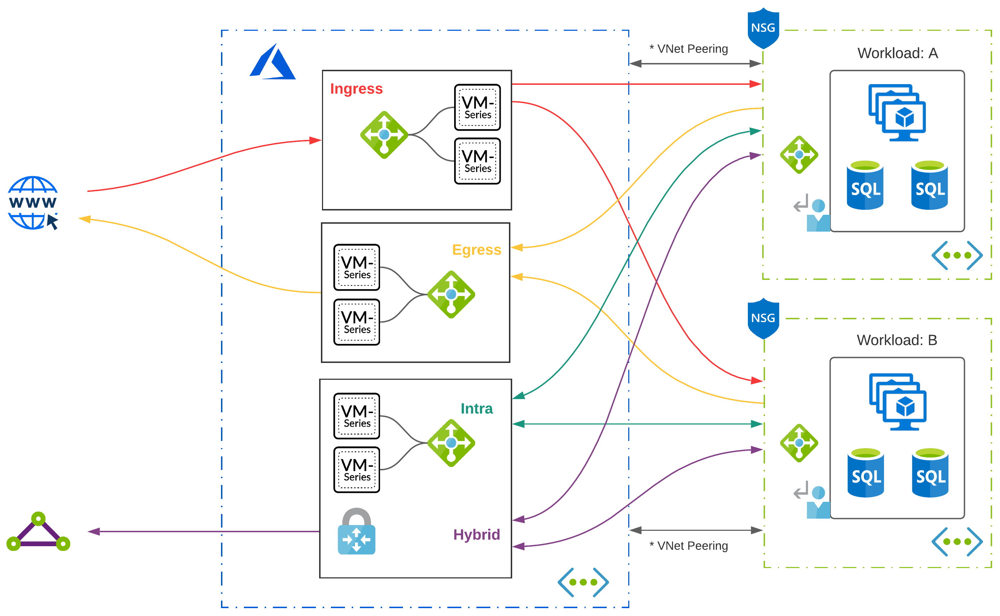
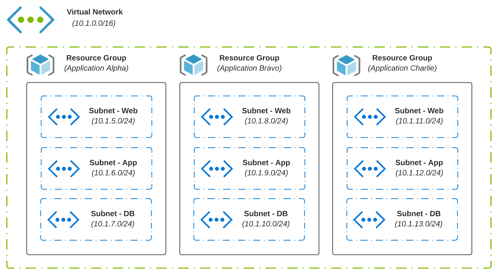
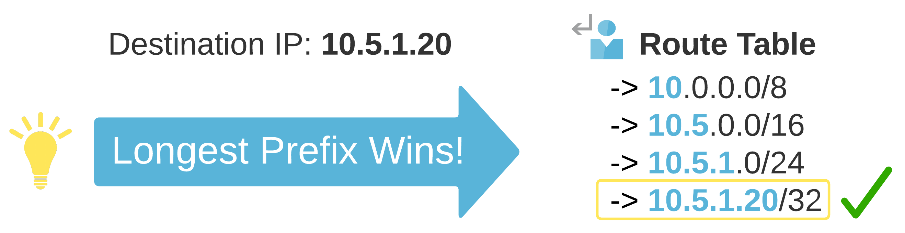
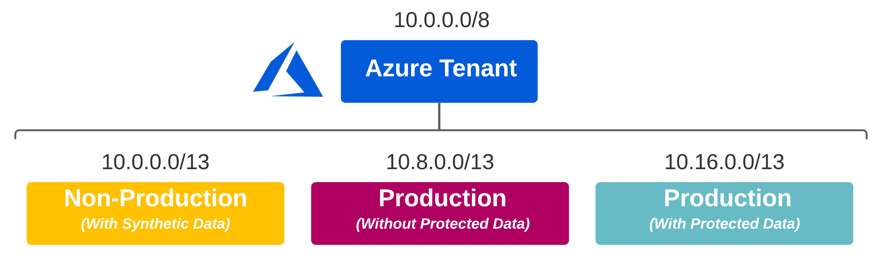
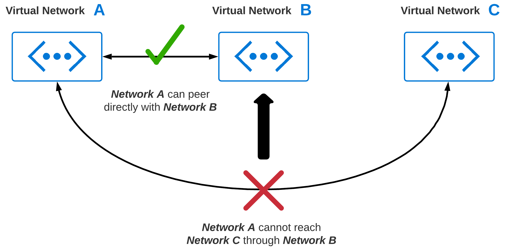
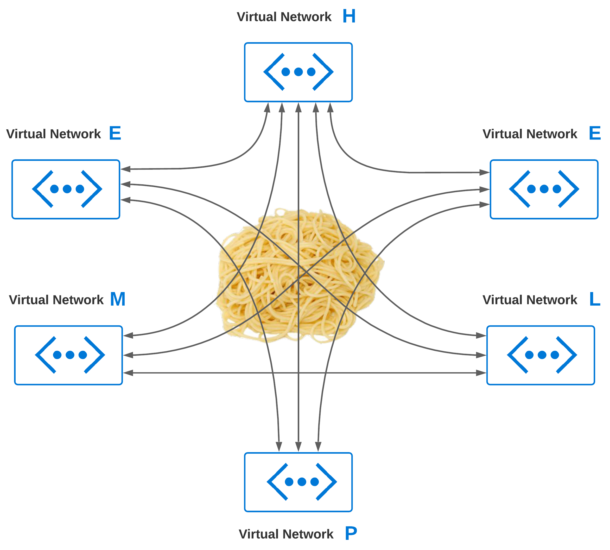

# Exploring Azure Cloud Networking - (Part 1)

Is _cloud networking_ complicated, or is it just different? In building your infrastructure in the cloud, _end-to-end_ system complexity increases exponentially. As enterprise applications mature, the foundational infrastructure and networking used to host and transport them must evolve. One obvious crux of networking is _blast radius_ - you cannot easily modify it without _down-time_.

This is _Part 1_ of a multi-part series that will explore [Azure](https://azure.microsoft.com/en-us/) networking. To the best of my ability, this series will be written to articulate _real-world_ scenarios and bring attention to specifics that are critical to an understanding before diving into _cloud networking_ architecture. Even in working through basics, sometimes a simple thing can be overlooked, which carries long-lasting implications over time.

## Core Concepts
New and shiny services like [Virtual WAN](https://docs.microsoft.com/en-us/azure/virtual-wan/virtual-wan-about) and [Route Server](https://azure.microsoft.com/en-us/services/route-server/) will continually be released as capabilities evolve. While new services and features are released to make life easier, some things rarely change. A few core network components are always required when deploying just about any application.

### Common Components
In the cloud, you generally have a hierarchy in which logical components exist, which may contain additional logical components. With Azure, for instance, [Management Groups](https://docs.microsoft.com/en-us/azure/governance/management-groups/overview) include Subscriptions. [Subscriptions](https://docs.microsoft.com/en-us/azure/cloud-adoption-framework/decision-guides/subscriptions/) hold Resource Groups, which is where [Virtual Networks](https://docs.microsoft.com/en-us/azure/virtual-network/virtual-networks-overview) live. A VNet may be a shared resource across many apps and services in scope across many teams.

* [Resource Groups](https://docs.microsoft.com/en-us/azure/azure-resource-manager/management/manage-resource-groups-portal) are containers that hold common objects; An example might be all resources and services which make up an application
* [Virtual Networks (VNets)](https://docs.microsoft.com/en-us/azure/virtual-network/virtual-networks-overview) enable connectivity between your resources, forming the foundation you need to run applications in the cloud
* [Subnets](https://docs.microsoft.com/en-us/azure/virtual-network/virtual-network-vnet-plan-design-arm#subnets) are created from the _address space_ defined at the VNet level; This allows a VNet to be segmented as needed
* [User-Defined Routes (UDRs)](https://docs.microsoft.com/en-us/azure/virtual-network/virtual-networks-udr-overview#custom-routes) are simply static routes that override Azure's default system routes or add additional routes to a subnet's route table; A given subnet can have **0** or **1** route tables associated with it

## Basic Routing
Knowing how Azure routes traffic between virtual networks, on-premises, and over the Internet is **good** knowledge to have. Understanding how you can override certain default behaviors is **excellent** knowledge to have. Putting these things together to build a network that enables business outcomes should be the goal.

### Subnets
In [Azure](https://azure.microsoft.com/en-us/) and [AWS](https://aws.amazon.com/), VPCs and VNets are limited to a single Region. This is about where the similarities stop. With AWS, a subnet is limited to a single [availability zone](https://docs.aws.amazon.com/AWSEC2/latest/UserGuide/using-regions-availability-zones.html) while Azure extends a single subnet across all [availability zones](https://docs.microsoft.com/en-us/azure/availability-zones/az-overview#availability-zones).

### System Routes
[System Routes](https://docs.microsoft.com/en-us/azure/virtual-network/virtual-networks-udr-overview#system-routes) are automatically created and assigned to each subnet. You cannot create system routes, nor can you remove them. A default routing table for a new subnet in Azure would look something like this:

| Source | Address Prefixes | Next Hop Type |
| ------ | ---------------- | ------------- |
| Default | Address Space (assigned at provision time) | Virtual Network |
| Default | 0.0.0.0/0 | Internet |
| Default | 10.0.0.0/8 | None |
| Default | 192.168.0.0/16 | None |
| Default | 100.64.0.0/10 | None |

_Next Hop Types_ are self-explanatory. The type **Virtual Network** routes traffic between address ranges carved out from the _VNet's_ address space. For internet egress, type **Internet** is used. If you want to **Null** route traffic, type **None** is used; Traffic will be discarded.

> You can validate effective routes via [network interface settings](https://docs.microsoft.com/en-us/azure/virtual-network/virtual-network-network-interface#view-network-interface-settings) or [route tables](https://docs.microsoft.com/en-us/azure/virtual-network/manage-route-table#view-details-of-a-route-table).

### Route Selection
How exactly does route selection in [Azure](https://azure.microsoft.com/en-us/) work? With traffic exiting a given subnet, a decision must be made based on the destination IP Address. Azure makes this decision based [on the longest prefix.](https://docs.microsoft.com/en-us/azure/virtual-network/virtual-networks-udr-overview#how-azure-selects-a-route) If multiple routes contain the same address prefix, the tie is broken based on the following priority:
1. [User Defined Routes (Custom)](https://docs.microsoft.com/en-us/azure/virtual-network/virtual-networks-udr-overview#custom-routes)
2. [Border Gateway Protocol (BGP)](https://docs.microsoft.com/en-us/azure/virtual-network/virtual-networks-udr-overview#border-gateway-protocol)
3. [System Route (Default)](https://docs.microsoft.com/en-us/azure/virtual-network/virtual-networks-udr-overview#system-routes)

> System Routes for VNet peering is always a preferred route, even if BGP routes are more specific. This is a small but critical detail as a design evolves.

## IP Addressing
Some decisions age like fine wine, while others seem to age like sour milk. An area that comes to mind here is **IP Address Planning**. Taking some time to plan out your _IP Addressing Scheme_ upfront can go a long way.

### IP Addressing Truths
There is no _one size fits all_ here. A few things that are general truths include:
1. IP Addressing Scheme should match the topology or vice versa
2. VNet Address Space cannot be [added, modified, or removed](https://docs.Microsoft.com/en-us/azure/architecture/networking/prefixes/add-ip-space-peered-vnet#:~:text=Many%20organizations%20deploy%20a%20virtual,the%20Hub%20and%20Spoke%20model.&text=However%2C%20address%20ranges%20can't,peered%20with%20another%20virtual%20network.) if a VNet peer is established
3. Design dictates consumption; Good automation becomes difficult with poorly planned designs
4. _IP Addressing_ and _Segmentation_ is a collaborative exercise; Align with the Security Overlords

### Planning Up Front
Let's use Healthcare as an example. Privacy is critical, and [HIPAA](https://www.cdc.gov/phlp/publications/topic/hipaa.html) sets clear guidelines on the use and release of health records. If your business deals with protected information, then _data classification_ is a great place to start. If you have a combination of applications (some leveraging protected information and some that do not), both categories can be treated fundamentally differently.

The above example puts **data classification** at center stage. If you can categorize all of your _protected data_ at a higher level, this simplifies the work required to ensure compliance. Think of it like this:

1. Protected Data can only exist in the **Production (With Protected Data)** segment
2. An alternative **Production** segment exists for workloads not requiring access to Protected Data
3. **Non-Production** exists for all _lower-stage_ environments across both **Production** segments; Synthetic Data enables rapid prototyping of heavily regulated data in lower-stage environments (Preventing the risk of accidental exposure)

## Virtual Network Peering
At some point, connectivity between two or more virtual networks is going to become a requirement. As you grow, chances are, your virtual network footprint will expand significantly. [Virtual Network Peering](https://docs.microsoft.com/en-us/azure/virtual-network/virtual-network-peering-overview) enables connectivity between two or more virtual networks. The big caveat with peering is, virtual networks natively are _none-transitive_. This means, if you have 3 VNets, you can't route from **VNet: A** to **VNet: C** through **VNet: B**.

### Peering Gone Wild
Without giving network peering more thought, common sense may imply just peering VNets which require communication. So, we peer every virtual network with every other virtual network. What is the worst that could happen? I like _spaghetti_ myself, but I don't think of it as a design principle when building my networks!

### Is Peering Bad?
No, peering is not bad. Like any feature, you should think through how it is used to provide the outcomes you want. Also, try hard not to over-extend it to do things that it was not designed to do. If you are peering everything with everything, then maybe the problem that needs to be solved is transitive routing. In thinking through VNet peering, some obvious things come to mind:
* **Cost** - [Inbound/Outbound Charges](https://azure.microsoft.com/en-us/pricing/details/virtual-network/)
* **Reliability** - A failure occurs with a connection; How would redundancy or mitigation work?
* **Operations** - As new VNets are added, overhead and complexity grows exponentially
* **Security** - Least privilege is real; _What can talk to what_ now shifts to [UDRs](https://docs.microsoft.com/en-us/azure/virtual-network/virtual-networks-udr-overview#user-defined) and [NSGs](https://docs.microsoft.com/en-us/azure/virtual-network/network-security-groups-overview)

## Conclusion
Now that we have a basic understanding of foundational network components, what's next? For [Part 2](https://wcollins.io/posts/2021/exploring-azure-cloud-networking-part-2/), we will go through the evolution of common network patterns ranging from _my own little desert island_, to modern _hub-and-spoke_ designs that we see today in larger environments.
