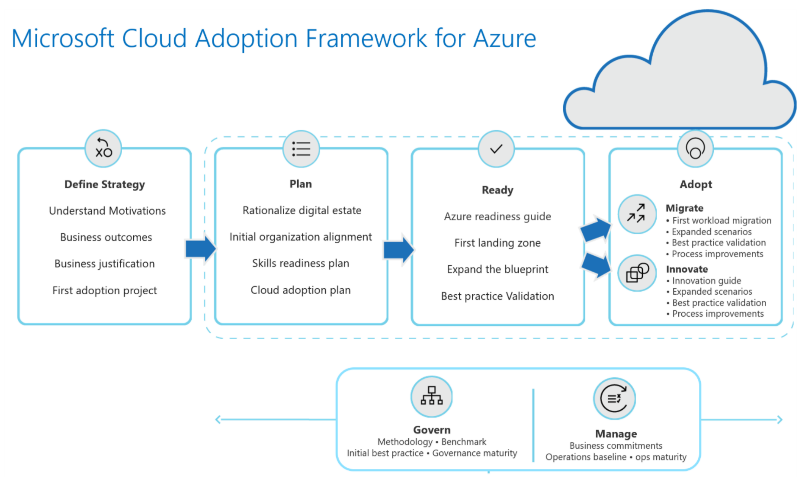
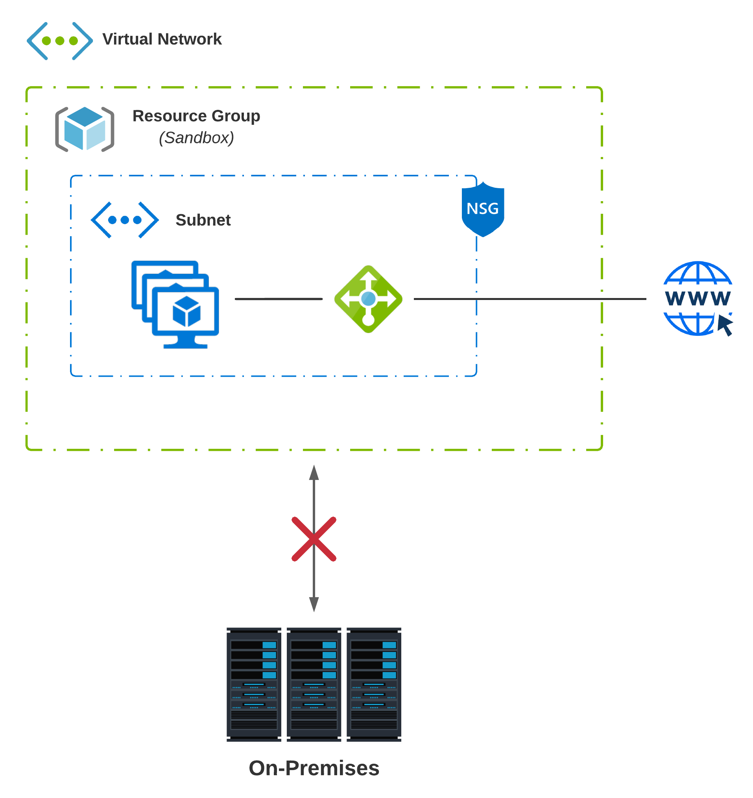
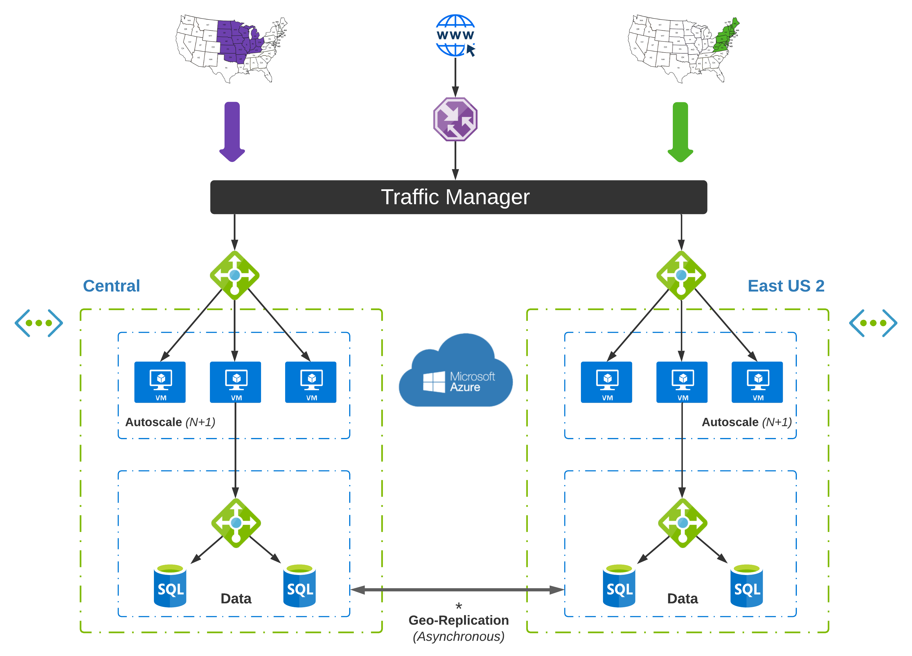
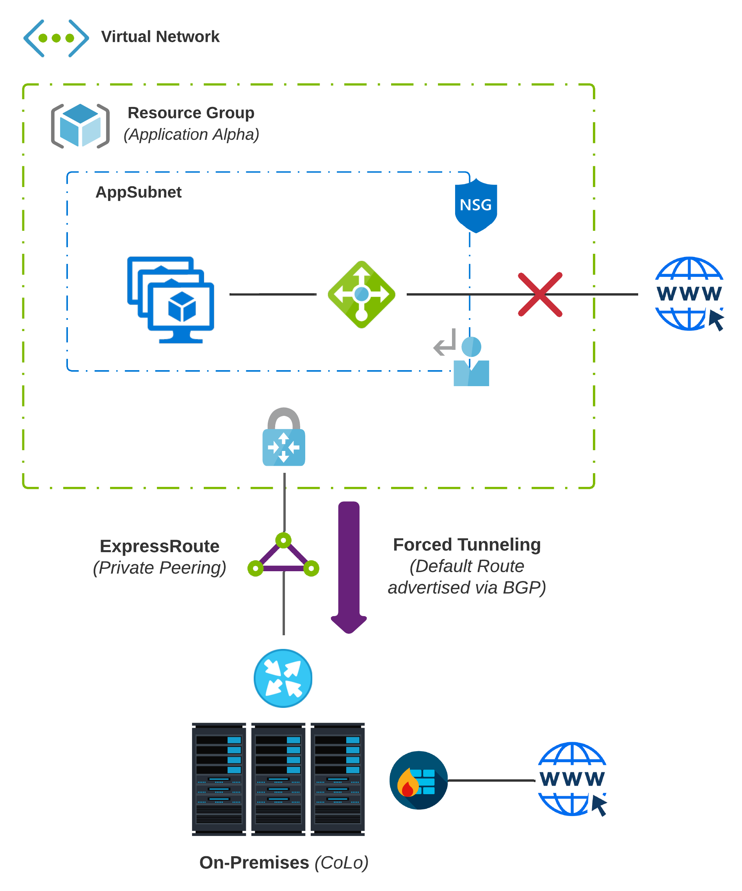
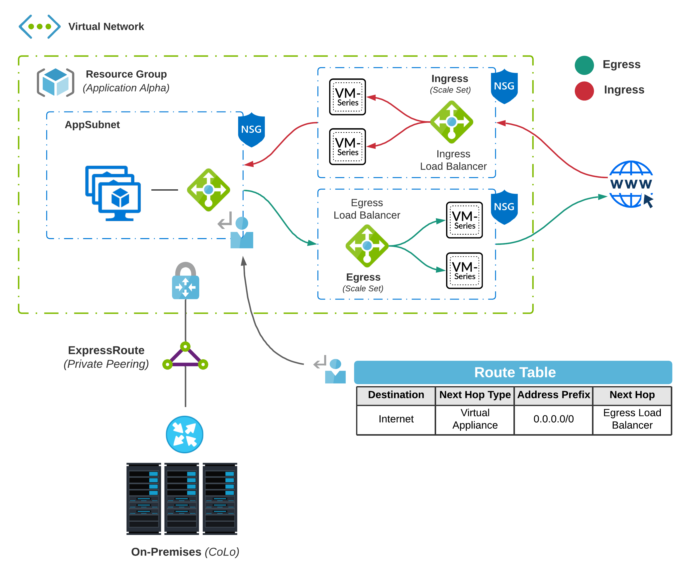
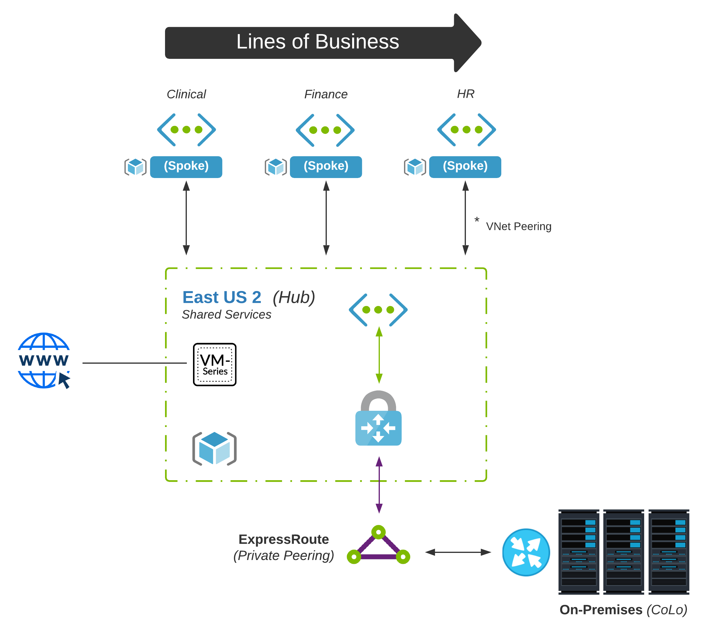
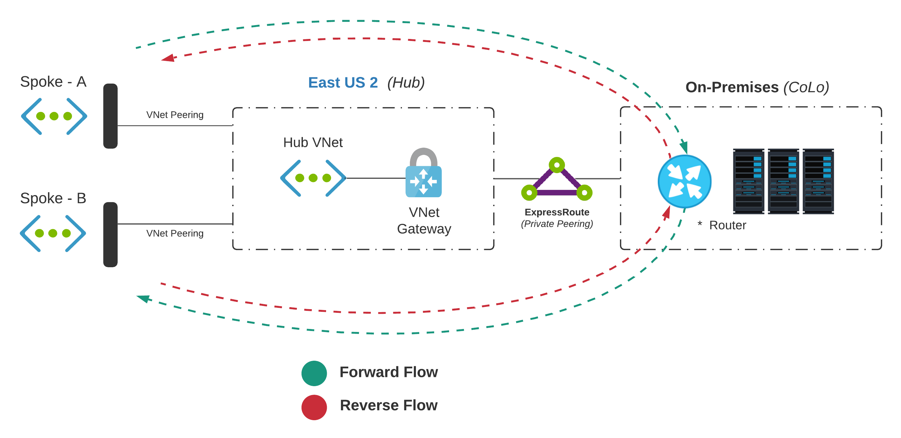
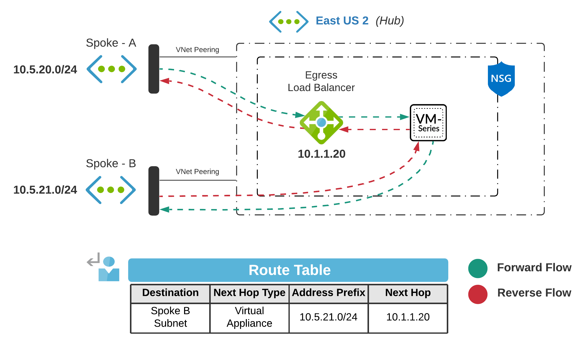

# Exploring Azure Cloud Networking - (Part 2)

In [Part 1](https://wcollins.io/posts/2021/exploring-azure-cloud-networking-part-1/), we went over some fundamentals. For _Part 2_, we will examine [Azure](https://azure.microsoft.com/en-us/) network design patterns based on _cloud maturity_ and _organization size_. The concept of [design patterns](https://en.wikipedia.org/wiki/Design_pattern) was first introduced by [Christopher Alexander](https://en.wikipedia.org/wiki/Christopher_Alexander) and has profoundly influenced many _technical disciplines_.

To keep things simple, let's define a _design pattern_ as a **reusable solution to a commonly occurring problem**. Of course, you are not the first practitioner out there transitioning to _cloud_ or growing to a new maturity model. Many trailblazers have already walked the walk and left behind beautiful _blueprints_ to help you along the way.

## Patterns Overview
While every scenario may not fall under these categories, there are generally three _phases_ that your cloud network may likely go through as your organization matures.
* **Island** - Starting point or _cloud native_ panacea; Disconnected from the enterprise network
* **Hybrid** - Often inevitable (integration requirements); Connected to the enterprise network
* **Hub & Spoke** - Stemmed by growth and need for centralized control; Increased governance

### Cloud Adoption Framework (CAF)
The [**Cloud Adoption Framework (CAF)**](https://docs.microsoft.com/en-us/azure/cloud-adoption-framework/ready/enterprise-scale/network-topology-and-connectivity) has been crafted using essential feedback from partners and customers. This provides an excellent place to start as you begin planning. Of course, you don't just land on the ideal design, but it helps to have a clear picture of where you are going. 

> The Microsoft [**Patterns & Practices**](https://github.com/mspnp) site is another good _Azure_ specific resource for understanding proven patterns and reference architectures. 

## The Island
[Webster](https://www.merriam-webster.com/dictionary/island) defines _island_ as **":an isolated group or area"**. There are a few variations of **The Island**, but one thing remains consistent; It has no connectivity to _on-premises_ networks. This environment is completely isolated.

### Island #1 - First Pass
Every good story has a beginning. Many enterprises started their cloud journey many years back by simply setting up an account, doing some sandboxing, and just familiarizing themselves with the Cloud. You never know, one day that _sandbox_ application could turn _Production_ overnight! (Yes, I've seen this happen)

Usually, the **first pass** at a technology (especially as transformative as Cloud) isn't going to be perfect. There are a lot of things you don't know until you know. The main criteria that define our _first pass_ at Cloud may include:
* Single [Virtual Network](https://docs.microsoft.com/en-us/azure/virtual-network/virtual-networks-overview); All dependencies _self-contained_
* Enterprise **Apps and Data** live in Data Centers (Owned or Colocation)
* No connectivity to _on-premises_ networks; Environment is completely isolated
* Cloud Environment may not be under _centralized I.T._ control; They slow things down, right?

### Island #2 - Cloud Native
We are getting this whole _cloud computing_ thing down now. We are super mature around _security_ and _governance_, and we want to take full advantage of Azure-specific services. In this scenario, we don't have any _hybrid_ dependencies and focus on reliable and scalable infrastructure leveraging _cloud native_ constructs in a single cloud-only. As a set of outcomes, this pattern aims to:
* [**Scale Out**](https://www.section.io/blog/scaling-horizontally-vs-vertically/#:~:text=Horizontal%20scaling%20means%20scaling%20by,as%20%E2%80%9Cscaling%20up%E2%80%9D).and not up; Optimize based on consumption
* [**Multi-Region**](https://acloudguru.com/blog/engineering/why-and-how-do-we-build-a-multi-region-active-active-architecture) _Active-Active_ design; Non-blocking asynchronous communication
* Embrace [**Stateless Application Design**](https://blog.dreamfactory.com/stateful-vs-stateless-web-app-design/); Local state is considered an anti-pattern
* Use **Internet** as primary transport; State is shared between regions over _cloud backbone_

> Our Cloud-Native Island is a _best case scenario_, but also unlikely at first for the traditional enterprise. This takes into account that your data lives in the Cloud, and you aren't making any calls to backend services in your data centers. [Data Gravity](https://whatis.techtarget.com/definition/data-gravity#:~:text=Data%20gravity%20is%20the%20ability,(the%20amount%20of%20data).) has proven to be a worthy antagonist in the quest to _cloud native_.

## Hybrid
Firstly, my definition of _Hybrid Cloud_ is: **Any workload that combines _public cloud_ with an _on-premises_ data center environment**. Meaning, if for some reason, this public Cloud no longer has connectivity back to the data center, then the application(s) will not work.

At some point, that Island is going to get a little lonely. How can you possibly migrate anything without a reliable connection to Azure? I will forego the _whiplash_ that generally takes place at this point in the story. That beautiful moment we all remember when **server, network, and security** experts first get involved.

So, we need a little bit of _hybrid_ now. This is probably where things get the most complicated. There are many variations of _hybrid_, a plethora of options/considerations, and numerous maturity levels.

### Hybrid #1 - Forced Tunneling
Our first iteration of _hybrid_ is met with much _skepticism_ and minimal _trust_. This is why the obvious thing to do from the **network and security** space is to backhaul every packet to the data center to use existing routing, segmentation, deep packet inspection, file blocking, etc.

This practice is known as [Forced Tunneling](https://docs.microsoft.com/en-us/azure/vpn-gateway/vpn-gateway-forced-tunneling-rm). It does precisely what is implied, e.g., it enables redirection of all traffic destined to the Internet back to your _on-premises_ network. 

* To accomplish this with [ExpressRoute - Private Peering](https://docs.microsoft.com/en-us/azure/expressroute/expressroute-circuit-peerings#privatepeering), advertise a default route from your _BGP speaker_ and all traffic from the associated _virtual network_ will be routed to your _on-premises_ network.
* Doing this will force traffic from services offered by Microsoft like [Azure Storage](https://azure.microsoft.com/en-us/services/storage/) back on-premises as well; You will have to account for return traffic via [Microsoft Peering](https://docs.microsoft.com/en-us/azure/expressroute/expressroute-circuit-peerings#microsoftpeering) or the public Internet.
* If [Service Endpoints](https://docs.microsoft.com/en-us/azure/virtual-network/virtual-network-service-endpoints-overview) is configured, traffic is not forced on-premises and remains on Azure's backbone network.
> To accomplish _Forced Tunneling_ over a [Site-to-Site VPN](https://docs.microsoft.com/en-us/azure/vpn-gateway/vpn-gateway-howto-site-to-site-classic-portal), you would set up a [User Defined Route](https://docs.microsoft.com/en-us/azure/virtual-network/virtual-networks-udr-overview#user-defined) to set the default route to the [Azure VPN Gateway](https://docs.microsoft.com/en-us/azure/vpn-gateway/vpn-gateway-about-vpngateways).

### Hybrid #2 - Cloud DMZ
For workloads in the Cloud, it makes sense to reduce dependencies on-premises (especially Internet) and keep as much traffic as we can in Azure. Also, to continue meeting various **security requirements**, often deploying [Network Virtual Appliances (NVAs)](https://azure.microsoft.com/en-us/blog/best-practices-to-consider-before-deploying-a-network-virtual-appliance/) will be necessary.

A common practice that accommodates future growth is routing **egress and ingress** traffic through separate [scale sets](https://docs.microsoft.com/en-us/azure/virtual-machine-scale-sets/overview). You can then use [User Defined Routes](https://docs.microsoft.com/en-us/azure/virtual-network/virtual-networks-udr-overview#user-defined) for limited traffic engineering. For example, traffic destined to the Internet would use the _private IP address_ of an [internal load balancer](https://docs.microsoft.com/en-us/azure/load-balancer/components#frontend-ip-configurations) as the _next-hop_.

In this scenario, **Ingress** represents _inbound_ connections into the [DMZ](https://en.wikipedia.org/wiki/DMZ_(computing)) while **Egress** represents traffic _destined_ to the internet. Another benefit of this design is additional throughput. [VM-Series - Firewalls](https://docs.paloaltonetworks.com/vm-series/10-0/vm-series-performance-capacity/vm-series-performance-capacity/vm-series-on-azure-performance-and-capacity.html) have come a long way but still have limitations that you must consider. You might also consider deploying an additional _scale set_ for **Transitive** routing in substantial deployments.

> NVAs must be deployed in _self-contained_ subnets. Deploying an appliance in the same subnet as your _workloads_ and attaching a UDR to that same subnet may cause a routing loop.

## Hub & Spoke
Until now, our patterns have been simple; Only a single _virtual network_ has been referenced. In larger enterprises, this can get a little tricky. Over time as the Cloud grows, additional business units, centralized services, security, and even finance may start to leverage the Cloud. Sound [governance](https://docs.microsoft.com/en-us/azure/cloud-adoption-framework/govern/methodology) is critical in managing adoption.

As consumption increases, [subscriptions](https://docs.microsoft.com/en-us/azure/cloud-adoption-framework/decision-guides/subscriptions/) will likely grow. It is generally a good practice to model these constructs to match your organization's hierarchy. As you follow this path, other _virtual networks_ will be created. How is this challenge designed around while taking _scale and governance_ in mind?

### Centralized Hub
Network practitioners are going to be very familiar with _Hub & Spoke_. Think about it like data center and branch office routing. We don't want prefixes to be visible randomly all across the network. Aggregation is our friend here.

It is much more efficient to have summarization of routing for each site at the edge. It also makes sense to centralize certain services at the edge rather than deploy them at every office. Deploying [NGFWs](https://www.paloaltonetworks.com/network-security/next-generation-firewall) at every site would become expensive and challenging to manage. Our cloud hub will follow this same pattern. Any shared services that will be used across all _spokes_ will live here.

### Spoke-To-Spoke Routing
Now that multiple _virtual networks_ are in play, how does traffic flow? Remember from [Part 1](https://wcollins.io/posts/2021/exploring-azure-cloud-networking-part-1/#virtual-network-peering) that VNets are _non-transitive_. For example, let's say we have _Spoke-A_ and _Spoke-B_ which are [VNet peered](https://docs.microsoft.com/en-us/azure/virtual-network/virtual-network-manage-peering) back to our hub. There have been two common approaches to solving this in the past:

#### On-Premises / CoLo - Routing
This approach forwards traffic back to a physical device (That lives outside of Azure's Cloud) that knows how to route packets. This approach is usually the first iteration as, if you already have _hybrid_ connectivity, then these devices are already reachable.

* The Hub _virtual network_ is configured to **allow gateway transit**; This enables peered _virtual networks_ to use any attached _virtual network gateways_
* Each _spoke_ should be configured to **use remote gateways**; This is required for traffic to use a gateway living in the _virtual network_ you are peered with
* The router _on-premises_ will handle any _spoke-to-spoke_ routing; The existing [BGP](https://en.wikipedia.org/wiki/Border_Gateway_Protocol) which was set up for _private peering_ handles _dynamic routing_

#### Network Virtual Appliance (NVA) - Routing
Another option would be leveraging [NVAs](https://azure.microsoft.com/en-us/blog/best-practices-to-consider-before-deploying-a-network-virtual-appliance/) existing in the _hub_ to route traffic between spokes. If we already have the **Cloud DMZ** design deployed, you would use [UDRs](https://docs.microsoft.com/en-us/azure/virtual-network/virtual-networks-udr-overview#user-defined) to redirect traffic.

* Each _subnet_ requires a _UDR_ to steer traffic
* **Destination** matches the subnet prefix from the adjacent VNet
* **Next Hop Type** will be defined as _Virtual Appliance_ ([Next Hop Options](https://docs.microsoft.com/en-us/azure/virtual-network/virtual-networks-udr-overview#next-hop-types-across-azure-tools))
* The **Next Hop** is the internal load balancer's private IP (If deployed in a [scale set](https://docs.microsoft.com/en-us/azure/virtual-machine-scale-sets/overview))

## Conclusion
Why not just use a [WAF](https://azure.microsoft.com/en-us/services/web-application-firewall/) for **Inbound** connections and [Azure Firewall](https://docs.microsoft.com/en-us/azure/firewall/overview) for **Outbound**? It all comes down to what requirements you are working with and the capabilities needed to meet them.

**NextGen Firewalls** have more capabilities today and are also being used heavily in the enterprise. Many will opt to extend these capabilities into the Cloud. Microsoft currently has [Azure Firewall - Premium](https://docs.microsoft.com/en-us/azure/firewall/overview#azure-firewall-premium-preview) in _Public Preview_, which should close the gap a little more.

If this material was valuable, check out [Part 1](https://wcollins.io/posts/2021/exploring-azure-cloud-networking-part-1/) to learn more about the fundamentals. In _Part 3_, we will dig into [ExpressRoute](https://azure.microsoft.com/en-us/services/expressroute/) design along with breaking down a few things I wish I would have known before jumping in the _deep-end_.

### Acknowledgements
Big thanks to the wise and resourceful [Steven Hawkins](https://www.linkedin.com/in/sthawkins/) for taking the time to peer review this post. Your feedback is always insightful and appreciated.
