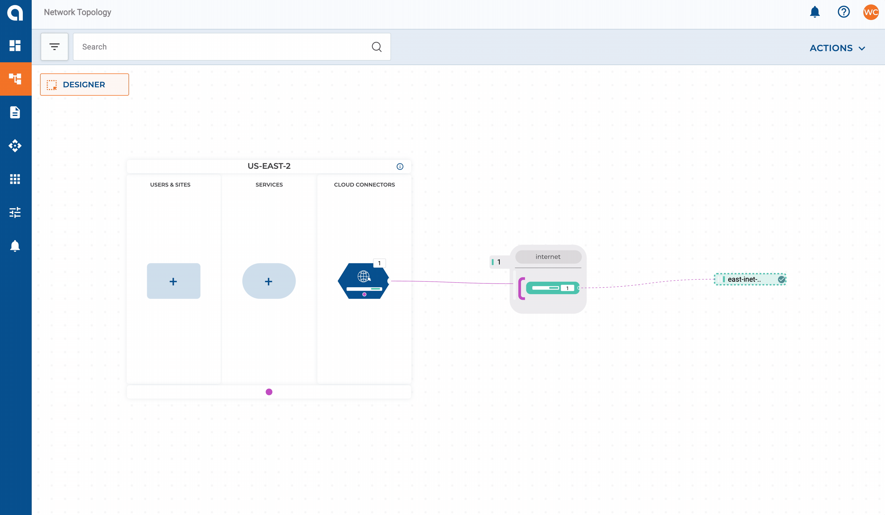

# Getting Started With Alkira And Terraform - (Part 1)

[HashiCorp's Terraform](https://www.terraform.io/) needs no introduction. It is all but the de facto vehicle for delivering cloud infrastructure, and for a good reason. What Terraform did for **Multi-Cloud** _Infrastructure as Code_, is precisely what [Alkira](https://alkira.com) does for the network. What happens when you use these two platforms together to deliver networking in and across clouds? If providing network services in code faster than ever before sounds interesting, this multi-part series is for you. Need a quick primer on Alkira? [You can read up here.](https://wcollins.io/posts/2020/alkira-multicloud-networking/)

## A Scalable Foundation
Troubleshooting networks that have been _over-engineered_ can be tricky. Some of the most reliable networks I have worked in were also the most simple by design. Simple is easier to understand, automate, and scale. To begin this series, let's deploy the following:
* A [Segment](https://registry.terraform.io/providers/alkiranet/alkira/latest/docs/resources/segment) for _macro-segmentation_; (We will deploy additional segments in a later post to demonstrate **Partner** and **Acquisition** connectivity scenarios)
* [Groups](https://registry.terraform.io/providers/alkiranet/alkira/latest/docs/resources/group) for _micro-segmentation_; These will be used for policy enforcement once we start connecting cloud and on-premises networks
* A [Billing Tag](https://registry.terraform.io/providers/alkiranet/alkira/latest/docs/resources/billing_tag) mapping to a hypothetical _Line of Business_ (Let's say _Digital Transformation_); Being able to bill specific app or product teams for network consumption is a game-changer
* An [Internet Exit](https://registry.terraform.io/providers/alkiranet/alkira/latest/docs/resources/connector_internet) for users, sites, and clouds along with elastically scaled [VM-Series Firewalls](https://docs.paloaltonetworks.com/vm-series/9-1/vm-series-deployment/about-the-vm-series-firewall.html) for our IPS, IDS, and ALG needs

## Segmentation Layout

> In Alkira, segments and groups are scaled globally, across clouds, and on-demand. To learn more about how Alkira handles _segmentation_, check out [this design zone video.](https://www.youtube.com/watch?v=qMkqI7SKpsA&t=738s)

## Let's Build!

### Segmentation
[Alkira's Terraform Provider](https://registry.terraform.io/namespaces/alkiranet) makes it easy to build networking the **DevOps** way. The following snippet creates our **segment** and **groups** used for _macro_ and _micro_ segmentation.

**alkira_segments.tf**


### Internet Egress
The following code will provision an **Internet Connector** with [VM-Series Firewalls](https://docs.paloaltonetworks.com/vm-series/9-1/vm-series-deployment/about-the-vm-series-firewall.html). These scale to real-time capacity demand while symmetrically steering application traffic using intent-based policies.

**Internet**, **Intranet**, and **Private-Spoke** [security zones](https://docs.paloaltonetworks.com/pan-os/8-1/pan-os-web-interface-help/network/network-zones/security-zone-overview.html) will be provisioned on the Firewalls with each zone mapping back to the corresponding **Alkira Groups** which provide the baseline for segmentation and policy

**alkira_internet.tf**


### Provision On Pull Request
I'm a big fan of [Terraform Cloud](https://www.terraform.io/cloud). For this example, I have my infrastructure committed to [Github](https://github.com) with Terraform Cloud runs triggered automatically as changes get **merged** in version control.

### Validation
Alkira has a very refined interface which serves as a great visual aid to validate configuration and policy. As we add more _infrastructure_ later in this series, we will use the _UI_ to gain a greater perspective into each aspect of the network.

## Conclusion
The place where applications, data, and systems intersect is the network. Networks of the future must adapt and scale over time as businesses grow, markets change, and policies adapt. Elastic networking driven by automation is the future. In [Part 2](https://wcollins.io/posts/2021/getting-started-with-alkira-and-terraform-part-2/), we will connect a mix of AWS, Azure, and GCP networks to demonstrate just how easy [Alkira](https://alkira.com) can make the **multi-cloud** network experience, so stay tuned!
