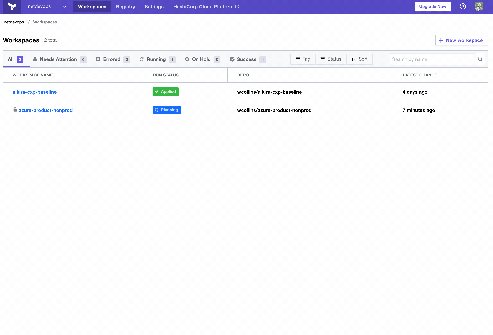
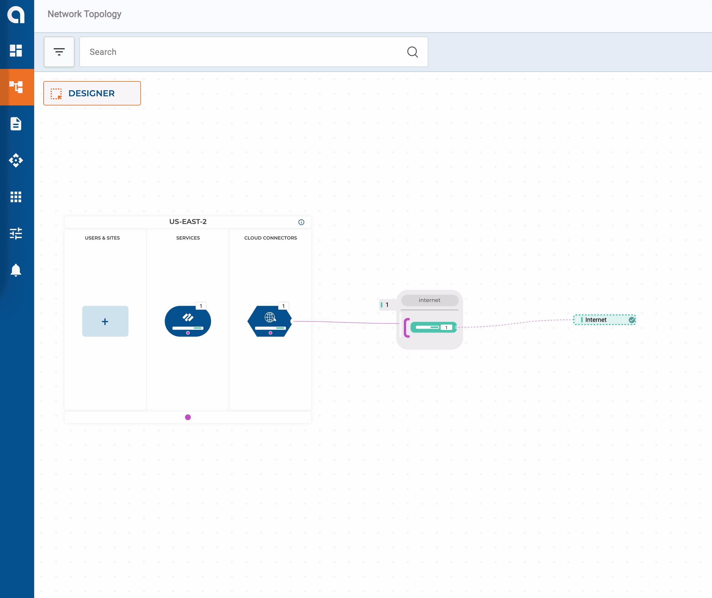

# Getting Started With Alkira And Terraform (Part 2)

In [Part 1](https://wcollins.io/posts/2021/getting-started-with-alkira-and-terraform-part-1/), we started with a scalable foundation that can adapt over time as the business grows and adjusts to changing markets. With [Alkira's Network Cloud](https://www.alkira.com/), we take a _cloud native_ approach in enabling our customer's transformation. No **appliances** need to be provisioned in remote VPCs or VNets, and no **agents** need to be installed on workloads. Getting started is as easy as kicking off a build pipeline. For _Part 2_, let's connect some networks from AWS, Azure, and GCP.

## Scenario
In _Part 1_, we set up a hypothetical **Line of Business** called **LoB - Digital**, which has the following network requirements:
* _Cloud Native_ applications will be deployed in [AWS](https://aws.amazon.com/); Application lifecycle requires **DEV**, **TEST**, **STAGE**, and **PROD** [VPCs](https://docs.aws.amazon.com/vpc/latest/userguide/what-is-amazon-vpc.html)
* [Azure](https://azure.microsoft.com/en-us/) gets the same network types as AWS for _cloud native_ workloads; In addition, Azure will also get a **MIGRATION** [VNet](https://docs.microsoft.com/en-us/azure/virtual-network/virtual-networks-overview) which will act as a landing zone for workloads being migrated from on-premises
* A new product surrounding _data analytics_ is being established, and the product team wants to leverage [GCP](https://cloud.google.com/); The product is not production-ready, so only **DEV**, **TEST**, and **STAGE** [VPCs](https://cloud.google.com/vpc) are required

> Since no **appliances** get installed inside cloud networks, how does Alkira interface with the cloud providers? Alkira takes the _cloud native_ approach of using existing authentication methods in each cloud. For instance, in AWS, this would be [IAM Policies](https://docs.aws.amazon.com/IAM/latest/UserGuide/access_policies.html) and with Azure, [Service Principals](https://docs.microsoft.com/en-us/azure/active-directory/develop/app-objects-and-service-principals). Most enterprises are already interacting with the cloud this way today, so integrating with their existing automation + pipeline strategy is seamless.

### Resources
We will be using the following [Terraform Resources](https://www.terraform.io/docs/language/data-sources/index.html) in this post:

| Name | Type | Description |
| ---- | ---- | ----------- |
| [alkira_credential](https://registry.terraform.io/providers/alkiranet/alkira/latest/docs/data-sources/credential) | data source | Reference existing credential
| [alkira_billing_tag](https://registry.terraform.io/providers/alkiranet/alkira/latest/docs/data-sources/billing_tag) | data source | Reference existing billing tag |
| [alkira_connector_aws_vpc](https://registry.terraform.io/providers/alkiranet/alkira/latest/docs/resources/connector_aws_vpc) | resource | Provision connector for AWS VPC |
| [alkira_connector_azure_vnet](https://registry.terraform.io/providers/alkiranet/alkira/latest/docs/resources/connector_azure_vnet) | resource | Provision connector for Azure VNet |
| [alkira_connector_gcp_vpc](https://registry.terraform.io/providers/alkiranet/alkira/latest/docs/resources/connector_gcp_vpc) | resource | Provision connector for GCP VPC |

## Connecting The Cloud
[Alkira's Terraform Provider](https://registry.terraform.io/providers/alkiranet/alkira/latest/docs) does quick work of connecting cloud networks to our _foundation_. The following snippet will connect an Azure VNet, place it in the _group_ we provide, and attach a _billing tag_.

**azure_connector.tf**


### Organizing Things
HashiCorp recommends [One Workspace Per Environment Per Terraform Configuration](https://www.terraform.io/docs/cloud/guides/recommended-practices/part1.html#one-workspace-per-environment-per-terraform-configuration). Since we are provisioning and connecting so many networks + environments across all three cloud providers, I simplified a few things. With Azure, for example, repositories map to _Workspaces_ like this:

### Provisioning 
Like _Part 1_, we will use [Terraform Cloud](https://www.terraform.io/cloud) for provisioning. A successful merge to our **main** branch will automatically trigger a **plan**, and **apply**.

### Validation
Twelve **VPCs/VNets** across three public clouds couldn't be easier! By default, networks connected to our _corporate_ segment have full-mesh connectivity to each other. Later in this series, we will build automated policies to work with our _groups_ that produce some logical _micro-segmentation_.

## Conclusion
For [Part 1](https://wcollins.io/posts/2021/getting-started-with-alkira-and-terraform-part-1/), we built a scalable foundation, and in this post, we connected networks from _AWS_, _Azure_, and _GCP_  to it. One area where enterprises struggle is securely connecting their _data center_ or _remote offices_ to the cloud. This use-case often maps back to migrating workloads to the cloud or running [Tiered Hybrid Workloads](https://cloud.google.com/architecture/tiered-hybrid). In [Part 3](https://wcollins.io/post/2021/getting-started-with-alkira-and-terraform-part-3/), we will connect a few _on-premises_ networks into the mix to see how Alkira can help solve this problem.
