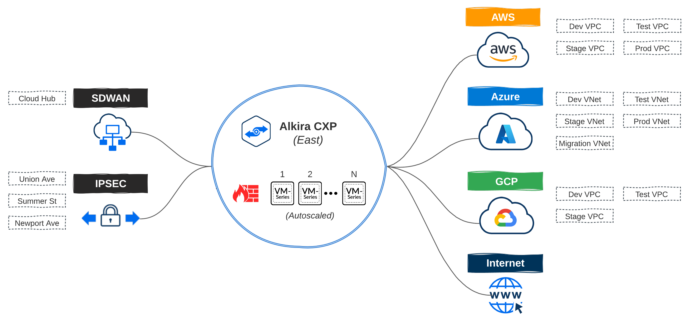

# Getting Started With Alkira And Terraform (Part 3)

Check out [Part 1](https://wcollins.io/posts/2021/getting-started-with-alkira-and-terraform-part-1/) and [Part 2](https://wcollins.io/posts/2021/getting-started-with-alkira-and-terraform-part-2/) where we put together a scalable foundation and connect cloud networks from AWS, Azure, and GCP. For _Part 3_, we will bring on-premises back into the spotlight and connect some sites over [Cisco SD-WAN](https://www.cisco.com/c/en/us/solutions/enterprise-networks/sd-wan/index.html) and IPSEC.

On-premises remains a strong focus for many enterprises through _2021_ going into _2022_. Some workloads, as noted by [Amazon CEO Andy Jassy](https://cloudwars.co/amazon/amazon-shocker-ceo-jassy-cloud-less-than-5-percent-it-spending/), may never move to the cloud. While this may seem like a shocker, if continuing to run specific workloads on-premises makes sense from a cost or compliance standpoint, why should they move?

## Scenario
Let's expand on our network design layout from [Part 2](https://wcollins.io/posts/2021/getting-started-with-alkira-and-terraform-part-2/) and add some requirements for our on-premises networks. For this example, my SD-WAN fabric consists of two data centers + HQ in the East region which, will have connectivity extended to my East _CXP_. Three smaller sites will get connected directly via IPSEC.
* Sites with **<= 10 users** will connect into Alkira's _CXP_ over IPSEC
* All other sites are on Cisco's SD-WAN fabric and get extended into the _CXP_

> In the enterprise space, connectivity can be handled in numerous ways. For instance, many enterprises may want or already have [AWS Direct Connect](https://docs.aws.amazon.com/directconnect/latest/UserGuide/Welcome.html), specifically for its bandwidth and performance. Alkira makes it simple to leverage existing options to connect data centers and sites to _Cloud Exchange Points_ meeting enterprise networking where it lives today and providing a path forward to elastic networks of the future.

### Resources
| Name | Type | Description |
| ---- | ---- | ----------- |
| [alkira_credential_cisco_sdwan](https://registry.terraform.io/providers/alkiranet/alkira/latest/docs/resources/credential_cisco_sdwan) | resource | Provision Cisco SD-WAN Credential |
| [alkira_connector_cisco_sdwan](https://registry.terraform.io/providers/alkiranet/alkira/latest/docs/resources/connector_cisco_sdwan) | resource | Provision Cisco SD-WAN Connector |
| [alkira_connector_ipsec](https://registry.terraform.io/providers/alkiranet/alkira/latest/docs/resources/connector_ipsec) | resource | Provision IPSEC Connector |

## Connecting On-Premises
A great deal of focus has been placed on the cloud over the past five years. However, for large enterprises, migrating and modernizing applications using the public cloud isn't as simple as a project, program, or **throwing lots of cash down to get it done in a year** exercise. Playing the _long-game_ is critical, and on-premises shouldn't be ignored.

### Terraform Cloud
Like _Part 1_ and _Part 2_, I used [Terraform Cloud](https://www.terraform.io/cloud) for provisioning. I'm going to forgo explanation in this post to minimize repetition. To get a better understanding of how I organized things, [check this out.](https://wcollins.io/posts/2021/getting-started-with-alkira-and-terraform-part-2/#organizing-things)

### IPSEC Connectors
[IPSEC](https://en.wikipedia.org/wiki/IPsec) can be set up with _static_ or _dynamic_ routing via _route based_ VPN mode. Connecting sites to Alkira consists of defining the _connector_ along with each _endpoint_ that should be associated with it.

**ipsec_connector.tf**


### SD-WAN Connectors
Extending the Cisco SD-WAN fabric into Alkira consists of defining the _connector_, _endpoints_, and the _bootstrap file_ from [Cisco vManage](https://www.cisco.com/c/en/us/solutions/enterprise-networks/sd-wan/vmanage.html). The SD-WAN fabric will then be extended into one or more _Cloud Exchange Points_, enabling regional hand-offs between the two.

**cisco_sdwan_connector.tf**


> I used [Cisco SD-WAN](https://www.cisco.com/c/en/us/solutions/enterprise-networks/sd-wan/what-is-sd-wan.html) for this post. Today, all three node types (_CSR_, _vEdge_, and _CAT8000v_) are supported. Alkira continually adds new partner integrations, like [Aruba EdgeConnect](https://www.arubanetworks.com/products/sd-wan/edgeconnect/) so keep a lookout for new product announcements

## Conclusion
In [Part 1](https://wcollins.io/posts/2021/getting-started-with-alkira-and-terraform-part-1/), we built a scalable foundation, and in [Part 2](https://wcollins.io/posts/2021/getting-started-with-alkira-and-terraform-part-2/), we connected networks to that foundation from _AWS_, _Azure_, and _GCP_. This post brought data centers and remote offices into the picture over **IPSEC** and **SD-WAN**.

Now that we have all of these networks connected, what about policy and service insertion? To be helpful to enterprises adopting cloud, limiting communication to and across clouds and on-premises is a given. Also, selectively steering specific traffic through [VM-Series Firewalls](https://docs.paloaltonetworks.com/vm-series/9-1/vm-series-deployment/about-the-vm-series-firewall.html) should be a trivial task. In _Part 4_, we will define policies in code and use [Alkira's](https://alkira.com) design canvas to validate.
