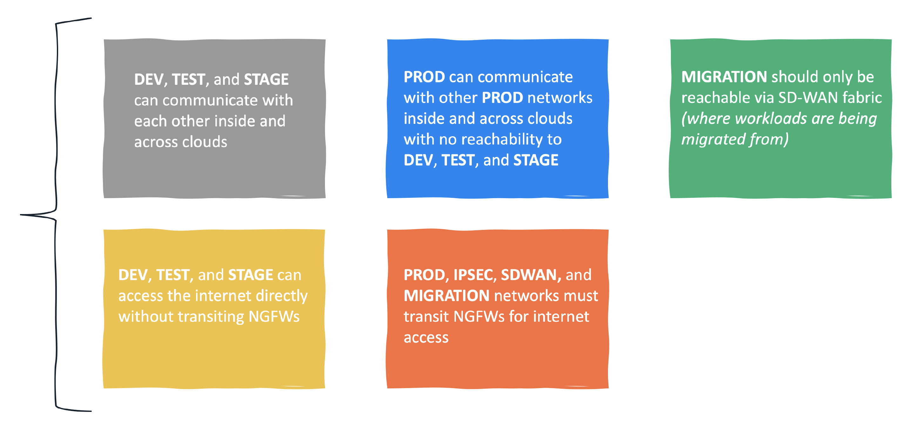

# Getting Started With Alkira And Terraform (Part 4)

In [Part 1](https://wcollins.io/posts/2021/getting-started-with-alkira-and-terraform-part-1/), we laid out our foundation. In [Part 2](https://wcollins.io/posts/2021/getting-started-with-alkira-and-terraform-part-2/) and [Part 3](https://wcollins.io/posts/2021/getting-started-with-alkira-and-terraform-part-3/) we connected various networks _(both cloud and on-premises)_ and provisioned [NGFWs](https://docs.paloaltonetworks.com/vm-series/9-1/vm-series-deployment/about-the-vm-series-firewall.html) that scale to real-time capacity. By default, networks connected to our _corporate_ segment have full-mesh connectivity to each other. Let's build some policies in code that can work with the _groups_ we created to produce logical _micro-segmentation_ that mirror a few _real-world_ use cases.



## Scenario
Before moving on to policy requirements, let's recap the infrastructure provisioned in the previous posts:

* **DEV**, **TEST**, **STAGE**, and **PROD** networks in AWS and Azure for _cloud native_ applications
* Additional **MIGRATION** network in Azure for application migrations from on-premises
* **DEV**, **TEST**, and **STAGE** networks in GCP for a new product that is not yet in production
* **Alkira Groups** non-prod, prod, migration, internet, ipsec, and sdwan for _micro-segmentation_
* **Internet Exit** for users, sites, and clouds along with elastically scaled **Palo Alto NGFWs**

### Policy Requirements

> I wanted these requirements to be grounded in reality. Segmenting application environments, isolating migration workloads, and selectively steering traffic to different services can be challenging when considering _Hybrid Multi-Cloud_. Defining these policies in code is a big step towards integrating _NetSecOps_ into network and security workflows.

### Without Terraform
[Alkira](https://alkira.com) makes it simple to define policies manually via the portal. A great benefit of doing it this way is to visualize the outcome of a given policy in _real-time_. To get a better idea of the process, let's create a sample policy to allow communication from our [Cisco SD-WAN](https://www.cisco.com/c/en/us/solutions/enterprise-networks/sd-wan/index.html) mesh to the [Azure](https://azure.microsoft.com/en-us/) migration zone:

## Building Policies With Terraform
Alkira uses a flexible policy-driven architecture for controlling traffic and enabling service insertion. These policies can be built and enforced without knowing the _IP addresses_ or _subnets_ that represent sites, cloud networks, or applications.

### Resources
| Name | Type | Description |
| ---- | ---- | ----------- |
| [alkira_policy_prefix_list](https://registry.terraform.io/providers/alkiranet/alkira/latest/docs/resources/policy_prefix_list) | resource | Manage Prefix Lists |
| [alkira_policy_rule](https://registry.terraform.io/providers/alkiranet/alkira/latest/docs/resources/policy_rule) | resource | Manage Rules |
| [alkira_policy_rule_list](https://registry.terraform.io/providers/alkiranet/alkira/latest/docs/resources/policy_rule_list) | resource | Manage Rule Lists |
| [alkira_policy](https://registry.terraform.io/providers/alkiranet/alkira/latest/docs/resources/policy) | resource | Manage Policies |

### Prefix Lists
Although defining _subnets_ as resources isn't required, it can make sense to categorize larger blocks of space together, like [RFC1918](https://datatracker.ietf.org/doc/html/rfc1918) private address space.

**alkira_policy_prefix_list.tf**


### Rules
Custom rules can be defined to control routing. For increased flexibility, rules allow matching on _community_, _extended community_, _as path_, and _prefix list_. You can also do _service insertion_ by using _service type_ to steer traffic through a given service. [Palo Alto](https://docs.paloaltonetworks.com/vm-series.html), [CheckPoint](https://www.checkpoint.com/quantum/virtual-systems/), and [ZScaler](https://www.zscaler.com/products/zscaler-internet-access) are supported services today.

**alkira_policy_rule.tf**


> Selectively steering traffic to services like _NGFWs_ in hybrid multi-cloud networks comes with many design considerations and challenges. In practice, this can often lead to _physical_ and _virtual_ firewall sprawl across CoLos, Public Clouds, and Sites. A great benefit of using Alkira is significantly limiting this firewall instance sprawl to only what is needed to meet capacity demands. Also, having a simple way of steering traffic as required saves time and simplifies design.

### Policies
Policies contain a _rule-list_ and get applied to connectors. Once an enforcement scaffolding is in place, newly added connectors will automatically inherit the intended policy defined with infrastructure-as-code.

**alkira_policy.tf**


## Validation
I used [Terraform Cloud](https://www.terraform.io/cloud) for provisioning. From the _design canvas_, we can validate that each policy matches our original intent.

## ONUG - Fall 2021
I presented at [ONUG - Fall 2021](https://onug.net/events/alkira-proof-of-concept-harnessing-infrastructure-as-code-to-deliver-elastic-networks-of-the-future/) on using _infrastructure-as-code_ to build a production-grade hybrid multi-cloud network. The majority of what I covered in this blog series, I demonstrate in real-time using [Github](https://github.com) in tandem with Terraform Cloud's [Version Control Workflow](https://www.terraform.io/docs/cloud/run/ui.html). To get a better idea of how this looks, check out the session:



## Conclusion
Automation is now a business imperative that underpins elasticity and intersects directly with business outcomes. In this blog series, we deployed a production-grade network spanning multiple clouds and sites with unified segmentation and security services, all via code and delivered using _CI/CD_. Keep a lookout for new content as I explore integrating [Alkira](https://alkira.com) with other tools and services!

### Acknowledgements
Big thanks to [Ken Guo](https://www.linkedin.com/in/kenguo/) for taking the time to peer-review and offer such thoughtful insight.
