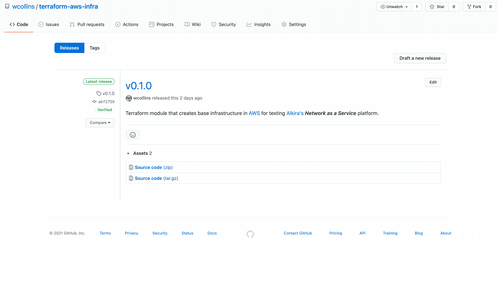
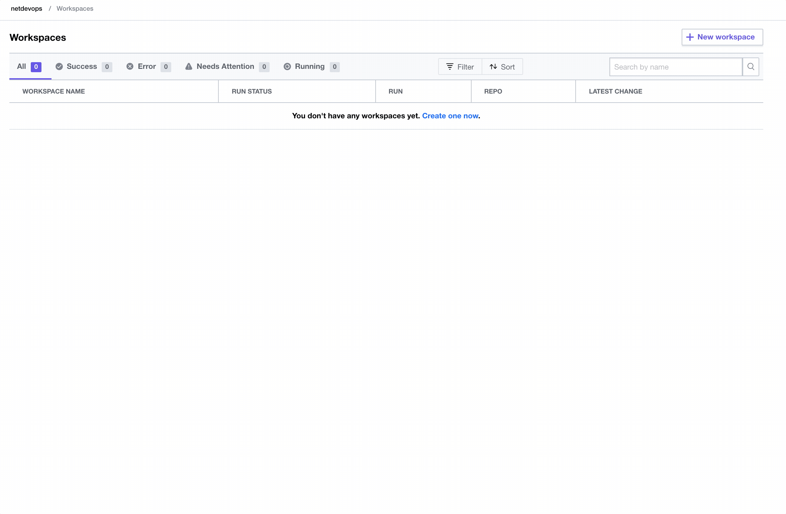

# Intro To Terraform Modules With AWS

Effectively automating infrastructure is no longer a luxury but a staple in the enterprise move through future transformation. I wrote a blog recently about [using Terraform with Packer together](https://wcollins.io/posts/2021/cloud-grade-automation-with-packer-and-terraform/), and wanted to take this thought further with breaking down **Terraform Modules** and getting well connected with **Terraform Cloud**. I recently put together a simple module for building base infrastructure in [AWS](https://aws.amazon.com/) for the purpose of testing [Alkira Network Cloud](https://www.alkira.com/). Let's dive in!

## What Is A Terraform Module?
If striving to build repeatable blocks of infrastructure that get provisioned consistently is the goal, then getting acquainted with [Terraform Modules](https://www.terraform.io/docs/language/modules/index.html) can help you get there. Deploying cloud infrastructure means deploying resources that depend on each other, are generally deployed together, and share the same lifecycle. This is what Terraform modules do - _enable the packaging and management of common resources together, extending reuse and environmental consistency_.

Modules are managed in a [version control system like Github](https://github.com/) and published to [Terraform Registry](https://registry.terraform.io/browse/modules). Terraform's Enterprise and Cloud variant have a **private** registry, making it an ideal vehicle for building, sharing, and managing internal modules for an organization. Furthermore, once a given module is published, it can be used in tandem with other modules to build purpose-based [workspaces](https://www.terraform.io/docs/cloud/workspaces/index.html). For this example, I'm going to use the **public** registry.

## Creating A Custom Module
For my testing, I needed the flexibility to create a new [AWS VPC](https://aws.amazon.com/vpc/) in one or more regions, provide a dynamic list of subnets to be provisioned, and also create a lightweight [EC2 instance](https://aws.amazon.com/ec2/instance-types/t2/) per subnet. However, setting these environments up by hand takes time, and tearing down all the infrastructure manually takes even more time. Plus, I want to use this configuration in tandem with similar scenarios in other cloud providers while testing and demonstrating [Alkira](https://www.alkira.com/).

### Version Control
[The following repository](https://github.com/wcollins/terraform-aws-awsinfra) was created to hold my work on Github. Module components include:
* [**main.tf**](https://github.com/wcollins/terraform-aws-awsinfra/blob/main/main.tf) - Primary logic which describes the infrastructure I want to build
* [**variables.tf**](https://github.com/wcollins/terraform-aws-awsinfra/blob/main/variables.tf) - Required input variables which must be set in the module block
* [**outputs.tf**](https://github.com/wcollins/terraform-aws-awsinfra/blob/main/outputs.tf) - Variables that can be exposed for other Terraform configurations to use; These act similar to _return values_ in programming languages
* [**versions.tf**](https://github.com/wcollins/terraform-aws-awsinfra/blob/main/versions.tf) - Acceptable versions of Terraform and the provider that work with my custom module

### Creating A Release
Terraform **public** and **private** registry expects release tags that can be used to identify module versions:

### Publishing A Module
Publishing the new module couldn't be easier. When going through the setup, it will ask to connect your Github account to the registry. If uploading to the **public** registry, only access to your public repositories will be needed.

## Terraform Cloud
[Terraform Cloud](https://www.terraform.io/cloud) makes provisioning easy. I set up [the following repository](https://github.com/wcollins/aws-infra-east-npe) to test out the new module. To run the new module, we need two files:

[**main.tf**](https://github.com/wcollins/aws-infra-east-npe/blob/main/main.tf)


[**variables.tf**](https://github.com/wcollins/aws-infra-east-npe/blob/main/variables.tf)


### Create A Workspace
Before applying any infrastructure, we must create a new [Workspace](https://www.terraform.io/docs/cloud/workspaces/index.html) in Terraform Cloud.

### Apply Infrastructure
After creating the Workspace and populating the appropriate variables, we can provision our desired infrastructure:

### Destroy Infrastructure
Running cloud infrastructure that isn't being used is a great way to rack up unwanted costs. So when testing is completed, let's destroy our infrastructure.

## Conclusion
Delivering automation in the context of **complete environments deployed intact** heralds a whole new world of possibilities. [Terraform Modules](https://www.terraform.io/docs/language/modules/develop/index.html) simplify the building blocks of _immutable infrastructure_, and [Terraform Cloud](https://www.terraform.io/cloud) enhances the ability to deliver and iterate. Stay tuned for new content coming that showcases the power of Terraform driving [Alkira Network Cloud](https://www.alkira.com/).
