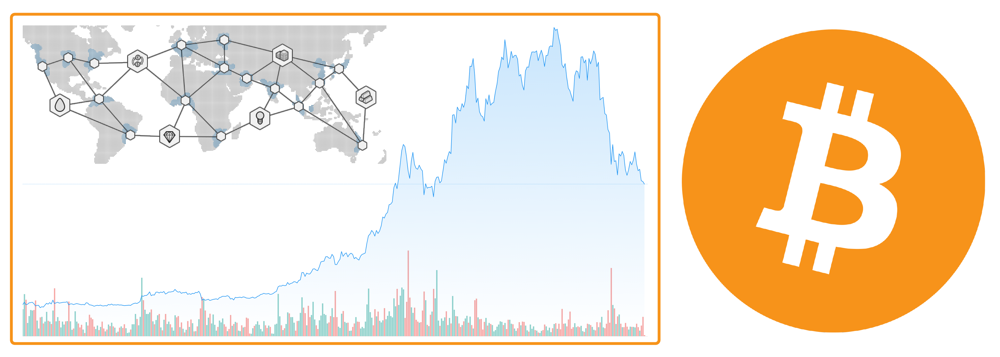
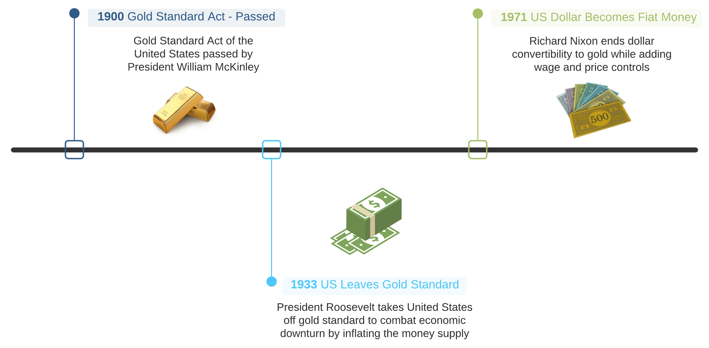

# Understanding The World Of Bitcoin

This is going to be a gigantic pivot from my usual topics of writing. If you are interested in learning something about [cryptocurrency](https://en.wikipedia.org/wiki/Cryptocurrency), stay put. The goal is to make this unbiased and thought-provoking while shedding light on what seems like a world of confusion and misinformation.

In the past month, I have heard various first-hand opinions about [Bitcoin](https://https://bitcoin.org/en/) like, it is a **pyramid scheme**, basically **gambling**, will **supersede** the U.S. dollar, and that one should invest **all** or **none** of their money into it. Talk about a wide range of opinions here!

## Gold Standard To Fiat
The United States operated under the [Gold Standard](https://en.wikipedia.org/wiki/Gold_standard) from **1879 to 1933**. All printed money officially became redeemable for a specific amount of gold in **1900** under the [Gold Standard Act](https://en.wikipedia.org/wiki/Gold_Standard_Act). Each country had its own monetary unit. For the U.S. it was the dollar; in the U.K., the pound. This unit then consisted of a specific number of [troy grains](https://en.wikipedia.org/wiki/Troy_weight#:~:text=The%20only%20troy%20weight%20in,grains%20for%20an%20ounce%20avoirdupois). The **mint price** was coined to represent the ratio of unit to the quantity of gold. Being international in scope, exchange rates between currencies tied to gold were fixed for participating countries.

### The Great Depression
Although the construction and automotive industries helped drive the post-war recovery for the United States after [World War I](https://en.wikipedia.org/wiki/World_War_I), European countries had borrowed heavily and faced challenges with paying off debts. This caused a slowdown on demand for U.S. exports. [The Wall Street Crash of 1929](https://en.wikipedia.org/wiki/Wall_Street_Crash_of_1929) and the bank failures of **1930** and **1931**, caused a frightened public to hoard gold. In addition, the inability of countries to stimulate their economies by increasing the money supply caused severe economic hardships.

To alleviate the economic turmoil, [FDR](https://en.wikipedia.org/wiki/Franklin_D._Roosevelt) took the U.S. off the gold standard in **1931** (Two years after Britain). Given the circumstances, overcoming deflationary forces was viewed as the best way out of the Great Depression. In truth, the global financial system still operated on the gold standard, albeit more indirectly, as the dollar could still be converted to gold under the [Bretton Woods System](https://en.wikipedia.org/wiki/Bretton_Woods_system). In **1971** [Richard Nixon](https://en.wikipedia.org/wiki/Richard_Nixon) ended dollar convertibility to gold completing the full transition to fiat money.

### What Is Fiat Money?
[Fiat money](https://en.wikipedia.org/wiki/Fiat_money) carries no intrinsic value. Today's dollar is solely based on one's faith and the credit of the United States Government. Since there is no tangible thing underpinning the U.S. dollar, this means additional money can be pumped into circulation without creating any extra underlying value. This affords the [central banks](https://en.wikipedia.org/wiki/Central_bank) considerable control across economic variables like credit supply, liquidity, interest rates, and money in circulation.


 [Webster](https://www.merriam-webster.com/dictionary/fiat%20money) defines _fiat money_ as **": money (such as paper currency) not convertible into coin or specie of equivalent value"**. 
{}

Great, now a government can spend without increasing taxes or withdrawing valuable resources from a thriving economy. This means the government can also pay on debts or fund programs effortlessly. It doesn't take much imagination to see where this goes. How do you pay for things not funded through taxation? Easy - The [Federal Reserve](https://en.wikipedia.org/wiki/Federal_Reserve) can keep buying bonds, printing money, and spending. Take a look at the [U.S. Debt Clock](https://www.usdebtclock.org/) for some perspective.

## What Is Bitcoin
[Bitcoin](https://en.wikipedia.org/wiki/Bitcoin) is a decentralized digital currency where transactions occur over the [peer-to-peer Bitcoin Network](https://en.wikipedia.org/wiki/Bitcoin_network). The ingenuity of Bitcoin is predicated on its integrity. A new kind of money that doesn't require any central authority or bank to verify transactions, no entity can inflate or deflate its value, and it's impervious to tampering or counterfeiting. The idea of Bitcoin, in many ways, is the polar opposite of fiat money. While fiat's value is created from the inside-out, Bitcoin's value is made from the outside-in.


For a full technical deep-drive on Bitcoin, check out the original whitepaper written by Satoshi Nakamoto [here](https://bitcoin.org/bitcoin.pdf).
{}

### Proof Of Work
Every time someone uses a portion of Bitcoin to make a purchase, a [cryptographically](https://en.wikipedia.org/wiki/Cryptography) secure transaction is created and broadcast to the network with the consensus being achieved by a [proof of work](https://en.wikipedia.org/wiki/Proof_of_work) system called mining. Reusable proof of work was pioneered by [Hal Finney](https://en.wikipedia.org/wiki/Hal_Finney_(computer_scientist)) in **2004**. Aside from maintaining the ledger of transactions, [Bitcoin mining](https://www.investopedia.com/terms/b/bitcoin-mining.asp) also produces new Bitcoin into circulation. This happens as miners add a new block of transactions to the blockchain. Therefore, proof of work (or any consensus algorithm) is critical in the operation of blockchain systems today.

### Blockchain
While _blockchain-like_ protocols have been proposed in the past, the invention of the blockchain has been credited to [Satoshi Nakamoto](https://en.wikipedia.org/wiki/Satoshi_Nakamoto). Think of our typical everyday commerce. I decide to go to the local coffee shop for a tasty caramel latte. This transaction will hit a point-of-sales system, go through a financial institution, and spit out a physical receipt. Many things happen between the buyer and seller. With Bitcoin, blocks of transactions are added to a distributed ledger called [blockchain](https://en.wikipedia.org/wiki/Blockchain). Each block contains the transaction data, timestamp, and the previous block's [cryptographic hash](https://en.wikipedia.org/wiki/Cryptographic_hash_function). No government, financial institution, or any other authority sits between buyer and seller.

A lot of this article focuses on the currency aspect of Bitcoin. In understanding what makes Bitcoin compelling to diverse audiences, let's decouple the underlying technology and view the benefits from a different lens. So, decentralization, security, immutability, and transparency all add to Bitcoin's charm. Doing these things more efficiently and cheaper is critical to just about every industry if we frame the outputs differently. What about a digital voting system? Full transparency, decentralization while also being tamper-proof? Think of how complicated medical record-keeping is. How about a massive reduction in paperwork while making records more accurate? Or faster money transfers with lower fees from anywhere to anywhere? What about immutability in pharmaceutical trading?


One crucial point - Blockchain is to Bitcoin what a battery is to a [Tesla](https://www.tesla.com/). Of course, this example isn't a perfect 1:1, but let's tease this out a little bit. Tesla is a brand, an idea, and by the opinion of many, the first trailblazer into the modern EV space. [Lithium-ion batteries](https://en.wikipedia.org/wiki/Lithium-ion_battery), the driving power behind the Tesla, has many use cases beyond cars ranging from phones to weed eaters. Similarly, blockchain has many use cases beyond Bitcoin.
{}

## An Investment Play Or Currency?
Bitcoin is still very new and in its infancy stages. It has been difficult for many, even large crypto advocates, to categorize Bitcoin because it's drastically different from other assets available on the market. The great and powerful [Commodity Futures Trading Commission (CFTC)](https://www.cftc.gov/Bitcoin/index.htm) labels all _virtual currencies_ as commodities under the [Commodity Exchange Act (CEA)](https://en.wikipedia.org/wiki/Commodity_Exchange_Act). Many big names in finance dismissed Bitcoin as having no value and strongly advised investors to stay away. Many of those same titans of business also argued that nobody would use crypto as an actual currency. This has slowly changed over the past few years, especially coming into **2021**. 

Kevin O'Leary from [Shark Tank](https://en.wikipedia.org/wiki/Shark_Tank) likened Bitcoin to a [**_giant nothing-burger_** ](https://www.cnbc.com/2021/01/12/kevin-oleary-on-why-he-wont-invest-in-bitcoin-btc.html) not worth investing in. Fast forward a little into the future, and his stance has changed.



[Mark Cuban](https://en.wikipedia.org/wiki/Mark_Cuban) on the other hand, said he would [**_rather have bananas than bitcoin_**](https://www.cnbc.com/2020/04/15/what-it-would-take-for-mark-cuban-to-change-his-mind-about-bitcoin.html). Now the billionaire entrepreneur and owner of the [Dallas Mavericks](https://en.wikipedia.org/wiki/Dallas_Mavericks) is accepting [Dogecoin](https://www.forbes.com/sites/carlieporterfield/2021/03/04/mark-cubans-dallas-mavericks-are-accepting-dogecoin-as-payment-because-we-can/?sh=1911d917677b) as payment, on top of already accepting Bitcoin.



[JPMorgan](https://www.jpmorganchase.com/) CEO **Jamie Dimon** [called Bitcoin a fraud](https://www.cnbc.com/2017/09/12/jpmorgan-ceo-jamie-dimon-raises-flag-on-trading-revenue-sees-20-percent-fall-for-the-third-quarter.html) but now [JPMorgan seems bullish on Bitcoin](https://markets.businessinsider.com/currencies/news/bitcoin-price-outlook-volatility-attractive-institutions-supports-price-target-jpmorgan-2021-4-1030270274) even predicting Bitcoin's volatility will converge with gold's in the future. JPMorgan even launched its own digital coin - [JPM Coin](https://www.jpmorgan.com/solutions/cib/news/digital-coin-payments) earlier this year.



[PayPal](https://www.paypal.com/us/home), a company that knows a thing or two about online payments, processed **3.47 billion** transactions worth a combined value of **$277 billion** in Q4 2020 alone. PayPal accepts cryptocurrency as a funding source for digital commerce at its 26 million merchants.



### What Does All This Mean?
Let's start by making something clear: the goal of **_institutional investors_** is to drive profits for themselves and their clients. So the first thing to mind is, how high can the value be pushed, and what does the cash out look like? The last thing to mind is transparency, opaqueness, decentralization, and cutting out the middle party.

A fear that many crypto purists have is, [Wall Street](https://en.wikipedia.org/wiki/Wall_Street) leveraging their money and power to take cryptocurrency away from the populous (think of how other financial assets are handled). An example of this would be providing **_"guidance"_** to the government that forces the use of an "authorized entity" instead of your standard [crypto wallet](https://en.wikipedia.org/wiki/Cryptocurrency_wallet). Of course, this entity would have to meet **stringent** requirements, and guess who dots all the I's and crosses all the T's?

History can be a great teacher. Usually, this falls in the category of not repeating it. Take, for instance [The Telecommunications Act Of 1996](https://www.fcc.gov/general/telecommunications-act-1996), which ultimately led to six media giants owning **90%** of what we read, watch, and listen to. Wall Street firms are skilled in the craft of buying up smaller fish. So why not buy up all the small crypto exchanges and popular wallet providers and integrate those wallets into their payment networks? What would stop Wall Street from persuading the government into handing over exclusive control of [**ICOs**](https://en.wikipedia.org/wiki/Initial_coin_offering) and [**IEOs**](https://en.wikipedia.org/wiki/Initial_exchange_offering)? In that version of the future, the money and influence will find their way into marketing and lobbying. Sounds to me like the control and power being regulated right into their pockets.

## Conclusion
To me, Bitcoin is not a pyramid scheme or gambling. Bitcoin's underlying technology is highly innovative, and its full potential is not yet realized. Will it supersede the U.S. dollar? Probably not. Should someone invest **all** or **none** of their money into it?

It's not for me to opine, but I am of the opinion that one shouldn't invest in anything, not even the investment options within an employer-sponsored [**401K**](https://en.wikipedia.org/wiki/401(k)), without first taking the time to understand precisely what one is investing in, level of risk, and potential for gains or losses.

Most investment professionals would agree that diversification across several different asset classes such as stocks, bonds, real estate, gold, etc. can be one of the best ways to reduce risk and volatility in an investment portfolio. Owning crypto could be viewed as just another way to add diversification and depth to your overall investment strategy.
