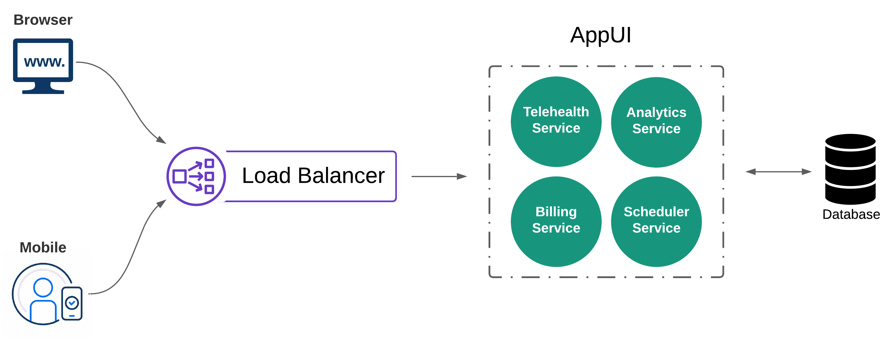
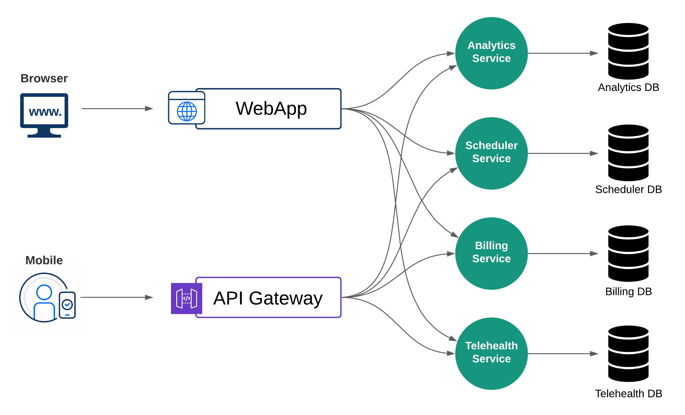

# Are Microservices Better Than Monoliths?

The year is **2022**, and [Kubernetes](https://kubernetes.io/) is wreaking havoc on software delivery as we know it. Applications are going through **modernization** programs so they can be converted into [microservices](https://en.wikipedia.org/wiki/Microservices), but they are coming out the other end as _distributed monoliths_. Next thing you know, services exist across several clouds and even in your data centers. And, of course, the large majority of enterprises aren't just greenfield.

Many have a combination of technologies stacked over decades, including mainframes. Want some perspective? Check out this article on how [COBOL still powers the Global Economy](https://www.tpr.org/technology-entrepreneurship/2019-05-23/how-cobol-still-powers-the-global-economy-at-60-years-old). In this blog, let's examine the polarization of **Kubernetes** and **microservices**. Is it a zero-sum game, or is the real world destined to merge many different types of solutions in organized chaos forever? Before jumping into the world of the _microservice_, let's visit our old friend, the _monolith_.

{}
1. : a single great stone often in the form of an obelisk or column
2. : a massive structure
3. : an organized whole that acts as a single unified powerful or influential force

	[Merriam-Webster](https://www.merriam-webster.com/dictionary/monolith)
{}

## What Is Monolithic Architecture?
A [monolithic application](https://en.wikipedia.org/wiki/Monolithic_application) consists of a server-side application, database, and client-side interface, all of which are deployed as a single unit. You could even have a _monolith_ in the cloud constructed with a _cloud-native_ database, load balancer, and application running on _virtual machines_. The vital question to ask is, **will rebuilding the application with a different architecture replace more problems than it is creating?**

### When To Monolith
Of course, the answer to this is, **it depends**. Greenfield applications that need to scale horizontally can do so in full monolithic glory using a combination of infrastructure-as-code, image management tooling, and cloud-native services. Yes, fully automated, immutable, pipelines-on-pipelines, and reliability grandma would be proud of.

And the best part about this is simplicity. **In my experience, having something simple enough to match where an organization is at ends up being far more valuable than something too complicated to troubleshoot, understand, or upgrade.** Technology affords us the means to simplify things, and in return, our brains tend to overthink and complicate it.

A monolithic system's initial **simplicity** can be appealing in many cases. Defining requirements, testing, and getting your [MVP](https://en.wikipedia.org/wiki/Minimum_viable_product) off the ground is quick. Some of the premiere companies built on _microservices_, like [Netflix](https://www.netflix.com/), started with a _monolithic_ architecture. Check out this talk given by _Ruslan Meshenberg_ on their journey:

{}

### Criticism of Monolithic Architecture
Some of the everyday shade thrown towards _monolithic_ architecture include:
- Diminished understanding over time of the application's architecture as a whole
- Lack of modularity, thus limiting reuse or replacement of individual components
- Ability to make quick and reliable changes following increased growth + complexity
- Slower innovation coupled with a vastly competitive market; Risk of losing market share
- Scaling limitations; Entire application can scale, but not specific services


Just because an application is _monolithic_ doesn't mean it's _legacy_ or even _outdated_. If you have a single _monolith_ with clearly defined module boundaries, sound design, and the ability to scale to an organization's needs, then why change anything at all?
{}

## What Is Microservice Architecture?
_Microservices_ position themselves as the **paladin**, leading the cause against the feared and long-lived tyrant, the infamous [Monolith](https://en.wikipedia.org/wiki/Monolithic_system). The microservice architecture breaks up a given application into loosely coupled and independently deployable services. Each of these services has its own codebase, database, and management model. [Kubernetes](https://kubernetes.io/) has emerged as the vehicle of choice for service orchestration. A common goal is to align those services to business capabilities with clearly defined [context boundaries](https://www.redhat.com/architect/microservice-context-boundaries). 


In large enterprises, _context boundaries_ are generally predicated on the _domain-driven_ structures of the organization. Furthermore, these contexts forge the boundary for the size and scope of the service. Domain experts must collaborate with development and infrastructure teams to ensure success and cohesion across parallel domains, making this concept a big hurdle for many modernization efforts.
{}

### When To Microservice
If a system can't support exponential growth, thus failing to deliver on business goals, then _microservices_ could be the answer _(meaning they solve problems related to horizontal scale)_. In large organizations, new technologies can often be championed to solve _human_ or _organizational_ problems. This tends to snowball over time as the number of solutions and technical staff to operate them increases. Solving causal problems requires an accurate understanding of their causal structure. One of the best explanations on this I have heard came from Rob Brigham at **re:Invent 2015**:

{}

In this talk, Rob recalls Amazon's retail website back in **2001** and how it was a large architectural monolith. He then explains how this _monolith_ became problematic and why breaking it into smaller pieces was the right solution. In Rob's story, maintaining, testing, and deploying in smaller chunks solved the scaling challenges Amazon was facing.


It should also be noted that although you can deploy _microservices_ independently, this does not mean they are entirely [decoupled](https://www.dictionary.com/browse/decouple). The goal is to produce a distributed system **from** a collection of services working harmoniously together for the good of the system as a whole. And although using _microservice_ architecture helps manage and scale complex systems, it can also introduce many new and often _unquantifiable_ complexities as a result.
{}

### Criticism of Microservice Architecture
On [GoTime#114](https://changelog.com/gotime/114), Kelsey Hightower talked at around **54:20** about one of his _unpopular opinions_ which is, **_"Monoliths are the future"_**. You can read some of the excerpts [here](https://changelog.com/posts/monoliths-are-the-future), but I would suggest going back and listening to the entire show to get the full context. Some of the common criticisms of microservice architecture include:
- Transitioning from monoliths require comprehensive understanding and refactoring
- Distributed nature adds complexity to testing; Increased overhead as services grow
- Time and cost associated with refactoring existing app portfolio to _microservices_
- Visibility and traceability challenges; New tooling required to manage sprawl
- Increased moving parts create a larger attack surface; New points of ingress/egress
- Relationship between services is often as efficient as collaboration between teams


Enterprise Ops teams typically absorb a lot of data that drives metrics for the business. The real test comes when something is broken. How quickly can an operations team restore service? If it is not in their power to restore service, how fast can the fault be identified and escalated to the appropriate team that can take action? Debugging _microservices_ often comes down to sifting through never-ending logs. Since many issues stem from failed integration between components, using methods like _distributed tracing_ is necessary to understand the relationship between logs to identify issues between services.
{}

## Things To Consider Before Changing Things Up
You get to work and sit down at your desk _(or maybe roll out of bed and turn on your laptop)_. You attend your company's Townhall presented by the _CTO_. This is the year of **Digital Transformation**. If [Google](https://google.com) can _microservice_ on the _kubernetes_, so can we. It is time to modernize these legacy apps. What would I say if I had a few minutes to talk to this _CTO_?

### Organizational Structure
Many enterprises today are still organized hierarchically, making the whole structure complex. This directly impacts the speed at which _critical_ decisions are made, thus delaying work from being completed. In _post-pandemic_ life, the ability to make quick and effective decisions is crucial at any rate, but especially when approaching modernized ways of delivering software. Finding ways to **flatten the structure, clearly define the roles, and push empowerment for decision making lower can help with organizing for the future.**

### Distributing The Monolith
In life, sometimes the _human_ side of us tends to hammer a square peg into a round hole. Designed initially not to fit, we continue to take swings. If the hammer is big enough and the peg is as frail as many applications, you will get the peg into the hole. Now the operation of the object housing the _peg_ may work, but not to its full potential.

When it comes to transitioning _monolithic_ applications into _microservices_, the result is often distributing the _monolith_. This type of application is deployed like a _microservice_ but built like a traditional _monolith_. I have often seen this happen with applications hammered into the managed cloud provider _kubernetes_ services. Are you in this boat? Start with these questions:
- Are any of our _microservices_ sharing a datastore?
- Is our _rock-star_ developer working across multiple _microservices_?
- Does making a change in one _microservice_ require changes to others?

### Understanding The Cost
In this scenario, we retain some of the problems we were initially trying to escape. Changing a small chunk of the application still comes with redeploying the whole thing, the horizontal scale is not as efficient as it could be, and deployments are slow. Also, the compound interest begins to sting because we have the complexity of _microservices_.

Many variables outside the application may impact the overall picture, including culture, infrastructure, adequate staffing, and technical talent. While no single solution can solve all problems, it stands to reason that a thorough understanding of where the _culture_ and _technology_ are should be the first step prior to planning any major transformational exercises. Attempting to modernize _misunderstood_ and _misrepresented_ applications with **Kubernetes** is not a strategy.

## Conclusion
In my opinion, many legacy applications will continue to run in the enterprise space. Some will end up getting _rehosted_ in the cloud, _replatformed_ or decommissioned in favor of equivalent _SaaS_ offerings. Others will go through large _modernization_ initiatives coming out the other end as _distributed_ monoliths running on _kubernetes_. Purely _greenfield_ applications have a better chance at seeing real _microservice_ architecture and reaping the benefits. Are any of these things wrong? I don't think so.

**The only constant is change**. The ability to acknowledge that something isn't working and promote the _fail-fast_ mentality from the top will encourage new ideas, technologies, and practices that help keep an organization relevant. If there is a culture of fear, then innovative solutions from talented engineers will get sidelined. **The _monolith_ VS _microservice_ conversation doesn't matter.** Delivering the best possible product to the customer with the resources available to you while delivering on business goals does.

### Acknowledgements
Big thanks to [Kiran Dongara](https://www.linkedin.com/in/kiran-dongara/) for taking the time to _peer-review_. Your wisdom and feedback are much appreciated!
