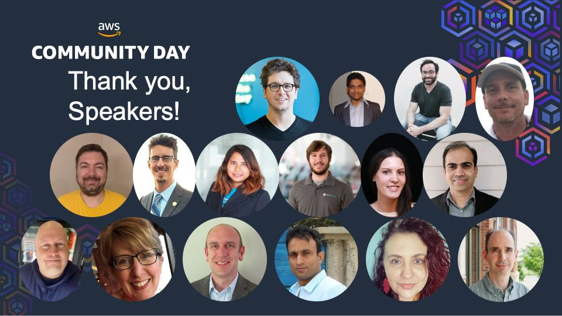

# AWS Community Day - Midwest

I had the opportunity to present at the 4th annual [AWS Community Day](https://www.midwestcommunityday.com/) for the _Midwest_ in June. This event was planned, organized, and delivered by AWS _user group_ leaders and was an absolute blast. I got to catch up with a few remarkable individuals I haven't talked to since _pre-pandemic_, and I got to meet many new people and listen to their stories of _transformation_ in their respective enterprises.

## Small Package, Major Home Run
**AWS re:Invent** is incredible, but it is a little like drinking from the firehose. So much to do, so many people to see, so many sessions, and a crowd like you've never seen. _Community Day_ is smaller, intimate, and focused. [CSCC, Mitchell Hall](https://www.cscc.edu/community/conference-services/mitchell-hall-event-center.shtml) was used for the venue, which is an excellent facility for event hosting, and the _Community Leaders_ did a fantastic job with organizing everything.

## My Talk
My talk was centered around my _real-life_ experiences with navigating **network complexity** as businesses dive into the **digital transformation** deep-end. You can grab the slides [here.](https://github.com/wcollins/cruising-through-network-complexity) One thing that did surprise me was how many other professionals in attendance were going through precisely what I had gone through in their respective organizations. Legacy infrastructure and company culture are no _respecter of persons_. If you want to take a listen, here is the link:
{}

## Other Great Sessions
[Diagnosing Childhood Cancer with AWS Step Functions](https://www.youtube.com/watch?v=2l8Vx_5Wdp4) presented by [Grant Lammi](https://www.linkedin.com/in/grant-lammi-88aa30/), was one of the major standout sessions for me. His talk focused on the difficulty of diagnosing and understanding why children have the cancers they do, what treatment is available, and how to get that treatment to them quicker. This involved a massive operation of sequencing the _DNA_ of children throughout the _United States_. All the other sessions I attended were fantastic.

## Conclusion
It was refreshing attending an event _in-person_ again. There is a **contagious** energy that these events bring, and I found myself going home motivated with lots of new ideas. Everyone is in a different stage of their journey, but no matter where you are, you will find someone who _emboldens_ you or others you can _encourage_. That, my friends, is _community_.
