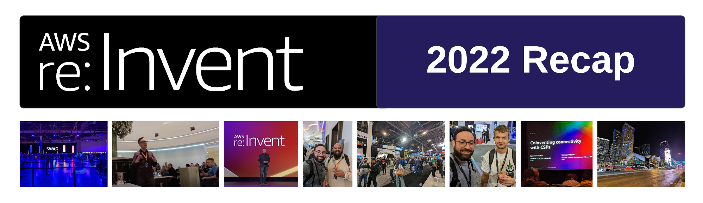
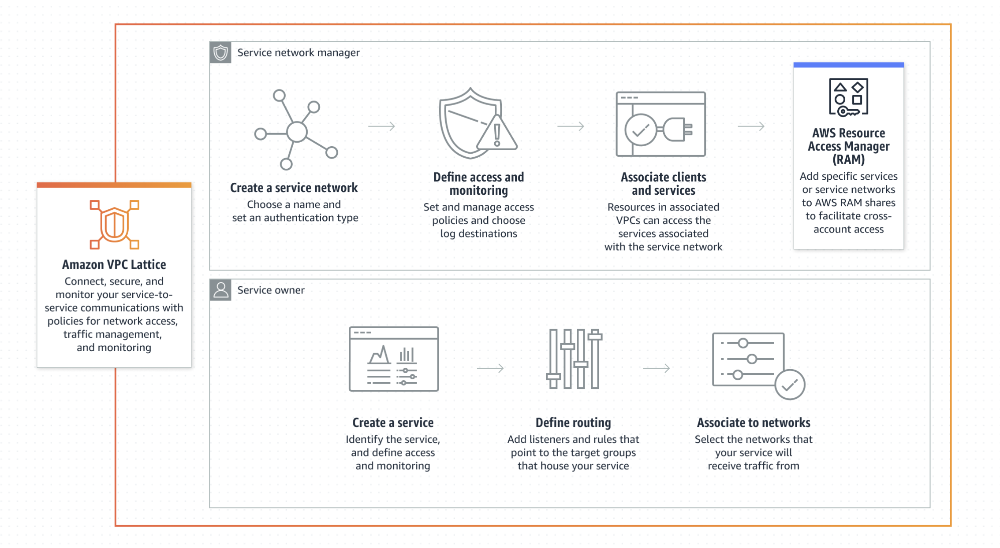
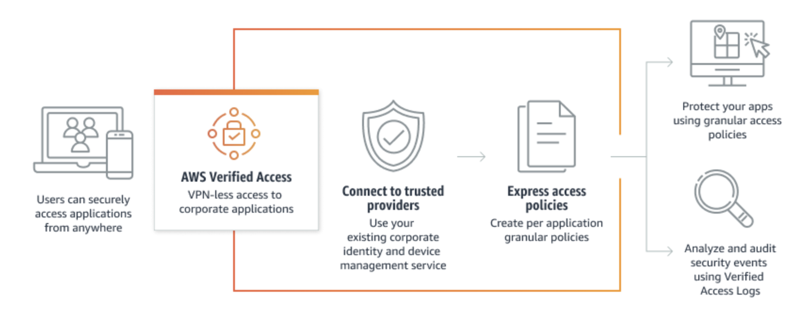

# AWS re:Invent 2022 - Recap

As far as _tech conferences_ are concerned, it's hard to find one as exciting as [AWS re:Invent](https://reinvent.awsevents.com/). Whether it's anticipation for new product announcements or connecting in person with the community, there is something electrifying about being at _ground zero_. And if you can make the trip, you will get a lot of great exercise too! I hit close to **100K steps** or approx. **43 miles** according to my _Fitbit_. What were some of my favorite highlights from **re:Invent 2022**?

## Community
[Jason Dunn](https://www.linkedin.com/in/jasonrobertdunn/) put on a spectacular event for the **AWS Community Builders**. Intros were made to various members of the AWS team, community managers, topic leaders, developer advocates, and _DevRel_ leadership. Even the legend, [Jeff Barr](https://aws.amazon.com/blogs/aws/author/jbarr/), was there. The food was hot, the SWAG was hotter, and the conversation and _networking_ was off the chain. These types of events are where major opportunities happen. Want to become a _Community Builder_? Check out our [page](https://aws.amazon.com/developer/community/community-builders/).

## Attendance
There were over **60K** in attendance this year, and all the sessions I attended were excellent. You can find most of the events already available on the [AWS Events](https://www.youtube.com/@AWSEventsChannel) YouTube channel.

## Network Announcements
My favorite category, **Networking & Content Delivery**, saw a few new product launches. Let's dig in!

### VPC Lattice
Want consistent network policy and traffic management across instances, containers, and serverless? A new full managed service called [VPC Lattice](https://aws.amazon.com/vpc/lattice/) is now in _preview_. This feels like a _service-mesh "lite"_ aimed at scaling _service-to-service_ connections while incorporating some _zero-trust_. Having visibility into _service-to-service_ interactions is important.

#### Pricing
[VPC Lattice Pricing](https://aws.amazon.com/vpc/lattice/pricing/) is broken down into three components that ultimately decide how much that final bill will increase.
- **Per hour** charge for each running service (that runs on instances, containers, or serverless). The price will differ per _region_, but for _US East_ it is **$0.0250/hr**
- **Per GB** charge for each gigabyte of data running through each service. Again, the price for _US East_ is **$0.0250/GB**
- **Requests** made to to each service are priced at a **$0.10** _per 1 million requests_ rate. You begin getting charged once you exceed the _always free tier_ 

{}
Services are heavily restricted and controlled during _Preview_ periods. _VPC Lattice_ is only available in **US West** _(Oregon)_ as of right now. You can get on the waitlist [here.](https://pages.awscloud.com/AmazonVPCLattice-Preview.html) Preview is available for up to 5 AWS accounts at a time.
{}

### Verified Access
_VPNs_ are getting a lot of hate these days, and _ZTNA_ products are getting a lot of love. I'm not surprised to see AWS release [Verified Access](https://aws.amazon.com/verified-access/) for secure access to corporate applications. Like the bulk of _ZTNA_ products on the market today, _Verified Access_ uses conditions based on _identity data_ and _device posture_ for application access.

#### Pricing
[Verified Access](https://aws.amazon.com/verified-access/pricing/) is broken down into two components that make up the final bill.
- **Application Hours** is an hourly charge for associated applications, which comes in at **$0.27/hr** _for 1-148800 app-hours_. If you surpass _148800 app-hours_, this is reduced to **$0.20/hr**. Each partial application hour is rounded up and billed for the whole hour.
- **GB of data processed** is a **$0.02** per GB charge that gets processed for all data flowing between users and applications while using the service.

{}
Visit [Service Terms](https://aws.amazon.com/service-terms/) to learn more about the terms and conditions for all release types. Remember, _Preview_ releases are not intended for production! You can check [here](https://aws.amazon.com/about-aws/global-infrastructure/regional-product-services/) to see if new services are available in a given region.
{}

## Other Big Announcements
This year seemed bigger than ever, and if I had to pick one category that commanded a lot of attention, it was _data management_. Nobody says this as elegantly as the CEO:

{}
To unlock the full power, the full value of data, we need to make it easy for the right people and applications to find, access and share the right data when they need it — and to keep data safe and secure.
{}

### DataZone
[DataZone](https://aws.amazon.com/datazone/) _aggregates_ data sources, sets up a data catalog of sorts, and allows you to define a taxonomy. You can then govern access to data in one place. Let's face it, _data_ is heavy, hard to manage, and time-consuming to make sense of. Anything that streamlines and simplifies administration is _winning_.

### Security Lake
Wherever there is _data_, security is not far behind. What happens when you combine _data lakes_ and _security_? You get a purpose-built data lake for security-related data and name it [Security Lake](https://aws.amazon.com/about-aws/whats-new/2022/11/amazon-security-lake-preview/). On the surface, this looks pretty valuable as it appears to aggregate data from the cloud and on-premises security infrastructure and solutions and normalize it with the [Open Cybersecurity Schema Framework (OCSF)](https://github.com/ocsf). In this long history of _security_ and _data_, gathering tons of _data_ was never a problem. Normalizing, understanding, and contriving value is.

### CloudWatch - Internet Monitor
_CloudWatch_ got a new feature called [Internet Monitor](https://aws.amazon.com/about-aws/whats-new/2022/11/amazon-cloudwatch-internet-monitor-preview/) which enables you to continually monitor _internet_ availability and performance metrics. The monitoring happens through your VPC, CloudFront distributions, and Workspaces directories. The goal is to arm operations with insight into how internet issues impact the performance of applications hosted in AWS and _end-users_ accessing those applications.

## Conclusion
As always, **re:Invent** did not disappoint. There was a lot of _post-pandemic_ excitement that was pretty contagious, and it was great to catch up with folks I hadn't seen in a while or had never met in _real-life_. When you get that many _builders_ together, you know some magic is bound to happen.
