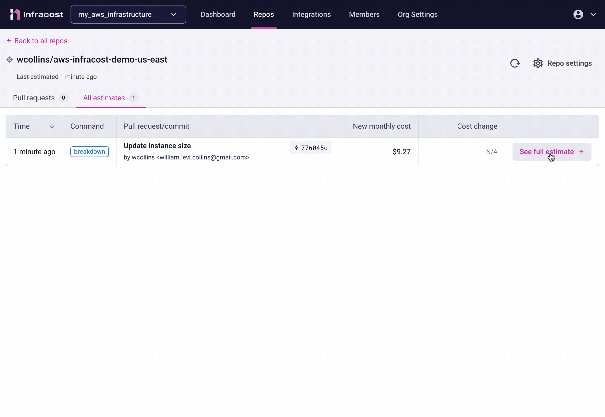
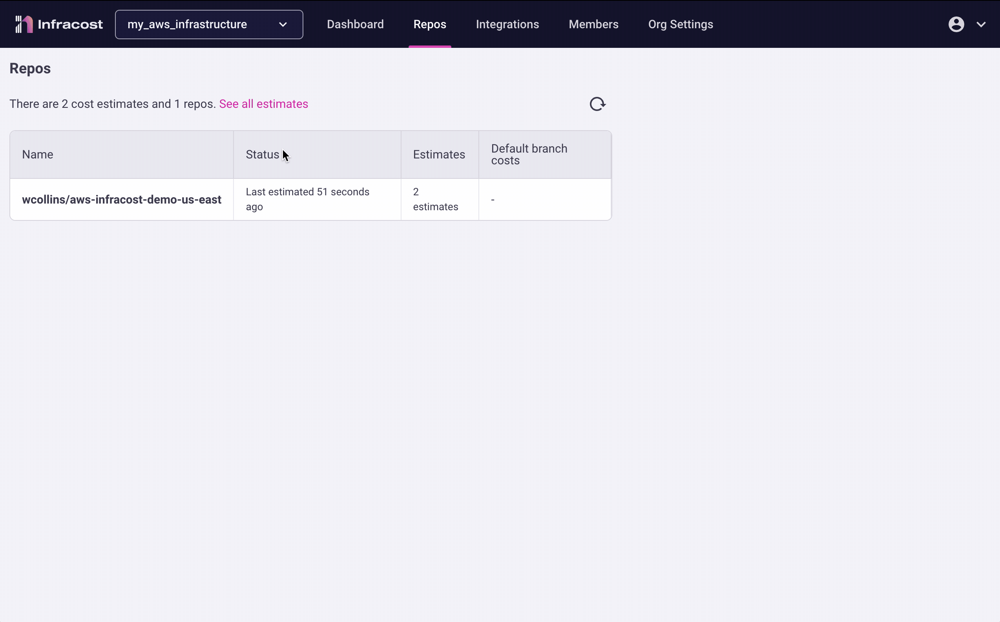
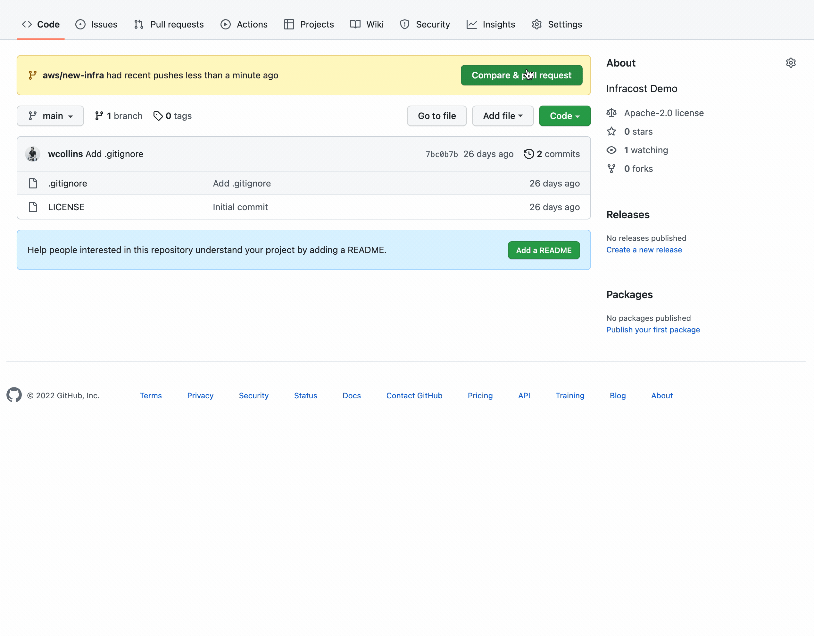

# Calculating Cost Like a DevOps Boss with Infracost and AWS

Blowing out _cloud spend_ is an easy thing to do. This [McKinsey Report](https://www.mckinsey.com/capabilities/mckinsey-digital/our-insights/unlocking-value-four-lessons-in-cloud-sourcing-and-consumption) notes that **80% of enterprises consider managing cloud spend a challenge**. I recently presented at the [Cloud Security Alliance](https://circle.cloudsecurityalliance.org/kansas-city/home) in Kansas City and had the opportunity to network with some tremendous _DevOps_ and _Security_ professionals. One excellent side conversation somehow transitioned to a deep discussion on better ways to understand cost implications in the era of _infrastructure-as-code_. Shouldn't cost be someone else's problem?

## Cost is a Shared Responsibility
As many organizations continue shifting workloads to _the cloud_, the cost impacts the bottom line. The responsibility of _cost-management_ now transcends the _CIO_ and _accounting_ straight down to individual _engineers_. If this sounds scary, fear not. It is an incredible opportunity in the making.

### Where do Engineers Work?
_Engineers_ do not work in spreadsheets, nor do they work with accounting software. Most software engineers work _day-to-day_ in [version control](https://en.wikipedia.org/wiki/Version_control). Furthermore, the centralized teams managing _cloud infrastructure_ more broadly live in this world as well. _Version Control_ often employs an approval process before a _pull request_ is merged, and infrastructure is provisioned. What if you could see the cost impact right here? Yes, right where **you, the engineer** live? This is what [Infracost](https://www.infracost.io/) does.

### Prerequisites
First, follow the instructions found [here](https://github.com/infracost/actions) to download and authenticate _Infracost_. This includes creating an _org_ inside the platform, which is where you can fetch the **API key**. Then we need a quick way to spin up some small _AWS_ instances and then quickly dial them up to more expensive options.

## AWS Configuration
I'll be using the following Terraform configuration to build the [AWS](https://aws.amazon.com/) infrastructure. I'll keep the _dynamic_ portions of the configuration in a separate **locals block** so we can easily adjust for testing.



## Let's Test via CLI
First, let's do a _terraform plan_ against the following criteria:



### Running a Cost Estimate
Now, let's run a cost estimate with _Infracost_ and provision an instance:

Once this is done, we can check out the results on the _Infracost_ portal:

### Running a Cost Diff
Bigger and more expensive is better, right? Let's update our configuration with a few changes. Let's switch that **t2.micro** to an **m5.24xlarge**, and let's see how much it would cost to provision four of them:



This time, we will tweak the command to generate a diff:

Once we navigate back to the portal, we can see the cost change. I have gone from a monthly cost of **$9.27** up to a panic-inducing **$13,449**. Maybe I don't need the **m5.24xlarge** instances for this testing!

## Testing with GitHub Actions
In the spirit of _shifting-left_, let's have a go with [GitHub Actions](https://docs.github.com/en/actions) running against every _pull request_. A lot of spending happens outside production, so this is an excellent way to control spending right at the source. If something doesn't get deployed, it can't cost you anything.

### GitHub Actions Workflow
By default, it will execute the typical Terraform _init_ and _plan_. Then it will run **terraform show -json plan.tfplan** and save the output to **plan.json**. Then, _Infracost_ can run its calculations. This will be populated in the _conversation_ log along with everything else being tested as part of the pipeline.



### Creating a Pull Request
Once we create any _pull request_, the workflow will run and populate the cost details. At this point in the _workflow_, multiple approvals can be added. Three sets of eyes are better than one when spending so much with the click of a button! You can find the supported CICD platforms in the _Infracost_ [documentation](https://www.infracost.io/docs/integrations/cicd/).

## Conclusion
Understanding _TCO_ in the cloud is a deep topic that spans a whole organization. It can be easy to keep provisioning [EC2 instances](https://aws.amazon.com/ec2/instance-types/) when you are disconnected from the _cost_. The ability to see the cost in the _pipeline_ is a fantastic way to practice _due diligence_ on the _technical_ side of responsibility.

Arming _engineers_ with the right _tooling_ and _knowledge_ will help drive cost-conscientious decisions. Small steps like this, along with driving [continuous governance](https://aws.amazon.com/blogs/training-and-certification/aws-partners-learn-how-to-establish-continuous-governance-and-management-at-scale/) strategically, are significant steps in getting control of _cloud spend_.
