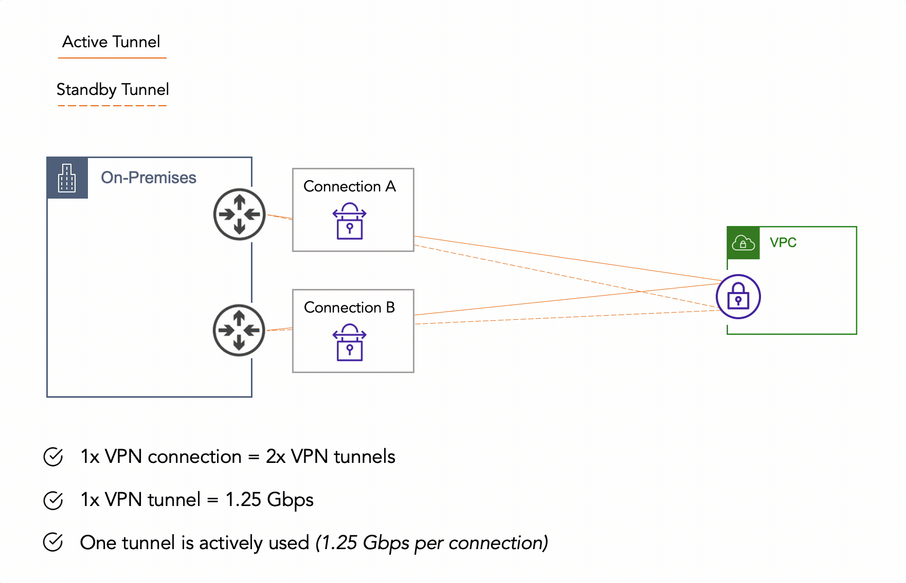

# Evolution of AWS Site-to-Site VPN - Part 1

The necessity for _protocols_ to keep communication secure has been around since the dawn of the internet. The first ever _VPN_ was jointly developed by a vendor consortium _(which included Microsoft)_ in **_1996_**, and came in the form of [Point-to-Point Tunneling Protocol](https://en.wikipedia.org/wiki/Point-to-Point_Tunneling_Protocol). Although many are skeptical about the value of VPNs in _2022_ and beyond, customer consumption of cloud provider _VPN_ services have paved the way for additional features and exponential scale.

What impact do innovations like [Transit Gateway](https://aws.amazon.com/transit-gateway/) and [Accelerated VPN Connections](https://docs.aws.amazon.com/vpn/latest/s2svpn/accelerated-vpn.html) have on design complexity, network performance, and operations? In this blog, I will look back at the first time I deployed a _site-to-site_ VPN and then examine what is possible today when thinking through network design. This is going to be _two_ parts.

## My First Experience
[Site-to-Site VPN](https://docs.aws.amazon.com/vpn/latest/s2svpn/VPC_VPN.html) in AWS is a fully managed and highly available service. This comes in the form of two endpoints on the AWS side (public IP addresses in different AZs per one VPN connection). This service is charged _hourly_ per connection _(plus data transfer charges)_. My first experience connecting _on-premises_ to **AWS** looked something like this:

This was long before the public cloud had disrupted enterprise infrastructure. In this case, we had a single _VPC_ that required connectivity back to on-premises. Since the application being _developed_ wasn't production, we set up a single _VPN_ connection to a single physical router in the Data Center. This was easy work since, as _network engineers_, we pushed _VPNs_ like _weights_. And we had an existing _B2B_ process in place, so our paperwork + process was ready. Somewhere along the way, though, this application went into production.

### Making it Highly Available
Pre _Transit Gateway_, you would typically see a Virtual Private Gateway and VPN connection from each _VPC_ back to _on-premises_ devices. If you follow best practices and want the highest availability possible in this scenario, you will also have redundant devices on-premises. This means you would end up with **2x VPN connections**, which totals **4x VPN tunnels** per VPC. Once the application went past _QA_, to meet our requirements for _Tier 0_ infrastructure, we needed _high availability_.


One question I could always count on getting from _developers_ when we would onboard this design was: "Since we have four tunnels here, why can't we forward traffic on all of them?" The simple answer is that you can override defaults and forward traffic across all tunnels **to AWS** from on-premises; however, the VGW will always select a single tunnel for return traffic.
{}

### Growth, Scale, and Operations
At some point, **Digital Transformation** _(you may have heard of it)_ caused crazy fast growth. And with that growth came more VPCs. And with those VPCs came the necessity for connectivity back to on-premises. Say we add just two additional VPCs using the above methodology, and we end up with **6x VPN connections**, bringing us to **12x VPN tunnels** to manage.


The above example is **single region** with only **3 VPCs**. The reality for many organizations using _AWS_ is much larger. What would this design look like if we had **50 VPCs**? What happens when we need to include _multi-region_ for DR capabilities? How does it impact operations when an application has performance issues, and the network is getting blamed?
{}

## Conclusion
As we onboard more _VPCs_, it becomes apparent that the above design does not easily scale. Bandwidth is limited, tunnels increase exponentially, and operations will have limited success in diagnosing network problems _(or proving the network is not the problem)_. In _Part 2_ we will dive into how [Transit Gateway](https://aws.amazon.com/about-aws/whats-new/2018/11/introducing-aws-transit-gateway/) and [Accelerated VPN Connections](https://docs.aws.amazon.com/vpn/latest/s2svpn/accelerated-vpn.html) take this from an operational _misstep_ to an enterprise _success story_.
