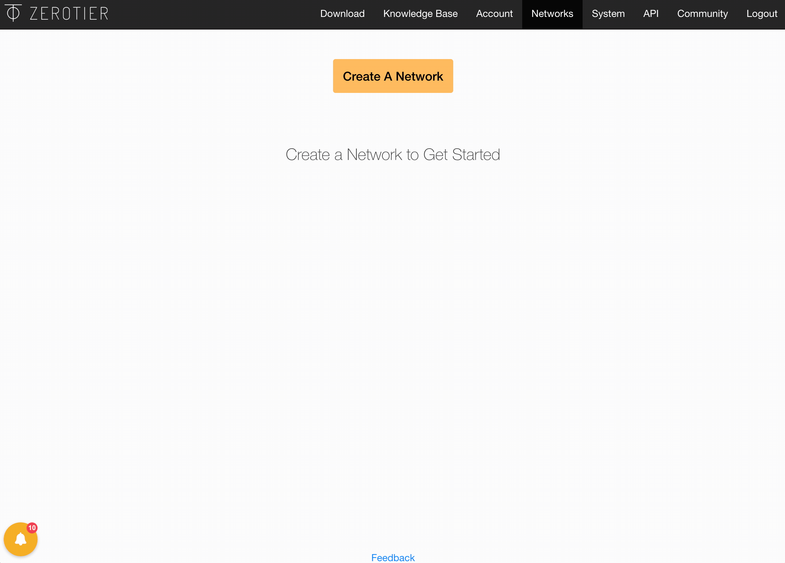
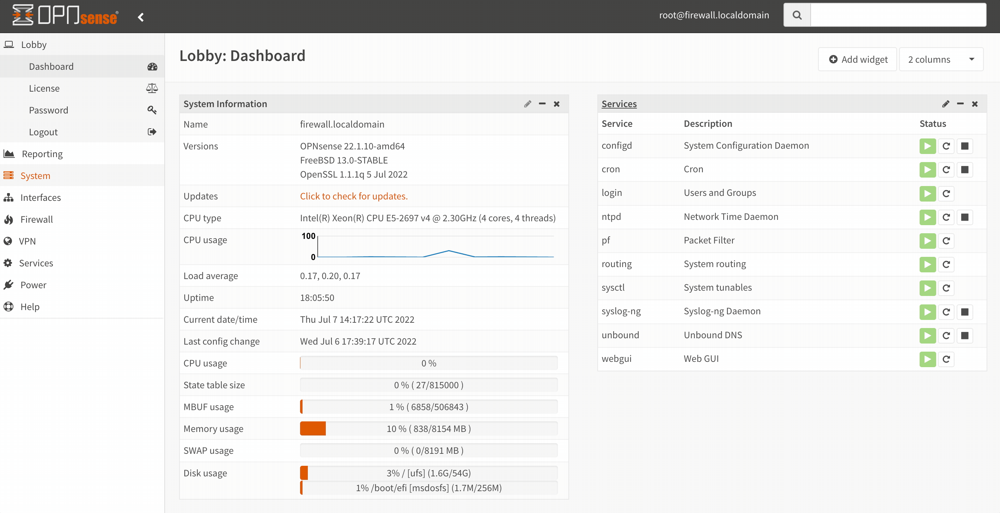
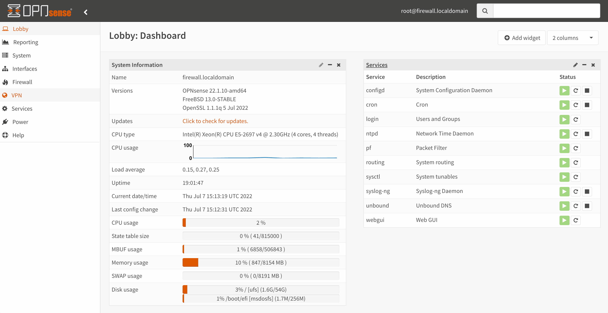
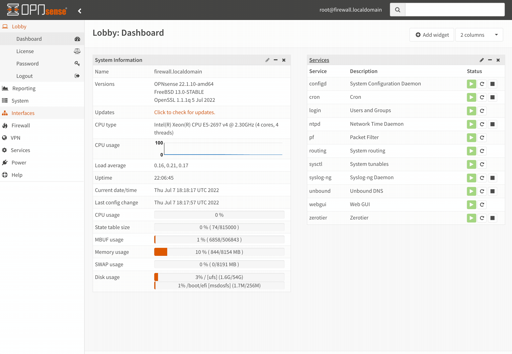
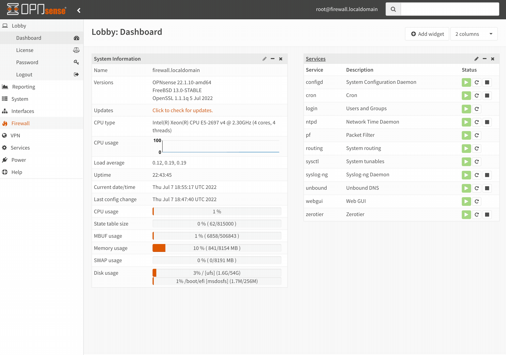

# Exploring ZeroTier For Remote Access

[Zero Trust](https://en.wikipedia.org/wiki/Zero_trust_security_model) is all the rage lately, and traditional VPNs are getting a lot of scrutiny since they essentially _add_ and _remove_ encryption at the firewall. This means _bad actors_ can skip off into the sunset (laterally) and gain access to those legacy systems with less effort. Another challenge with using a traditional VPN is scaling with the dramatic shift to _hybrid work_. [ZeroTier](https://zerotier.com) is an interesting solution that claims to combine the capabilities of _VPN_ and _SD-WAN_, among other things. Let's take it for a spin.

{}
Most tech these days supports _HTTPS_. How hard could _Zero Trust_ be? Anyone that has managed _certificates_ in a large enterprise can answer this question. It is more complicated than it may appear to be on the surface. And as you begin removing that _complication_, you start trusting _identity providers_ and _certificate authorities_ more broadly. One question that must be asked is, if you are using any number of _Zero Trust_ solutions hitting the market, are they _Zero Trust_ when you trust them to own everything?
{}

## Scenario
I know many people _(myself included)_ that want to access devices on their home network while they are away. A solid example here is _security cameras_ or maybe a lab environment that you can test with while traveling. I wouldn't want to make my home cameras reachable directly from the internet. 

One way you could solve this problem is by hosting an [OpenVPN](https://openvpn.net/) server on your network, so when you are away, you can fire up the mobile app, connect, and check out what is going on around your property. How would these scenarios work with _ZeroTier_? Let's lab it up!

## First, What is ZeroTier?
_ZeroTier_ is a _Mesh VPN_ solution. Mesh VPNs facilitate connectivity directly between any two endpoints in the mesh without having to transit through a concentrator in a data center. Sessions between every pair of endpoints are encrypted _end-to-end_. If a _bad actor_ can exploit a device, they only gain visibility into the traffic coming in and leaving that device, making lateral movement a challenge.

### ZeroTier Network Hypervisor
ZeroTier's [network hypervisor](https://github.com/zerotier/ZeroTierOne/tree/master/node) is a custom protocol that implements a [VXLAN](https://en.wikipedia.org/wiki/Virtual_Extensible_LAN) **like** ethernet virtualization across two layers:
- **Virtual Layer 1 (VL1)**: is the underlying _peer-to-peer_ transport layer handling encryption, endpoint authentication, and credential verification
- **Virtual Layer 2 (VL2)**: overlays boundaries, multicast, rule enforcement, and certificate-based access control on _(VL1)_

{}
Want to dig deeper into ZeroTier's **Network Hypervisor**? Check out the [Protocol Design Whitepaper](https://docs.zerotier.com/zerotier/manual) for a transparent explanation of ZeroTier's services, apps, and libraries. Remember, sufficiently advanced technology is like magic until you read the docs!
{}

## What is OPNsense?

[OPNsense](https://opnsense.org/) is an open-source security platform based on [FreeBSD](https://www.freebsd.org/). I have used it historically as an entry point into various lab environments and as a _customer-side_ appliance to terminate _site-to-site_ VPNs for various public cloud providers. Since the platform offers **LDAP** and **2FA**, extending access to others for collaboration is simple. OPNsense offers a [ZeroTier Plugin](https://docs.opnsense.org/manual/how-tos/zerotier.html) and supports _dynamic routing_ via [FRR](https://docs.opnsense.org/manual/dynamic_routing.html).


You may be asking, why are we installing this on a firewall given the _peer-to-peer_ architecture of _ZeroTier_? By installing _ZeroTier_ on the firewall, it acts as a bridge of sorts between all the devices on my test network and the outside _ZeroTier_ members I authorize. In doing this, I don't have to install the _ZeroTier_ client on each device I want to talk to when operating remotely.
{}

## Setting up ZeroTier
First, we need to sign-up for a [ZeroTier Account](https://zerotier.com). Each _VL2 network_ is identified by a **64-bit (16 hex digit)** ID. Once our email is confirmed, we can create a _network_, add a new friendly name + description, and retrieve the **Network ID**.

### Installing ZeroTier Plugin
Next, let's install the _ZeroTier_ plugin on the OPNsense instance in front of the _lab_.

### Configuring OPNsense
Now, we need to configure the _ZeroTier_ service on _OPNsense_. First, we must enable the service, and then we can add the _network_ using the **Network ID** generated when we created the _network_ in the _ZeroTier_ portal.

### Authorizing New Members
After we add the network in _OPNsense_, we can hop back to the _ZeroTier_ portal and authorize it. Since I want to enable access for others to this lab environment, I'll be setting up a _managed route_ with the destination as the **RFC1918** space of the lab with the _OPNsense_ instance as the gateway. To prevent any future confusion, I configured **Do Not Auto-Assign IPs** when authorizing, and configured the _managed IP_ statically.

### Assigning the ZT Interface
If you navigate to **Interfaces** > **Assignments**, you should see a new interface populated. We need to add this interface and _assign_ a static **IPv4** address using the _managed IP_ we set in the _ZeroTier_ portal.

### Adding a Managed Route
To route traffic beyond the _OPNsense_ instance, we need to add a _managed route_ in _ZeroTier_. For the _destination_, we will use the **RFC1918** space for the lab environment. For the gateway _(Via)_, we will use the _managed IP_ we set for _OPNsense_ in the _ZeroTier_ portal.

### Allowing Traffic on OPNsense
To allow communication from other _ZeroTier_ members into our lab environment, we need to add a _firewall rule_ on the _ZeroTier_ interface in _OPNsense_. Of course, since this is a blog, I'm committing the _cardinal sin_ of inserting an **any-to-any** rule. Avoid doing this as a general practice!


_ZeroTier_ uses [UDP hole punching](https://en.wikipedia.org/wiki/UDP_hole_punching), which essentially tricks the router into allowing access to a port on a device directly without establishing a _TCP session_. Since firewalls are stateful, they keep track of connections. Since _UDP_ doesn't establish a session, there is only a concept of inbound/outbound packets on the firewall. This means the firewall has to rely on limited data to let returning packets through _(UDP 5-tuple data)_.
{}

### Connecting from Client Devices
You can find the _ZerTier One_ application on [Google Play](https://play.google.com/store/apps/details?id=com.zerotier.one&hl=en_US&gl=US) or the [Apple Store](https://apps.apple.com/us/app/zerotier-one/id1084101492). Once the _app_ is downloaded, you can provide the _network ID_ and click **Join Network** to connect. Downloads for other platforms can be found [here.](https://www.zerotier.com/download/)

## ZeroTier SDK
Want to enable a mobile app to join a network without requiring special permissions on the phone or adding a **tun/tap** port? The [ZeroTier SDK](https://zerotier.atlassian.net/wiki/spaces/SD/pages/569769988/ZeroTier+SDK) takes the _network hypervisor_ and couples it with an embedded TCP/IP stack which you can link into an application library. This essentially moves the _network stack_ into the application itself.

## Conclusion
**Mesh VPNs** offer a _thought-provoking_ alternative to traditional **hub-and-spoke** designs. It would be interesting to see what a _large-scale_ deployment would look like in the typical _risk-averse_ enterprise and how the _migration path_ would play out. [Tailscale](https://tailscale.com) seems to be the biggest competitor in this space and more or less does the same thing, just using different protocols. While _ZeroTier's_ protocol is proprietary, _Tailscale_ uses [Wireguard](https://www.wireguard.com/) for its data plane. I look forward to seeing how _remote work_ evolves over the next few years.
