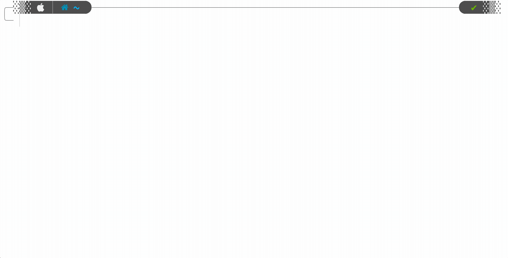

# Importing Infrastructure With Azure Terrafy

Anyone that has worked in _tech_ knows that building _greenfield_ is much easier than dragging along _brownfield_ environments through a roller-coaster they aren't ready for. Tools like [Terraform](https://terraform.io) make _infrastructure-as-code_ a breeze, but what about all that infrastructure you already have provisioned? April Edwards, Cloud Advocate at Microsoft, recently posted a blog about [Azure Terrafy](https://github.com/azure/aztfy), a new tool in preview which aims to simplify the process. You can find the original blog [here](https://techcommunity.microsoft.com/t5/itops-talk-blog/azure-terrafy-import-your-existing-azure-infrastructure-into/ba-p/3357653/WT.mc_id=modinfra-566685-apedward). Let's take it for a spin!


[Terraform Import](https://www.terraform.io/cli/import/usage) enables the importing of infrastructure today, but this only imports one resource at a time, and it's on you to build the configuration files. Sounds time-consuming, right? When you are in the process of learning Terraform, having a tool that can import _brownfield_ environments into _state_ while also generating the [HCL files](https://www.terraform.io/language/syntax/configuration), is extremely useful.
{}

## Installing Terrafy
I installed it via **go install github.com/Azure/aztfy@latest**. 

## Building some Infra
To kick off this little experiment, I will build some infrastructure in Azure using Terraform and then create a different project directory to test _Terrafy_ in. If things go south, I don't have to remove everything manually.

**main.tf**


## Running Terrafy
I created an empty directory called **terrafy-test** for this exercise. Before running _Terrafy_, make sure [azure-cli](https://docs.microsoft.com/en-us/cli/azure/install-azure-cli) is installed and authenticated. If your running on macOS and use [Homebrew](https://brew.sh/), you can run **brew update && brew install azure-cli** and then **az login**.


Like a boss, I ran with defaults and didn't bother reading any of the well-crafted [README](https://github.com/azure/aztfy#readme). Most of the resources were translated fine, but I noticed the _virtual machines_ and _storage accounts_ didn't make it. When going through the setup, you will be able to cycle through and view all the resources available to import. If you see **(Skip)**, that resource will indeed get skipped unless you update the resource type accordingly. 
{}

## Was it Successful?
Let's test a few things before we ride off into the sunset. I did a **terraform plan -refresh only**, and also updated some resources, and everything looks good!

## Some Thoughts
This is a great tool, especially in learning and adoption of _infrastructure-as-code_. The _import_ process is scoped at the [resource group](https://docs.microsoft.com/en-us/azure/azure-resource-manager/management/overview) level, which makes a lot of sense. [Subscriptions](https://docs.microsoft.com/en-us/microsoft-365/enterprise/subscriptions-licenses-accounts-and-tenants-for-microsoft-cloud-offerings?view=o365-worldwide#subscriptions) would be the next level up, and that might get too messy. When _Terrafy_ generates the _infra-as-code_ files, it builds a **provider.tf** to source the _azurerm_ details, and all the other configuration is generated in a monolithic **main.tf** file. This is the layout here:

### More Organization
With _infra-as-code_, there is no easy button. To make things work at scale, things have to be organized. As a starting point, it would be neat to see _Terrafy_ do more organization. Even something simple like breaking down infra into separate categories would be helpful.

An example of this would be taking resources like _localNetworkGateways_, _networkSecurityGroups_, and _virtualNetworks_ and putting them into a separate file called **network.tf** as they all fall under **Microsoft.Network** when drilling down through _azurerm_.

 Virtual Machines and all compute-related components would fall under **Microsoft.Compute** and would be in a different file called **compute.tf**. Organizing things in categories like this would make it easy to sift through larger imports.

## Summary
_Terrafy_ is a great way to bring existing _infrastructure_ into Terraform state. Installation and usage are simple, and the documentation is good. I think this tool will gain enough momentum that new features will come quickly, hopefully on the organization side. To learn more, visit [the GitHub page](https://github.com/azure/aztfy). Happy building!
