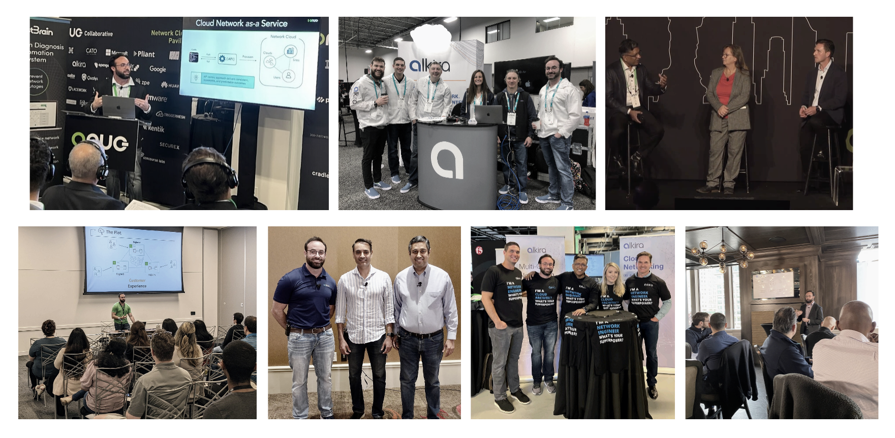
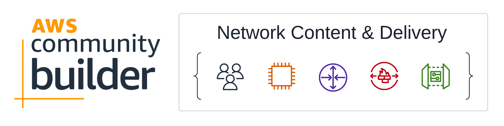
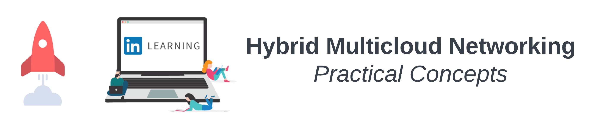

# Looking Back At 2022

At the end of each year, I take some time for _self-reflection_. Looking back through **2022** gave me a colossal reminder of how vital _teams, communities, and leaders_ are. Take _hockey_ for instance. You have certain athletes, often referred to as _generational players_ that carry unmatched individual talent and get selected first overall in the NHL Draft.

These players are weekly highlight reels, yet, without the right system, coaches, and team, they will never lift the Stanley Cup. This year, I had the opportunity to learn from great _leaders_, work with amazing _teams_, engage with valuable communities, and visit exciting places. Here is a _recap_ of my **2022**.

## Startup Life With Alkira
My favorite part of working for a startup like [Alkira](https://alkira.com) is, making life easier for our customers. Having amazing _founders_ that promote a culture that exemplifies a _team of teams_, has a way of creating opportunities that translate directly to the _product_ that, in turn, serves our customers. I'm thrilled to be working with the brightest minds in _networking_ as we take a lot of momentum into **2023**.

## Tech Evangelism
I participated in some incredible _community_ and _partner_ events in **2022**. Travel is back in full swing _post-pandemic_, and it was great to see happy smiling faces again. I got to jointly present with the [ONUG Collaborative](https://onug.net/working-groups/network-cloud/) on the [Network Cloud - Whitepaper](https://onug.net/wp-content/uploads/2022/04/ONUG-Network-Cloud-White-Paper.pdf) we finished earlier this year, and also the state of _Network Cloud_. **NYC** is nice and all, but you can't beat the weather in _Santa Clara_ which is where [Tech Field Day](https://www.youtube.com/watch?v=gilQSBy3ljI) was hosted. The weather was terrific, the delegates were outstanding, and it was a blast connecting with everyone.

### Partner Events
Many large _organizations_ juggle various _architectures_ that were deployed at different times when specific technologies were available. This is why _partner integrations_ are critical for businesses looking to evolve while still managing some of their older _design patterns_. Often, those older applications are the ones generating a lot of the revenue.

I got to _co-present_ with quite a few of our _partners_ this year, including _HashiCorp_, _Fortinet_, and _Infoblox_. These events are significant because the **better together** story is grounded in reality. Each of these integrations is there because it solves a considerable customer problem.

### Midwest Community
Connecting with the community closer to my backyard is always great! **AWS Community Day - MidWest** was hosted in the _Buckeye State_, and the sessions were fantastic. I talked about [network complexity and digital transformation.](https://www.youtube.com/watch?v=fjISOH6ssSQ) I also somehow landed in _Kansas City_ for the **BBQ**, and stayed for [Cloud Security Alliance - KC Chapter](https://csakc.org/). This was a fun bunch with tons of questions and engagement. 

### AWS Community Builders
Passion culminates in sharing and brings contagious energy to many professionals at every stage of their journey. I'm super excited about participating in the **AWS Community Builder** program in the **Network C&D** category. So far, the engagement has been great. I have been able to learn from seasoned experts and also grow new technologists. This is what makes _community_ such a powerful machine.


If you are curious about joining the program, you can find out more [here](https://aws.amazon.com/developer/community/community-builders/). During my first month in the program, I got expert assistance with some complicated _Terraform_ I was writing, authored a blog on the [AWS Community Builders DEV org](https://dev.to/aws-builders), and _peer-reviewed_ some blogs for other builders. Community is a fantastic way to grow your network!


## LinkedIn Learning
Sometime in late **2021**, the passionate and dynamic [Heather Hurley](https://www.linkedin.com/in/heatherhurley/) reached out to me to discuss making LinkedIn Learning Content. One gap that was particularly interesting to me was _networking_ skills transitioning to the _cloud-era_. The need for content that went beyond certifications and approached the problem with **real-life** scenarios and experiences was needed. Working with the **LinkedIn Learning** team was a blast, and in _September_, we released [Hybrid Multicloud Networking - Practical Concepts](https://www.linkedin.com/learning-login/share?forceAccount=false&redirect=https%3A%2F%2Fwww.linkedin.com%2Flearning%2Fhybrid-multicloud-networking-practical-concepts%3Ftrk%3Dshare_ent_url%26shareId%3D%252F%252FVTUh5aQh63B64%252FlXLqSQ%253D%253D).


Are you passionate about your craft? Want to bring it to life and help others along their journey? You can apply to become a _LinkedIn Learning Instructor_ [here](https://learning.linkedin.com/instructors). If you have experience creating content on your own, then doing it with LinkedIn will be a pleasant surprise. Not having to do your own _post-processing_ is **winning!**. 


## Writing About Startups
In **2022**, I decided to pick a few _up-and-coming_ startups to write about that I think will be valuable in the future. This year it was [Lightlytics](https://wcollins.io/posts/2022/shifting-left-with-lightlytics/), [Infracost](https://wcollins.io/posts/2022/calculating-cost-like-a-devops-boss-with-infracost-and-aws/), and [ZeroTier](https://wcollins.io/posts/2022/exploring-zerotier-for-remote-access/) - _(I guess ZeroTier isn't technically a startup anymore, but Mesh VPNs are cool)_. I plan to continue that trend this year.

## Conclusion
Happy Holidays to everyone! Hopefully, many of you can take time with your family and recharge. If you are near the Hartford, CT area, join me at the first [(CT)NUG](https://events.bizzabo.com/448357) of **2023** on _January 19th_ at [Thomas Hooker Brewery](https://hookerbeer.com/). If you are not in Hartford, check out [(US)NUA](https://www.usnua.com/) for upcoming events close to your area! Hearing professionals in the community talk from experience and share their collective wisdom is **magic** and offers some good perspective you can't get over _Zoom_. See you there!
