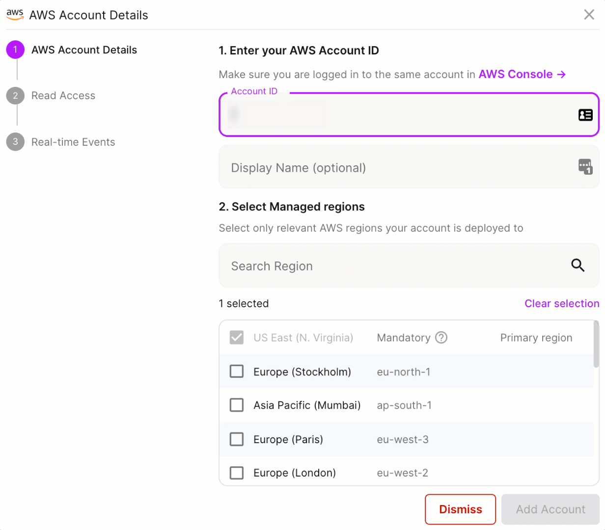
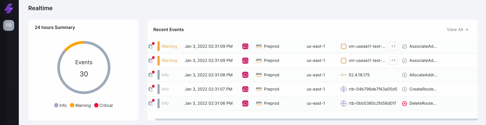

# Shifting Left with Lightlytics

The _public cloud_ continued to dominate spending in 2021. Gartner forecasts worldwide end-user spending for public cloud to reach [$397.4 billion by 2022.](https://www.gartner.com/en/newsroom/press-releases/2021-04-21-gartner-forecasts-worldwide-public-cloud-end-user-spending-to-grow-23-percent-in-2021) With increased velocity; automation continues to be a critical business imperative for the enterprise. Getting automation right means getting all the appropriate teams pulled into the process early on _(shift left)_. [Lightlytics](https://www.lightlytics.com/) is a new _SaaS_ product on the market that aims to make _DevOps_ for cloud infrastructure as agile as software delivery.


[Shift left](https://en.wikipedia.org/wiki/Shift-left_testing) is the practice of getting adequate _testing_ completed **early**, **often**, and with the **right team engagement**. Instead of cloud security practitioners being brought in to remediate an environment that is _QA_ getting ready to go _Prod_, shifting-left would integrate security policy as early as initial development pull requests (or even commits) to version control. If you can't merge risky infrastructure-as-code in the first place, then it will never make it to Prod!
{}

## Getting Started
[Lightlytics](https://www.lightlytics.com/) is a **SaaS** platform that empowers **SRE + DevOps** to automatically predict, pre-empt, and prevent failures, downtime, or business disruption caused by infrastructure. Getting started is pretty simple as they offer a [14-day free trial (no credit card required)](https://www.lightlytics.com/signup). Let's take it for a spin!

### Adding an AWS Account
To get started, you need to add an AWS account. This is done by simply providing your _Account ID_, choosing a _Display Name_, and selecting the AWS regions you have infrastructure deployed to. Lightlytics creates an [IAM Role](https://docs.aws.amazon.com/IAM/latest/UserGuide/id_roles.html) for **Read Access** using a [CloudFormation Stack](https://docs.aws.amazon.com/AWSCloudFormation/latest/UserGuide/stacks.html).

To keep your posture up-to-date in **real-time**, your account must have [CloudTrail](https://docs.aws.amazon.com/awscloudtrail/latest/userguide/cloudtrail-create-a-trail-using-the-console-first-time.html) configured with a **Management Events** trail that applies to all regions. You can then enable _real time_ collection of configuration events and updates (meaning Lightlytics stays up-to-date with infrastructure changes as they happen). This is enabled through an additional _CloudFormation Stack_.

## A Common Scenario
Security-focused teams in enterprises generally want to decrease or eliminate direct internet exposure (especially from EC2 instances). Somehow, this still ends up happening, and  _reactive_ projects are scoped out to remediate. Let's take this scenario through the paces with _Lightlytics_ and see how it might prevent us from doing this.

### Some Risky Configuration
The following [security group](https://docs.aws.amazon.com/vpc/latest/userguide/VPC_SecurityGroups.html) is referenced in my **aws_network_interface** configuration, which is attached directly to my **EC2 instance**. I also set up an **aws_route** with the destination CIDR of **0.0.0.0/0** to an IGW. This configuration will allow both **ingress** and **egress** internet traffic for the ec2 instance.




One trend I've noticed with _cloud security_ in the enterprise is, response to risky configuration seems to be **reactive**. Some bad configuration happens over a period of time followed by an audit. The audit yields actionable insights, and a remediation effort is planned. It is never easy **remediating** production infrastructure as an outage is usually incurred. How could we get **security** in the loop to get eyes on and understand the scope of the change before it ever gets any legs?
{}

### Simulation with GitHub Actions Integration
This [GitHub Actions](https://docs.github.com/en/actions) workflow is slightly modified from [the Lightlytics Documentation.](https://docs.lightlytics.com/docs/github-action) Every time an attempt is made to **merge** changes to infrastructure into **main**, this workflow will _kick-off_ and simulate the proposed changes in _Lightlytics_. This works by executing the _Terraform Plan_ and sending the plan output to _Lightlytics_ with each designated trigger (push/pull request). A link is generated directly to the simulation in the **gitflow**. In a subsequent release, _Lightlytics_ plans to release the ability to automatically fail _pull requests_ if a violation is detected.



### Entering DevSecOps
This is valuable because you could enforce default **protections** on every new git repository you create (complete with security approvers). The security practitioner could then click on the link and review an easy-to-follow simulation outlining the **impact radius** before approving and merging the changes. Can you say **DevSecOps**?

### Discovering Brownfield
Things have a habit of slipping through the cracks. [Lightlytics Discovery](https://docs.lightlytics.com/docs/discovery-overview) decomposes all the dependencies between services, containers, or other common infrastructure you may have deployed. What if I need to find all **EC2 instances** that have internet _ingress_ or _egress_ in an unsupported design? I can narrow this criterion down using **Search Paths** in the _Discovery_ dashboard. Using _Internet_ as the source, I can set the Destination as a _Resource Type_ (In this example, I use EC2).

## Why use Lightlytics?
There are a lot of great _open-source_ projects on the market that work by scanning Terraform **HCL** or **Plan** files that can accomplish most of what was outlined in this blog. Why would I turn to something like _Lightlytics_?

### Barrier to Entry
There is a reason **SaaS** is the largest market segment _(public cloud services)_. Lightlytics requires minimal setup while making quick and easy work of integrating with _version control_ and adding immediate value with thoughtful change review. The more _open-source_ you go, the more customization is required to get the desired results. Furthermore, you must take steps to understand the maintainers of an _open-source_ project, how it gets funded, and possibly assess the risk of it potentially being abandoned.

### Going beyond Terraform State
Many products I've tested for _static code analysis_ are effective only with _infrastructure_ that is managed in [Terraform State.](https://www.terraform.io/language/state) Lightlytics takes this further by simulating changes against the entire infrastructure contained in the _AWS account_. If I have a _brownfield_ environment deployed outside of Terraform State, I want to make sure the influx of new changes doesn't negatively impact it.

### Agentless Approach
In reading my past blogs, you'll know I'm partial to approaching as many problems as possible without _agents_ or _appliances_, **especially** in the cloud. In the **CSPM** space, products generally use some combination of API calls, cloud logs, proprietary agents, or appliances. _Lightlytics_ uses a combination of _API calls_ along with integrations to _cloud native_ features like [CloudTrail](https://docs.aws.amazon.com/awscloudtrail/latest/userguide/cloudtrail-user-guide.html) and even [VPC Flow Logs](https://docs.aws.amazon.com/vpc/latest/userguide/flow-logs.html) to add _data-plane_ context.

With this approach, there is no reliance on scheduled or periodic scans of your infrastructure or git repositories. The posture is updated as changes happen. The following **.gif** was taken as I ran a **terraform apply**. Events were populating on the **Lightlytics** dashboard as they were completed in the Terraform plan output in _real time_. There is value here in that no gap exists between new _infrastructure_ being provisioned and operational posture getting updated. This is what makes the **Simulation** piece compelling since you know that it will be running against a completely up-to-date _picture_ of your entire infrastructure.


In some circumstances, agents are a **must**. This holds true especially when an in-depth perspective into an asset's OS, kernel, and processes is required. As the shift to _immutable infrastructure_ continues, the need for this is minimized as resources like _VMs_ are not long-lived. Leveraging _cloud native_ API calls and logging provides a seamless union allowing for better integration and correlation with native provider automation and enforcement mechanisms.
{}

## Conclusion
For _infrastructure-as-code_, taking a proactive approach by _shifting-left_ and catching things in the build pipeline is the ultimate security. Today, many products tend to be _reactive_ which seems to be the modus operandi of security. [Lightlytics](https://www.lightlytics.com/) has created a solid foundation that can provide value to _CloudOps_ and _Cloud SecOps_ teams that want to go **fast** without leaving **availability** and **security** behind.

As of writing this, _Lightlytics_ has support for AWS but has **multi-cloud** on the roadmap. In addition to supporting additional clouds, the team is working to incorporate the ability to enforce custom-made, industry best practices, and business logic _(architectural standards)_ as part of the GitOps flow. You can learn more about the _vision_ and _team_ [here.](https://www.lightlytics.com/about)
