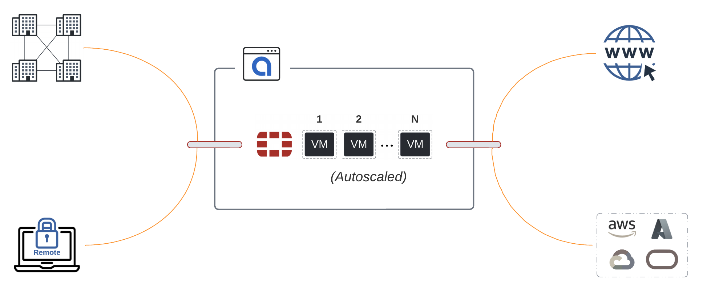

# Terraforming Alkira and Fortinet is Multicloud Bliss

There is a reason why enterprises prefer the _best-of-breed_ approach to connect and secure their network and intellectual property. [Alkira announced its integration with Fortinet](https://www.alkira.com/blog/alkira-and-fortinet-partner-to-secure-cloud-area-networking-traffic/) at **AWS re:Inforce** in July, and this is a _perfect_ example of **the best** in action. As anyone that reads my blog knows, I have an **automation first** approach to everything. [Alkira's Terraform Provider is Fortinet ready](https://registry.terraform.io/providers/alkiranet/alkira/latest/docs/resources/service_fortinet), so let's take it for a spin!

## Key Features
This partnership comes packed with great features, including the seamless integration of [FortiManager](https://www.fortinet.com/products/management/fortimanager.html?utm_source=blog&utm_campaign=fortimanager-main-page) _(which orchestrates the Fortinet Security Fabric)_, extending existing firewall _zones_ into and across clouds with **auto-mapping** of _zones-to-groups_, and weathering traffic surges with **auto-scaling**.


Coming from the _Data Center_ world, configuring firewalls for _high-availability_ has its challenges. Since firewalls are _stateful_, if traffic ingresses **firewall-a** and egresses **firewall-b**, you break state since **firewall-b** has no session. With Alkira, **FortiGate** instances run _active/active_ and _traffic symmetry_ is handled natively. Consistent hashing is inserted into the forwarding layer to detect failures and transition to available instances.
{}

## The Plan
For this exercise, I decided to include a mix of **Hybrid Multi-Cloud** and **Multi-Region** to play with, and why not cross _continents_ too? I already have an _SD-WAN_ fabric extended into **East US** and **Central EU** regions along with an IPSEC tunnel. For _cloud_, I have several networks connected from [AWS](https://aws.amazon.com/) and [Azure](https://azure.microsoft.com/en-us/) with Multi-Cloud [Internet Exit](https://registry.terraform.io/providers/alkiranet/alkira/latest/docs/resources/connector_internet_exit). This gives us plenty of options for selectively forwarding traffic to the **FortiGates** for _east/west_, _north/south_, and internet bound traffic.

### Existing Topology

### Scoping Criteria
First, let's scope out the basics of _what_ we want to deploy:
- _FortiGates_ running [FortiOS: 7.0.3](https://docs.fortinet.com/document/fortigate/7.0.3/fortios-release-notes/553516/change-log) deployed in all regions
- Register with _on-premises_ **FortiManager**
- _Minimum: 2 / Maximum: 4_ auto-scaling configuration
- Extend existing on-premises _FortiGate_ zones across all clouds

### Policy Criteria
Second, let's define what traffic we want to steer through the **FortiGates** and what should be left alone.
- Deny _any-to-any_ by default
- Non-Prod can talk to Non-Prod directly but must pass through a _FortiGate_ when talking to Prod
- Non-Prod can egress to the internet directly, but Prod must first pass through a _FortiGate_
- Partner can talk to migration cloud networks only but must first pass through a _FortiGate_
- Corporate can talk to _all_ cloud networks but must first pass through a _FortiGate_

The _partner_ requirement above is pretty standard. As organizations look to modernize using the _public cloud_, often, they will work with a **preferred partner** to give them a strong start and avoid mistakes in the beginning that would otherwise set them back. These _partners_ generally have access to the environments in scope for modernization only.


It may be tempting to forward all traffic through **NGFWs**. Meeting compliance requirements, especially when **protected data** is involved, can be challenging. However, it does not make sense when examining cloud principles and cost. Identify traffic required to transit _firewalls_ if possible for compliance or other meaningful reasons. If you have _sandbox_ cloud networks that have no access to data or any other intellectual property, does it make sense to forward all that traffic through a _firewall_?
{}

## Let's Build!
We could create separate _resource_ blocks for each **FortiGate** we want to deploy, but that would be unsightly. For this example, let's use [count]([https://](https://www.terraform.io/language/meta-arguments/count) to create multiple services and [dynamic blocks](https://www.terraform.io/language/expressions/dynamic-blocks) to handle the _nested schema_ for **instances**.

### Some Locals
We need to deploy the service twice since we are working across _two regions_. Let's define names for the service, the regions we are deploying for, _instance_ configurations for when _auto-scaling_ occurs, and some values for policies. I have a separate **variables.tf** file with var type: **list(map(string))** that I have the instance _names_ and _serials_ defined in, so I'm just looping through those here.



### Fortinet Configuration
Since we already have _segments_ and _groups_ provisioned, we can reference them in our **main.tf** file. This configuration will provision a **Fortinet** service per region, connect back to our **FortiManager** instance on-premises, map our existing _firewall_ zones to Alkira _groups_ for multi-cloud segmentation, and _auto-scale_ to handle load elastically.



### Policy Configuration
Now, we can selectively steer traffic to the _FortiGates_. [Policy Resources](https://registry.terraform.io/providers/alkiranet/alkira/latest/docs/resources/policy) can take a _list of ids_ for _source_ and _destination_ groups. This is why I defined the **to_groups** and **from_groups** in local variables. We can simply loop through each set, return the IDs, and provide them as a single value to the policy resource.



## Validation
Let's validate our policies to make sure they are meeting requirements. Alkira's ability to visualize policy comes in handy when reviewing multi-cloud policy, traffic flows, and network security more broadly. Having the ability to integrate this into the **DevOps Toolchain** makes for a great experience.

## Conclusion
Ever heard of that _single_ product that solved all your organization's network and security problems? Me neither! Valuable _integrations_ like this one solve **real** problems. With the explosion of **cloud services**, it pays to zoom out and think about the **long game**. Building a strategy for your organization to support the _legacy applications_ you can't migrate, the applications on deck for migration to the cloud, and _greenfield_ applications across multiple clouds, is a winning strategy. [Alkira](https://alkira.com) and [Fortinet](https://fortinet.com) are two products that can help shift your focus to _outcomes_.
