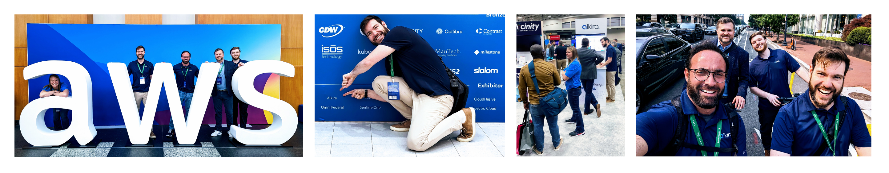
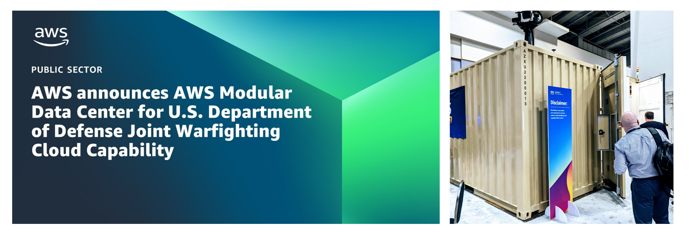

# AWS DC Summit - Recap

What fits somewhere in between [re:Invent](https://reinvent.awsevents.com/) and [Community Day](https://aws.amazon.com/events/community-day/) events? That would be the [AWS Summits](https://aws.amazon.com/events/summits)! This year, I got to experience a double dose of fun by representing [Alkira](https://alkira.com) at our booth and presenting at the **AWS Community Developer Lounge**. I may be biased, but I believe the _Alkira_ team is the best in the world.

It was a blast getting to talk _about cloud networking_ with event attendees while getting a glimpse of how the _public sector_ is adapting to change. And, for my first time _presenting_ at a _Summit_, I thought it fitting to do a live demo. Why not pull in some advanced concepts and do it all live with semi-flaky internet and see how it goes? [Leeroy Jenkins](https://en.wikipedia.org/wiki/Leeroy_Jenkins) would be proud.

## Highlights
My favorite highlights included:

### Team Alkira
Whether it was the many engaging conversations we had with event attendees at the booth, the unplanned _team-building exercise_ of scooting through the **D.C.** bike lanes or seeing the [Washington Nationals](https://www.mlb.com/nationals) get smashed, I wouldn't pick any other team to do it with. What made this _event_ great was the fantastic questions we got from event attendees. As it turns out, great questions lead to great conversations!

### Keynote
At the keynote, we got to hear from [the CIA's first CTO, Nand Mulchandani](https://www.cia.gov/stories/story/cia-names-first-chief-technology-officer/). Keeping your ears open will teach you something new every day. For me, it was that researchers at the CIA created the lithium-iodine battery. I guess this shouldn't come as a surprise, given the need for long-lasting battery power and the nature of surveillance.

### Modular Data Center
Back in _February_ AWS announced their [Modular Data Center for U.S. Department of Defense Joint Warfighting Cloud Capability](https://aws.amazon.com/blogs/publicsector/announcing-aws-modular-data-center-u-s-department-defense-joint-warfighting-cloud-capability/). This only available to government customers under the [JWCC Contract](https://aws.amazon.com/blogs/publicsector/aws-selected-for-u-s-department-of-defense-joint-warfighting-cloud-capability-contract/) and is currently supported in the AWS GovCloud _(US-West)_ and _(US-East)_ regions.


You could rely on limited _infrastructure_. You could also procure, build, and provision _infrastructure_ yourself. Why not just deploy a self-contained and modular data center? In isolated environments, it can securely store, analyze, and interpret _petabytes_ of data in real-time. I got to walk through one of these at the _summit_ and my **nerd** senses were tingling.


### Snowblade Announcement
Want compute and storage amongst other hybrid services in remote locations, including **Denied, Disrupted, Intermittent, and Limited (DDIL)** environments? If you are a _(JWCC) contract customer_, take a look at [AWS Snowblade](https://aws.amazon.com/about-aws/whats-new/2023/06/aws-snowblade-us-defense-jwcc-customers/). This _tech_ extends AWS infrastructure to the _tactical edge_ and meets _U.S. Military Ruggedization Standards (MIL-STD-810H)_. Snowblade is available in the AWS GovCloud (US-West) region.

### Presenting in the _Dev Lounge_
Through the amazing [AWS Community Builders](https://aws.amazon.com/developer/community/community-builders/) program, I got to present in the _Dev Lounge_. Many folks wanting to enter _tech_ seem to go the _software engineering_ route by default. **Serverless** and **AI/ML** are also newer and much more shiny than _networking_. Throughout my time in tech, there appears to be a waning interest in _network engineering_.

One of my goals in the _community_ is to show that _networking_ is equally exciting in the cloud, especially when paired with awesome tools like _Terraform_. In this _Dev Chat_, I started with some theory and real-world problems and then ran a _live demonstration_ on how you could solve some of those problems by combining the power of AWS [Transit Gateway](https://aws.amazon.com/transit-gateway/) and _Terraform_. The slides and code I ran for the demo can be found [here.](https://github.com/wcollins/aws-summit-dc-2023)


Properly designed and executed **network and security** is the solid foundation on which many of the newer and _trendy_ technologies run atop. If you drive a Ferrari, you can reach your destination quickly _(I wish I had a Ferrari)_. If the highway isn't in place, however, and you were driving on rugged terrain, can you imagine what the experience would be like? Imagine also if an optimal interconnection of highways didn't exist between you and your destination.


## Conclusion
This AWS Summit was a whirlwind of learning, engagement, and networking - literally and figuratively! Representing [Alkira](https://alkira.com) and having the opportunity to educate attendees on our product led to many deeper discussions around the state of networking in the cloud. It was a blast to discuss cloud networking, interact with various individuals, and offer a different perspective on a field often perceived as a **thing I want to get out of the way**.
