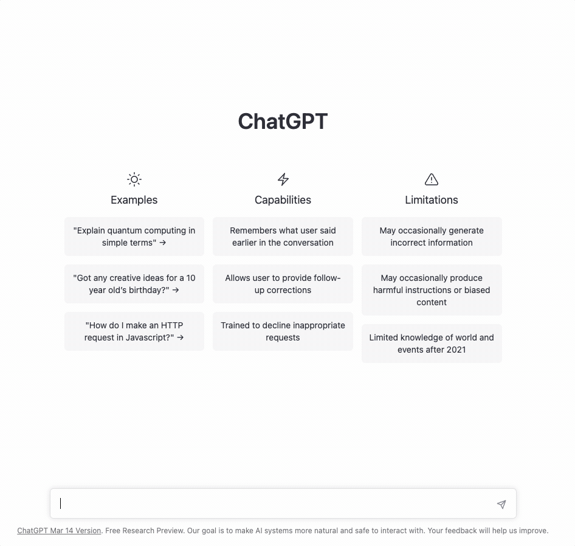

# Can ChatGPT Terraform Simple Networking In AWS?

Usually, when it comes to _technology_, my grandmother doesn't know much because she doesn't care. What is the cloud? How to install a new browser on her laptop? What is 2FA? I might be speaking _French_ to her as I discuss these things. Yet, she knows what [ChatGPT](https://openai.com/blog/chatgpt) is. This shows the vast amount of publicity, hype, and polarization that has ensued since _November 2022_. I tend to avoid AI fear-mongering and focus more on, **how could a tool like this help enhance my daily grind**? Can _ChatGPT_ write [Terraform](https://www.terraform.io/) as elegantly as a poem written from the perspective of Samuel L. Jackson in _Pulp Fiction_? Let's take it for a spin on [AWS](https://aws.amazon.com/) using _infrastructure-as-code_.

## Create a VPC and Two Subnets
Let's ease in gently. Just like when my wife says she is making cookies, I tell myself I will keep things simple and only have one. My first request for _ChatGPT_ is a simple one:  **Create a VPC and two subnets in AWS using Terraform**.


That was pretty seamless. I provided little detail in my first _request_, but ChatGPT filled in all the required arguments added tags for the _Name_ of each resource, and even put my subnets in separate availability zones.


### Does it Work?
Whenever the cookies come out of the oven, I am overcome with a sense of responsibility to test them out before anyone else eats any _(maybe I run this test 3 or 4 times depending on the cookie)_. Like those cookies, _ChatGPT_ isn't getting any favors from me. Let's test:

## Updating our Request
I'm always down for a good conversation when I'm eating cookies. Let's talk a little more to _ChatGPT_ and request an update to our _Name_ tags for our resources:


Asking _ChatGPT_ to update _Name_ tags was successful. Not only did I get the updated code, but comments were added to the code file to show what changes were made. This conversational style is very intuitive. If I don't get what I need, or maybe the output clues me into something additional I need to add, I need but ask. This **generative pretrained transformer** is starting to win my heart over, just like cookies do.


## Going Beyond Basics
At some point _(usually around Christmas / New Year's)_, I realize I have been eating way too many cookies. The _cookies_ have failed me. Let's add more logic to see if _ChatGPT_ fails me too. Since _ChatGPT_ offered up handling _availability zones_ without me asking, let's see what happens if I throw the [count Meta-Argument](https://developer.hashicorp.com/terraform/language/meta-arguments/count) in the mix? 


Anyone who has spent time writing Terraform would likely have spotted the problem before running the code. The 'count' Meta-Argument in Terraform works using an _incrementing counter_. With _ChatGPT_ knowing all the "answers" and providing the availability zones as part of the configuration, it also decided to _increment_ them in the same manner used with **cidr_block** and **Name** tag. Using this logic, it produced **us-east-11**, **us-east-12**, and **us-east-13** which are not availability zones in AWS, thus causing my configuration to crash and burn. Time to go on a diet?


## Conclusion
It is hard not to be impressed. The value goes beyond simply providing lines of code. With each update to my request, **ChatGPT** provided a clear explanation as to why it modified the logic in the manner that it did. Since I began experimenting in _January_, I have found many ways to get _ChatGPT_ to produce wrong _(sometimes laughable)_ code or configuration. Network gear, general-purpose programming, and infrastructure-as-code are complex things, though. Numerous complications, variables, versioning, and interpretation require adjusted expectations.

Knowing how to _phrase_ the question that _frames_ what you need is half the battle. It will supply you with as much detail in the configuration as you request and provide placeholders for the rest. In my _testing_, I have learned quite a few things that have ended up in my _day-to-day_ workflows, which is valuable to me. The idea that this is only the beginning doesn't scare me in the way that it scares many others I have talked to. _ChatGPT_ isn't taking my job. If there is anything that _does_ scare me, it is technologists at the beginning of their journey that will miss out on the valuable details of working their way through complex problems. That experience is worth its weight in gold.
