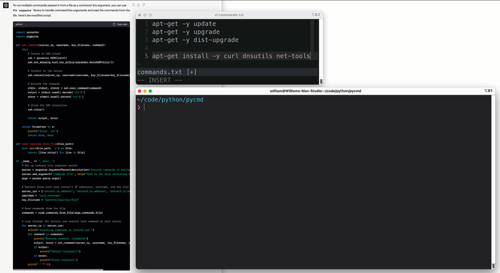
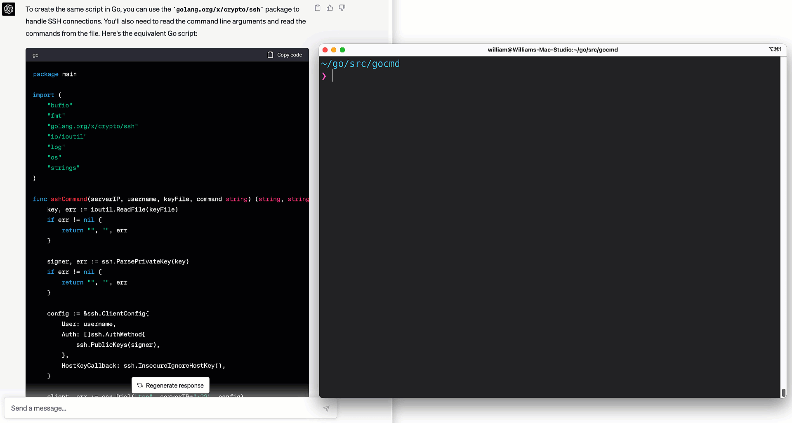

# Configuring Systems With ChatGPT, Python, and Go

I recently wrote a blog about [generating Terraform with ChatGPT.](https://wcollins.io/posts/2023/can-chatgpt-terraform-simple-networking-in-aws/) In that experiment, I was using **GPT-3.5**. It didn't take much to trip up the _galactic AI_ in many of the experiments I did with _Terraform_ and beyond. According to **OpenAI** [GPT-4](https://openai.com/product/gpt-4) soars past its predecessor in its advanced reasoning capabilities. Let's use this model to build code in _Python_ and _Go_. How will the _super titan_ fair in the _Sysadmin_ arena? Let's take on some tedious _backend_ work head-on with the biggest brain around and see what happens.

## Creating a Narrative
In the vast expanse of the Digital Frontier, there were the **sysadmins**. These Server Sheriffs were the guardians of data prairies. Notorious for their unwavering dedication to their craft, Server Sheriffs ensured that systems always stayed up _(and up to date)_. When I did a lot of _sysadmin_ work, _AD-HOC_ scripting was serious business.

Let's not kid ourselves. AD-HOC scripting is **STILL** serious business. One common task was logging into a ton of _systems_ and running a set of commands. For this little experiment, I launched three VMs running [Debian 11.3](https://www.debian.org/News/2022/20220326) in the lab - _(VMware ESXi hypervisor)_.

## Starting Simple
In my experience testing _ChatGPT_ so far, I have found a lot of success in asking a simple question first and then refining the output with more thoughtful questions once I have an idea of what it is throwing back at me. Let's start with the following:

### Question: 1
**Write a python3 script that logs into a debian server and runs a command**


The first pass was a success! Even though I'm a _cowboy_, I'm hard-coded to not hard-code passwords in files. Before I ran the script, I copied it out of _ChatGPT_, and tweaked the password _var_ to use _getpass_. I also filled in the _username_, _server IP_, and _command_. To that point, I would rather not use passwords at all. And logging into a single server is hardly useful. Logging into many servers is. Let's ask _ChatGPT_ to help us out here.


## More Servers, No Passwords
At this point, I put on a fierce glare, look the **AI** straight in the eyes, and murmur, "Is that all you got, you bucket of bolts?" For the _second pass_ I created a key pair with [ssh-keygen](https://en.wikipedia.org/wiki/Ssh-keygen) and SCP'd it to each of the _Debian_ VMs. And with that, I ask my next question:

### Question: 2
**Use this script to loop through multiple servers with key based authentication**


This question only required a little of an update to the script. Merely updating the _function_ input to **key_filename**, adding a variable for the _key_, and constructing a **For Loop** for the cattle, I mean servers. I went ahead and switched out the command to **apt-get update**. Anyone could build this script, right? After testing, I glanced over and saw _ChatGPT's_ spurs glinting like silver in the blazing sun. 


## Arguments And Files
One common task I would do in my _sysadmin_ days was, adding multiple commands in a file and passing that file into the script as a _command line argument_. This is something I started doing many moons ago first with bash scripting, then Perl, and onwards to Python. This was a great approach to automation before _APIs_ took over the world.

### Question: 3
**Use this script to run multiple commands passed in from a file as a command line argument**


I added some commands in _commands.txt_ in my local dir and passed it in with my command. Not surprisingly at this point, everything was successful. In the middle of the town, as the church bell struck _high-noon_, I took a sideways glance at _ChatGPT_ and tipped my hat. _ChatGPT_ glanced back at me as a _tumbleweed_ passed quietly between us. The **AI Titan** then murmured, "Would you like me to translate that script to **GO**?"


## Translating Python to Go
A long time ago, I worked on a project that took several enormous _Perl_ scripts and attempted to transpose them to _Python_. These scripts were hacked together like nothing I'd ever seen. We quickly realized the best path forward was starting from scratch. I have been spending more time in [Go](https://go.dev/) lately, so let's see if our **AI Superpower** is _multilingual_.

### Question: 4
**Create this script in Go**


In some of my testing, I went back to some fairly dated _Perl_ scripts I had lying around and had _ChatGPT_ translate them to some of the newer languages the cool kids are using now. I then opened a new chat and had this _rattletrap_ convert the new scripts back to _Perl_ and thought, **so that is what really efficient _Perl_ would have looked like!**


## Conclusion
Asking _ChatGPT_ questions is kind of like building an [MVP](https://en.wikipedia.org/wiki/Minimum_viable_product) _(minimum viable product)_. You don't ask for the finished product on the first pass. That initial request forms the baseline, e.g., I want a script that can connect to _this_ and run _that_. You, as the _consumer_, can then do some testing and then provide feedback by means of asking additional questions. This makes me think of a _customer feedback loop_. In this case, though, you are the customer and, to some extent, the builder. In my next round of experiments, I'll be setting my aim on _networking_. Perhaps some _OSPF_ and _BGP_?
