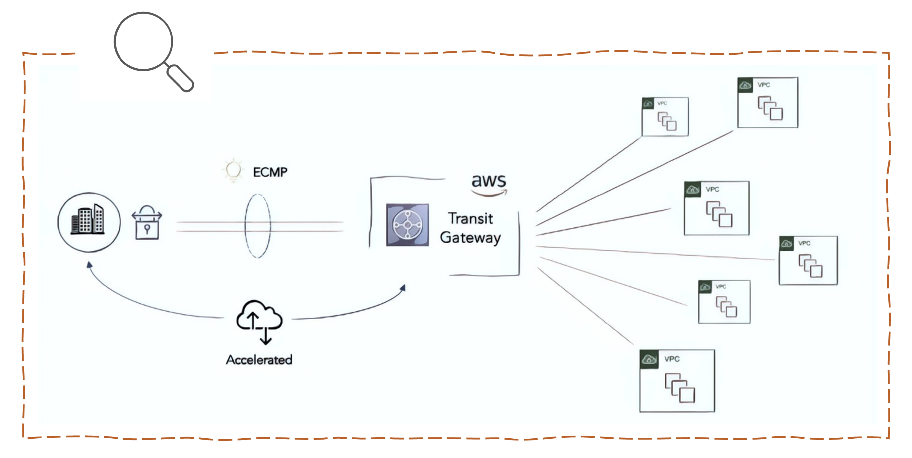
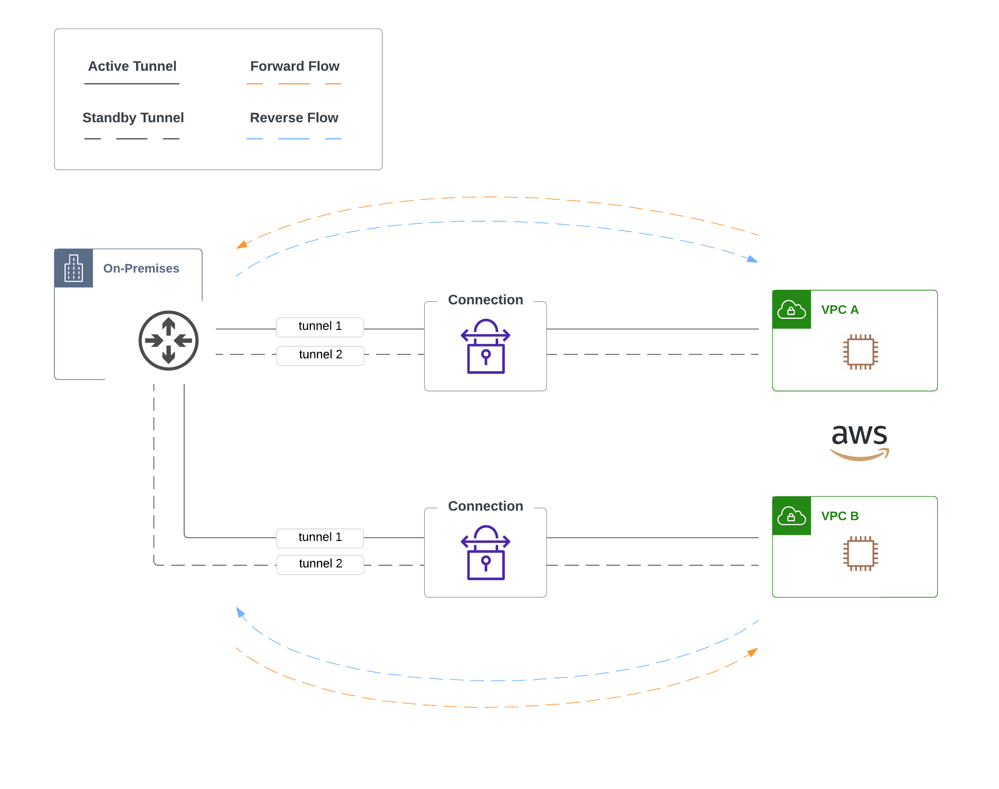
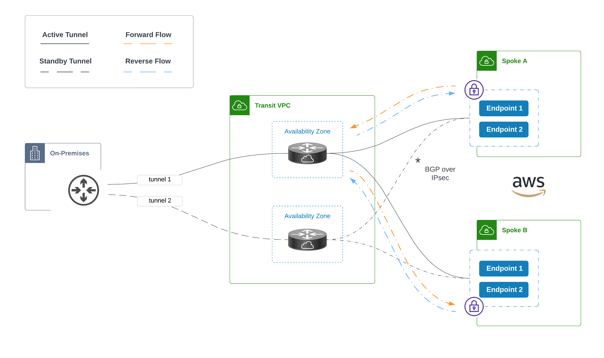
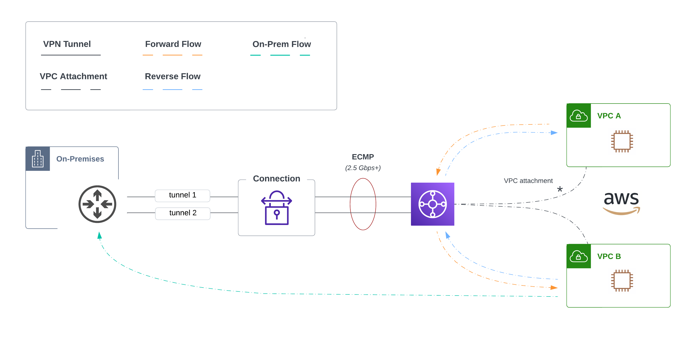
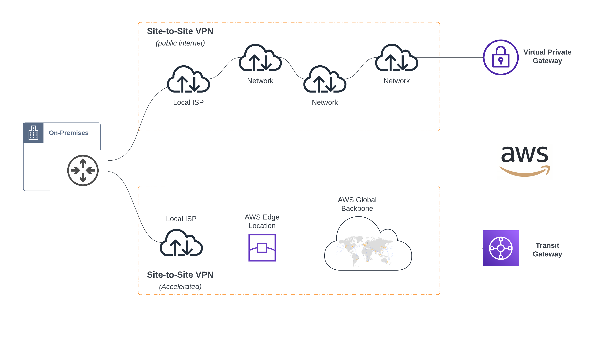

# Evolution of AWS Site-to-Site VPN - Part 2

In [Part 1](https://wcollins.io/posts/2022/evolution-of-aws-site-to-site-vpn-part-1/), we talked about the origins of the [Site-to-Site VPN Service](https://docs.aws.amazon.com/vpn/latest/s2svpn/VPC_VPN.html) in AWS. As consumers began to scale in the early days, they faced tunnel sprawl, performance constraints, and the need for a simplified design. AWS responded with [Transit Gateway](https://aws.amazon.com/transit-gateway/). How did _Transit Gateway_ simplify architecture leading to smoother operations, better network performance, and a scalable blueprint for the future network?

## Pre Transit Gateway
Security teams in the early days would often balk at the idea of using [VPC peering](https://docs.aws.amazon.com/vpc/latest/peering/what-is-vpc-peering.html) without having a centralized transit hub _(where the hybrid connectivity was landed)_. Since _VPC_ couldn't do any advanced packet forwarding natively, many designs would do transitive routing on the customer gateway. Traffic patterns looked something like this:


In this design, the tunnels exist from the customer gateway all the way to the VPC. In this _one-to-one_ relationship, there is no intelligent way to manage the complexity of incremental connections as you grow. Traffic also exits _AWS_ even when the destination is another VPC which is inefficient. Also, since one tunnel is actively forwarding traffic at a time, you are limited to **~ 1.25 Gbps**.


### Transit VPC
To solve some of the shortcomings with VPC peering and tunneling to each VPC directly, [Transit VPC](https://docs.aws.amazon.com/whitepapers/latest/aws-vpc-connectivity-options/transit-vpc-option.html) was born. This solution deploys a _hub-and-spoke_ design that reminds me of my data center networking days when we connected sites to data centers with all the glory of active/standby and _boxes_ everywhere. Want to connect another network? Deploy another few boxes! Sometimes this is unavoidable, but any opportunity I get not to manage additional appliances or agents, I take it.

When I prototyped this design for the first time, we used [Cisco CSRs](https://aws.amazon.com/marketplace/pp/prodview-b75wijpubtr3k) deployed in a _Transit VPC_. This acted as the hub, and each spoke VPC's VGW had two tunnels to the CSRs with BGP running over IPsec. Since VGW doesn't support ECMP, this gives us active/standby out of the box. This design does perform transitive routing in the hub which keeps spoke-to-spoke traffic in the cloud.


In this design, you are responsible for provisioning the appliances (across multiple availability zones in a given VPC). This means you have to do the routine software upgrades along with the emergency firefighting when new CVEs are uncovered. Also, running this design at scale is problematic. As the number of VPCs grow, the number of appliances grow. Imagine the above diagram with 60 VPCs attached.


## Enter Transit Gateway
AWS [Transit Gateway _(TGW)_](https://docs.aws.amazon.com/vpc/latest/tgw/what-is-transit-gateway.html) works as a managed distributed router, enabling you to attach multiple VPCs in a _hub + spoke_ architecture. These VPCs have reachability to each other _(with the TGW doing the transitive routing)_. All traffic remains on the global AWS backbone. The service is _regionally_ scoped; however, you can route between transit gateways in different AWS regions using _Inter-Region Peering_.

You connect various _network types_ to TGW with the appropriate attachments. The various attachment types can be found [here.](https://docs.aws.amazon.com/vpc/latest/tgw/what-is-transit-gateway.html) Since we are talking about the evolution of _site-to-site VPN_ design, we would use the [TGW VPN Attachments](https://docs.aws.amazon.com/vpc/latest/tgw/tgw-vpn-attachments.html) to terminate our VPNs and [TGW VPC Attachments](https://docs.aws.amazon.com/vpc/latest/tgw/tgw-vpc-attachments.html) for connecting VPCs.

### Simplified Connectivity
Keeping things simple has a lot of benefits. This includes reducing the number of tunnels you have to manage while getting _more_ from them. Sometimes you find that _less is more_, especially knowing that someone has to do operations!


Ludwig was a German-American architect who adopted the motto **less is more** to describe the aesthetic of minimalist architecture. In the network, a design should be as simple as possible while meeting requirements.


When using _Virtual Private Gateway (VGW)_, we know the tunnel spans from the customer gateway to redundant _public endpoints_ in different AZs. With this new design, tunnels would land directly on the transit gateway. This also enables us to leverage a single _VPN connection_ for all of our VPCs back to on-premises. We can also use [ECMP](https://en.wikipedia.org/wiki/Equal-cost_multi-path_routing) to aggregate the bandwidth of both tunnels in the connection.

### Accelerated Connections
When using transit gateway, you can enable acceleration when adding the _TGW attachment_. An accelerated connection uses [AWS Global Accelerator](https://aws.amazon.com/global-accelerator/) to route traffic from your on-premises network to the closest AWS edge location. Your traffic is then optimized once it lands on AWS's global network. Let's examine using acceleration with TGW versus no acceleration with VGW:

### When to Accelerate
If the sites being connected are close to a given AWS region where your resources exist, you will see similar performance between both of these options. As distance increases, additional hops over the public internet are introduced, which can increase latency and impact reliability.

This is where acceleration shines. It works by building accelerators that enable you to attach redundant _anycast_ addresses from the edge network. These addresses act as your entrypoint to the VPN tunnel endpoints and then proxies packets at the edge to applications running in a given AWS region.


AWS boasts up to **60% better performance for internet traffic** when using Global Accelerator. You can learn more about how this is accomplished along with the criteria for measurement [here.](https://aws.amazon.com/blogs/networking-and-content-delivery/achieve-up-to-60-better-performance-for-internet-traffic-with-aws-global-accelerator/) 


## Conclusion
Understanding your organization's goals and how the network needs to support them is no trivial task. This is where **_"it depends"_** rears its proverbial ugly head. In the world of cloud networking, complexity, data transfer, and compounding cost, it pays to think through the design and weigh the trade-offs. One thing is certain -- AWS's site-to-site VPN and other adjacent services have evolved, providing the means to construct high-performing networks with a global scale and amazing user experience.
