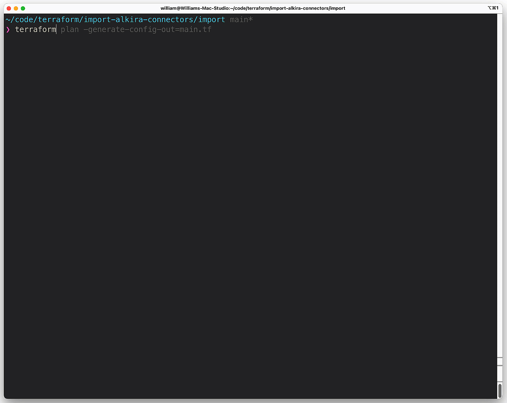

# Using Terraform Import Blocks with Alkira

For many moons, importing existing infrastructure _(that is to say, infrastructure running outside of Terraform state)_, has not been a trivial task. Historically, [Terraform](https://terraform.io) did not generate any configuration. You would have to write the _infrastructure-as-code_ in a manner that reflects how it was deployed. Then, to make matters not easier, you would fetch the 'ol shovel and dig out the unique _resource identifiers_ to feed through the command line. Handling a single resource in this manner is pretty simple. Wrangling **20+** resources like this is not. Last month, [Terraform v1.5.0](https://github.com/hashicorp/terraform/releases/tag/v1.5.0) was released, offering the ability to use **import blocks**. Let's test this new feature on my favorite infrastructure provider, [Alkira](https://alkira.com).

## Why is this Useful?
This feature shifts _import_ from a **CLI driven** approach to _configuration-driven_ and _plannable_ actions for adopting existing resources. Here are the key takeaways:

- **Configuration-Driven:** You can now declare imports within your Terraform configuration files using an import block, making the process more streamlined and part of the initial planning.

- **Plannable Action:** Terraform treats importing as part of a standard plan. Running terraform plan will show a summary of the resources that Terraform intends to import, along with other planned changes.

- **Preservation of existing CLI command:** The existing terraform import CLI command remains unchanged and can still be used separately.

- **Support for Generating Configuration for Imported Resources:** This feature, used in conjunction with the import block, enables templating of configuration when importing resources. A new flag **-generate-config-out=PATH** is added to terraform plan. When this flag is set, Terraform generates an HCL configuration for any resource included in an import block that doesn't already have an associated configuration, writing it to a new file at the specified PATH.

## A Common Scenario
In this scenario, I'll build an **AWS VPC** and connect it to Alkira using the [alkira_connector_aws_vpc](https://registry.terraform.io/providers/alkiranet/alkira/latest/docs/resources/connector_aws_vpc) resource. This is a pretty common scenario I see with our customers. They begin a _proof-of-concept_ for a particular use case and do most of the testing via Alkira's excellent user interface. Instead of building a new environment for _production_ however, a lot of times, they will want to take the _proof-of-concept_ to production. From here, they need to _import_ what has already been built into the appropriate [Terraform State](https://developer.hashicorp.com/terraform/language/state) file.

### Building some Infrastructure
I'm going to _mock-up_ the infrastructure we will import using Terraform.



### Importing that Infrastructure Somewhere Else
Now that we have some _infrastructure_ to work with, along with the _resource identifiers_, let's put _import blocks_ to the test. First, we create an _import block_ for the Alkira connector in a file called **imports.tf** in a separate directory. I defined the _connector_id_ returned from the previous configuration into a new variable called **var.connector_id**:



Next, we _initialize_ this separate directory containing the new Terraform configuration. Once everything is initialized, we can run **-generate-config-out=main.tf** which generates the following:

## Conclusion
This is a great _feature_ that saves time. If I had to guess, as more functionality and polish is added, you'll see _modules_ popping up that leverage _import blocks_ and provide a simplified way to import larger swaths of _infrastructure_. Some tools exist out there to do this today. Last year, I wrote about one such tool - [Azure Terrafy](https://wcollins.io/posts/2022/importing-infrastructure-with-azure-terrafy/). The difference is that since this is now integrated with the Terraform configuration and planning process, it can keep all of the logic in the _HashiCorp_ ecosystem. No messing around with fetching _binaries_ or needing to do any _third-party_ tricks.
