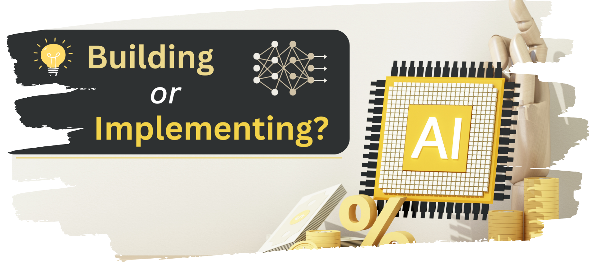
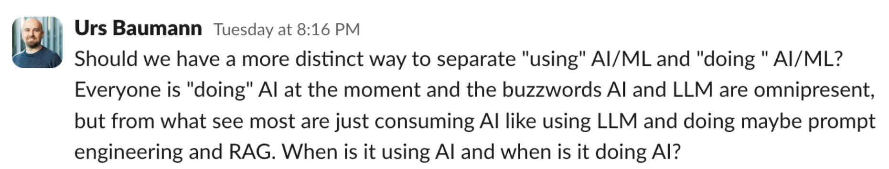

# Are You Building AI Or Just Using It

As AI dominates tech headlines and corporate strategies in 2024, an important distinction is being blurred - the difference between developing AI versus consuming AI services. This mischaracterization risks confusing the market and overselling capabilities, but that isn't anything new right? Take zero-trust, cloud computing, or even take a look back at the _early-2000s_ with the web revolution. [Urs Baumann](https://www.linkedin.com/in/ubaumannch/) tossed out a great questions in the _Network Automation Forum - Slack_ recently, and I thought it would make for a good blog _(or maybe venting session depending on how you look at it)_. Remember, these are opinions.

## The Big Question

I think this is an excellent question. The moment _Urs_ posted this in the chat, it made me think about _medicine_. There's a clear difference between researchers that are advancing medical science and those practicing medicine. A family doctor doesn't claim to be "doing pharmaceutical research" when prescribing medication. Let's dig down a little further.

## Building AI - (A Small Crowd)
Core AI development represents a deeply interconnected ecosystem where each component builds upon and enables others. This is the story of our lives in tech, right? Training large language models requires novel neural architectures, which themselves emerge from fundamental machine learning research. This research, in turn, depends on insights gained from model training attempts and optimization techniques. The optimization methods then get refined. If you are _doing_ AI, then you probably fall into one of the four cycles:
- Foundational Models & Training
- Neural Architecture Development
- Machine Learning Research
- Optimization Techniques


If I had to summarize this, I would say: If you are consuming APIs or even fine-tuning models, you are most likely _(not always)_ operating independently of the aforementioned core development cycles. This means you are consuming AI services. Consider the evolution of web services: Many companies claiming to "do web services" were typically implementing standardized protocols that were developed and maintained by a group of core contributors. While not a perfect 1:1 example, the same principles apply.


## Implementing AI - (Most of Us)
Most companies today use databases without developing database engines, or build on the public cloud services without building data centers. What about AI then? Isn't it the same thing to say, companies are implementing AI without developing the underlying models or architectures? BINGO! What I'm seeing in the market today is a layered approach of implementation that looks something like:
- Basic API integration of existing LLMs 
- Domain-specific apps _(content generation / data analysis)_
- RAG or fine-tuning pre-trained models


ChatBots, document analysis, data processing, content generation, and even code assistance are all, in my opinion, examples of _AI consumption_. These implementations mirror other technological adoptions throughout computing history _(the above database example)_. 


## Recognizing The Critical Nature of This Distinction
The distinction between AI development and AI implementation isn't merely academic - the implications bleed into the industry, investors, and end-users. When tech companies for example, blur this line in their marketing, it creates unrealistic expectations about their capabilities. The consequences of this across sales, product, and engineering teams are self-evident.

## The Feature VS. Product Debate
Another opinion I hold strongly is, most implementations of AI today are features rather than products. They enhance existing solutions rather than create fundamentally new ones. When AI serves as an enhancement to existing software, it's clearly a feature. An example might be, building a _ChatBot_ that is trained on product documentation, support tickets, and some measure of product data. This would be a feature that ultimately enhances customer experience and provides new ways to interact with and use a given product.

## Looking Forward
As AI technology matures, it makes sense that we would see further separation between core development and implementation. What category do you fall into? There's no shame in brining value to your customers by being an excellent AI implementer - but accuracy in how we describe our relationship with AI technology matters. Moreover, being honest about how we describe and market the products we build, is becoming increasingly important and will serve to build integrity and trust. In conclusion, let's celebrate both the innovators advancing core AI technology and those skillfully implementing it to solve real-world problems. But let's also maintain clarity about the distinction between these roles.
