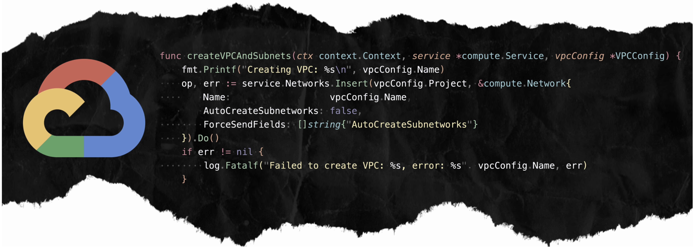
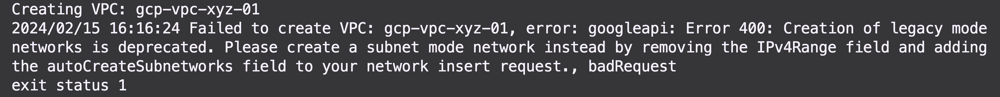

# GCP SDK Fun

Sometimes, especially if you aren't a developer by trade, you can get stuck on something small that will find you banging your forehead on your desk _(figuratively, of course)_. Most of the time, it is easy enough to find an answer online or even from [ChatGPT](https://chat.openai.com/). Other times, you may not be so lucky. The other day, I fell victim to a **TWE** or _time wasting event_ that I thought was worth writing about. Fasten your seatbelt!

## The Problem
[GCP SDK](https://cloud.google.com/sdk?hl=en) provides libraries and tools for interacting with Google's cloud products and services. Pick your poison with whatever programming language you choose! On this particular **Fun Day**, I was writing a quick script to build _VPCs_ and _subnets_ from **.yaml** files and then expose a _destroy_ call to wipe everything out when particular testing was completed. I've built something similar for [AWS SDK for Go](https://aws.amazon.com/sdk-for-go/). On this particular day, I ran into the following error:

### Digging into the Code
I knew I had to set **AutoCreateSubnetworks: false,** in the code as it disables GCP from _automagically_ creating subnets for me. Of course, I want to do that myself! And this is where the confusion started -- I did have this set, and I had omitted the **'IPv4Range'** at the _VPC level_ despite what the error said.



## Solving the Problem
I searched on [DuckDuckGo](https://duckduckgo.com/), my search engine of choice, and came up empty. In my desperation, I turned to a _bucket-of-bolts_ I don't fully understand who's supposed to know all the answers, **ChatGPT**. I pasted in the error message and code. The **AI Overlord** then patted me on the back _(again figuratively)_ and told me to set **AutoCreateSubnetworks: false** and remove **IPv4Range** from my code since that is for _legacy networks_. The problem is that **IPv4Range** wasn't defined anywhere in my code and **AutoCreateSubnetworks** was already set to _false_.

### Google Wins
As I sat pondering reality, space, and time, I decided to just _google search_ it and came across this [excellent answer](https://stackoverflow.com/questions/59058750/gcp-compute-api-creates-vpc-in-legacy-mode) on Stack Overflow. Apparently, the **AutoCreateSubnetworks** field is not included in the request payload unless you define it explicitly with **ForceSendFields: []string{"AutoCreateSubnetworks"},**. All I needed was this extra line:



## Conclusion
_Artificial Intelligence_ is a society-altering technology. Is it coming for our jobs anytime soon? I don't think so. Will it help enhance and augment our _workflows_? Yes, Absolutely! However, situations like this remind me that there is no substitute for people who possess deep skills and understanding in particular areas of technology. This holds especially _TRUE_ when something fails or isn't exhibiting the correct behavior. Happy coding!
