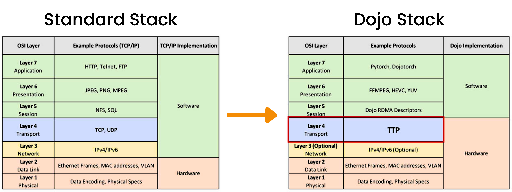

# Tesla Adapts Ethernet with Modified Transport Layer for Dojo

The foundation of high-performance computing that powers _artificial intelligence_ lies not just in powerful GPUs, but in the intricate web of connections between them. As models grow exponentially in size and complexity, the networking infrastructure that facilitates their training has become a critical bottleneck. This has sparked a fascinating race to develop networking solutions tailored for AI-centric workloads, with tech giants like [NVIDIA](https://www.nvidia.com/en-us/networking/) who are on an infrastructure _trailblazing_ marathon.

In _big tech_, unique requirements drive cool _(and sometimes custom)_ innovations. Never one to follow the crowd, [Tesla](https://tesla.com) has developed its own networking protocol tailored for AI workloads: TTPoE (Tesla Transport Protocol over Ethernet). As presented at [Hot Chips 2024](https://chipsandcheese.com/2024/08/27/teslas-ttpoe-at-hot-chips-2024-replacing-tcp-for-low-latency-applications/), TTPoE takes a fundamentally different approach to the high-performance networking problem. You can find the source material slides [here.](./tesla-ttpoe-slides.pdf)

## The Lossless Imperative
At the heart of this networking revolution is the concept of lossless vs. lossy networks. Traditional Ethernet networks are lossy by nature - packets can be dropped when congestion occurs. While this is acceptable for many applications, AI workloads are exceptionally sensitive to data loss. If a datagram is dropped, GPUs may become idle while waiting to resynchronize. Moreover, GPUs need to be synchronized at the start and end of a run. When a run ends, the processed data often needs to be distributed across GPUs.

This is where lossless networking protocols like InfiniBand and RoCE _(RDMA over Converged Ethernet)_ enter the picture. These technologies implement flow control mechanisms to prevent packet loss, ensuring reliable data transmission even under heavy load. However, achieving lossless behavior comes with its own set of trade-offs, including increased complexity and potential for congestion spreading.


Can you imagine running **> billion dollars** worth of GPUs and having synchronization issues stemming from packet loss on the network? Talk about a gigantic waste of computational resources. If you are training at this scale, network efficiency becomes massively critical. Ethernet is inherently lossy. Atop Ethernet, protocols like **IP** and **TCP/IP** introduce additional layers where loss can occur _(think buffering, queues, etc.)_


## NVIDIA's Mellanox Masterstroke
In 2020, [NVIDIA completed its $7 billion acquisition of Mellanox](https://nvidianews.nvidia.com/news/nvidia-completes-acquisition-of-mellanox-creating-major-force-driving-next-gen-data-centers), a move that seemed puzzling to some at the time. In retrospect, it was a stroke of genius. Mellanox was the leading provider of InfiniBand and high-performance Ethernet solutions - precisely the technologies needed to unlock the full potential of NVIDIA's GPUs for AI workloads.

This acquisition gave NVIDIA end-to-end control over the AI computing stack, from GPUs to networking fabric. It allowed them to optimize the entire pipeline, resulting in solutions like the [NVIDIA DGX SuperPOD](https://www.nvidia.com/en-us/data-center/dgx-superpod/) that can scale to thousands of GPUs with minimal performance loss. The foresight demonstrated in this acquisition has positioned NVIDIA as the dominant force in AI infrastructure. If you want to hear the whole story straight from _Jensen Huang_, check out [this episode of the Acquired Podcast](https://www.acquired.fm/episodes/jensen-huang).

## RoCE: Bridging Worlds
While InfiniBand offers unparalleled performance for all your AI workload needs, its proprietary nature and specialized hardware requirements can be a barrier for many organizations. Enter [RoCE (RDMA over Converged Ethernet)](https://docs.nvidia.com/networking/display/mlnxofedv23070512/rdma+over+converged+ethernet+(roce)), which aims to bring the benefits of RDMA (Remote Direct Memory Access) to standard Ethernet networks.

RoCE implements many of the same lossless principles as InfiniBand but does so over familiar Ethernet infrastructure. This offers a compelling middle ground - performance approaching that of InfiniBand, but with greater flexibility and potential cost savings. However, achieving truly lossless behavior with RoCE requires careful network configuration and can be challenging to scale in large deployments.


Wait, your whole business model doesn't revolve around **AI/ML**? That sounds like most of the companies out there! This means you are probably seeking a middle ground. This is where RoCE comes into play. Since just about every organization out there already runs on Ethernet powered infrastructure, RoCE offers a path forward without the necessity to completely overhaul your existing network.

So it doesn't match InfiniBand's peak performance? If the cost saving is substantial, the deployment familiar, and RoCE and traditional ethernet can coexist, then why adopt the complexity of InfiniBand? If you do however require the absolute highest performance and can justify the investment in a specialized network, InfiniBand remains the top choice.


## How is Tesla's TTPoE Different?
Instead of implementing complex lossless mechanisms, TTPoE adapts Ethernet by replacing TCP with a custom transport layer with the goal of delivering _microsecond-scale_ latency while allowing for simple hardware offload. How does it do this? By simplifying connection handling, removing wait states present in TCP, and taking a more direct approach to congestion control.


This is an oversimplification, but for those who are not deep in the _network engineering_ discipline, let's try and simplify: TCP wait states happen during the process of establishing or terminating a connection between two devices over a network. When this happens, TCP pauses during the connection process and sequences data packets to ensure ordered delivery - which is why these pauses are necessary. When packet loss occurs, it triggers TCP's recovery mechanisms, leading to more wait states and retransmissions. When dealing with large volume, this problem snowballs quickly.


### TCP Got It Right - Just Do It In Hardware
_TCP Got it right - just do it in hardware_ is a direct quote from Tesla's presentation and speaks to TTPoE's key differentiator: it's implemented in hardware. Tesla designed a custom MAC _(Media Access Control)_ hardware block that sits between the chip and standard Ethernet hardware. This block, described as acting like a shared cache, handles the TTPoE protocol entirely in hardware, making it transparent to software.

This aids in the protocol facilitating efficient data transmission across standard Ethernet networks. Unlike lossless RDMA networks that require specialized switches, TTPoE functions over conventional Layer-2 transport. In contrast to both traditional TCP/UDP protocols and lossless RDMA solutions, TTPoE takes a unique approach by anticipating potential packet loss and incorporating built-in retry mechanisms. This design philosophy sets it apart in the landscape of network protocols.

### Dumb-NIC and Potential Performance Gains
TTPoE is implemented on what Tesla calls a "Dumb-NIC" - a cost-effective network interface card designed for commodity driven scale. This approach allows Tesla to efficiently scale the number of host nodes feeding their Dojo supercomputer, which powers their autonomous driving training workloads.

At Hot Chips 2024, Tesla suggested that TTPoE could offer lower one-way write latency over switches, including NVLink. This claim, if proven in real-world deployments, could have significant implications for the performance of distributed AI training workloads.

## UltraEthernet Consortium and Public Offering
Tesla also announced its participation in the [UltraEthernet Consortium (UEC)](https://ultraethernet.org/). This step indicates Tesla's intention to promote TTPoE as a potential new standard beyond just their own operations. By offering TTPoE publicly, Tesla is positioning its technology as a possible solution for broader AI and high-performance computing applications. Sharing is caring!

## Conclusion
The emergence of these diverse networking approaches - InfiniBand, RoCE, and TTPoE - highlights a crucial point: there is no one-size-fits-all solution for AI infrastructure or even tech more broadly. Each approach has its strengths and trade-offs, making them suitable for different scenarios.

InfiniBand remains the gold standard for ultimate performance in controlled environments. RoCE offers a bridge to lossless networking for organizations heavily invested in Ethernet infrastructure. Tesla's TTPoE, while still unproven at scale, demonstrates the potential for new ideas and innovation tailored for specific unique purposes.

As AI continues to push the boundaries of computing, we can expect further innovations in networking technology. The key takeaway is the importance of aligning infrastructure choices with specific workload requirements and organizational constraints. The future of AI will likely be built not on a single networking standard, but on a diverse ecosystem of solutions, each optimized for particular use cases. Big thanks to [Pete Lumbis](https://www.linkedin.com/in/alumbis/) for taking the time to peer review!
