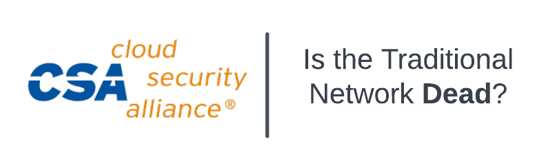

# Cloud Security Alliance - Kansas City, MO

# Slides [Link](cloud_security_alliance_kc.pdf)
"Move everything to Cloud," they said. Don't worry about the traditional network, it doesn't matter anymore! When organizations are mostly hybrid and have compliance, centralized control, availability, and security to wrangle, does networking really NOT matter anymore? Users now work from anywhere, workloads exist across many clouds, and a lot of your organization's data is still in the data center. Let's break down the convergence of networking and security and tease out cloud-native security VS best-of-breed for securing your Hybrid Multi-Cloud world.
