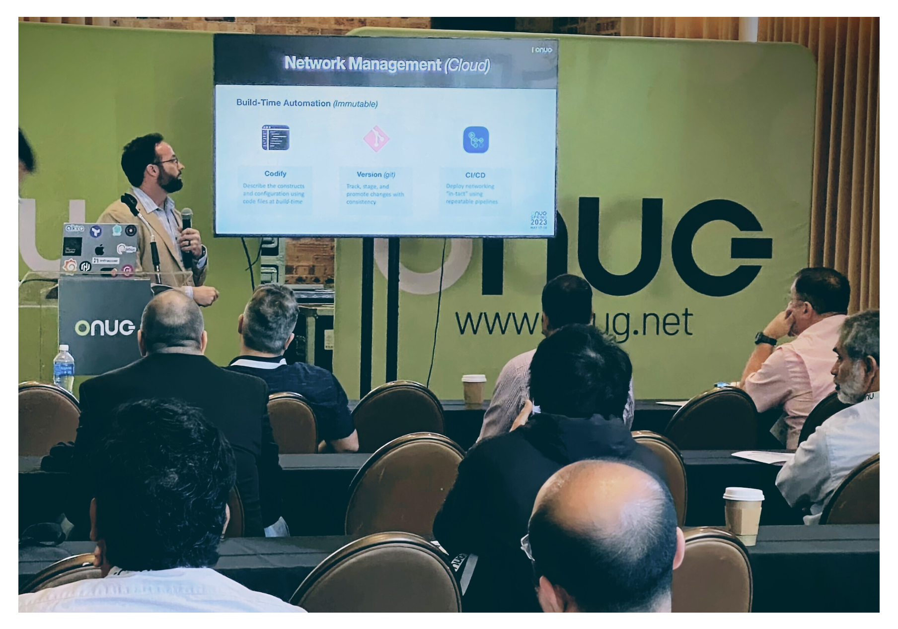

# ONUG Spring - Dallas, TX

# Session
As the public cloud continues to gain momentum, the gap broadens between operating traditional networks and cloud networks. A different set of skills and tooling is required to deploy and maintain network infrastructure. In this course, you will gain an understanding of the following:
- The value proposition of _Infrastructure-as-Code_
- Building basic AWS networking with _Terraform and Python_
- Expanding the scope to multi-cloud with _Network-as-a-Service_
- Benefits of standardized toolchain for managing infrastructure

The slides and code used in this session can be found at [https://github.com/wcollins/onug-spring-2023](https://github.com/wcollins/onug-spring-2023)

